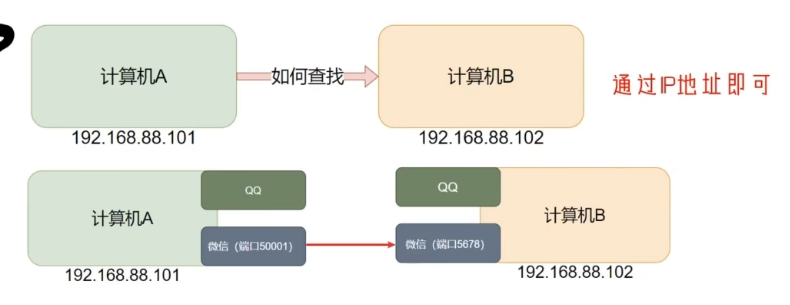

# 第四章-09-端口

在Linux网络通信中，端口（Port）是一个非常重要的概念。它允许计算机上的不同服务或进程通过网络进行通信，而不会相互干扰。

## 1. 什么是端口？

端口是网络通信中一个抽象的软件结构，它与IP地址结合使用，共同标识网络上的唯一通信端点。IP地址用于定位一台主机，而端口号则用于定位一台主机上的一个特定的应用程序或服务。

*   **端口号的范围：** 端口号是一个16位的数字，范围从0到65535。
*   **常见端口分类：**
    *   **周知端口（Well-known Ports）：** 0==到1023==，通常分配给常用服务，如HTTP（80）、HTTPS（443）、FTP（21）、SSH（22）等。这些端口通常需要root权限才能绑定。
    *   **注册端口（Registered Ports）：** ==1024到49151==，这些端口可以由用户进程使用，也可以由IANA（Internet Assigned Numbers Authority）分配给特定的应用程序或服务。
    *   **动态/私有端口（Dynamic/Private Ports）：** 49152到65535，这些端口通常是客户端进程发起请求时临时分配的，或者用于一些不常用的服务。

## 2. 如何查看端口使用情况？

在Linux中，有几个常用的命令可以用来查看端口的使用情况，以及哪些进程正在监听或连接这些端口。
## nmap==命令查看端口占有情况==
语法：nmap 被查看的ip地址

使用yum install nump进行下载

nmap 127.0.0.1自己
### 2.1 `netstat` 命令

`netstat`（network statistics）命令用于显示网络连接、路由表、接口统计等信息。
`netstat -anp|grep 端口号` ：==看特定端口的占用情况== 
**常用选项：**
*   `-a`: 显示所有连接和监听端口。
*   `-t`: 显示TCP连接。
*   `-u`: 显示UDP连接。
*   `-l`: 显示正在监听的套接字。
*   `-n`: 以数字形式显示IP地址和端口号，而不是尝试解析主机名和服务名。
*   `-p`: 显示使用端口的进程ID（PID）和进程名称（需要root权限）。

**示例：**
*   显示所有TCP监听端口及对应进程：
    ```bash
    sudo netstat -antp | grep LISTEN
    ```
*   显示所有建立的TCP连接：
    ```bash
    netstat -ant | grep ESTABLISHED
    ```
*   查看某个特定端口（例如80端口）的使用情况：
    ```bash
    sudo netstat -ntlp | grep :80
    ```

### 2.2 `ss` 命令

`ss`（socket statistics）命令是`netstat`的替代品，它能更快地显示更多TCP/IP套接字信息。在大流量服务器上，`ss`的性能优势更为明显。

**常用选项：**
*   `-a`: 显示所有套接字。
*   `-l`: 显示监听套接字。
*   `-t`: 显示TCP套接字。
*   `-u`: 显示UDP套接字。
*   `-n`: 不解析服务名和主机名。
*   `-p`: 显示进程信息。

**示例：**
*   显示所有监听的TCP端口及对应进程：
    ```bash
    sudo ss -antp | grep LISTEN
    ```
*   查看80端口是否被占用：
    ```bash
    sudo ss -antp | grep :80
    ```

### 2.3 `lsof` 命令

`lsof`（list open files）命令用于列出当前系统打开的文件。在Linux中，网络连接也被视为文件，所以`lsof`也可以用来查看端口使用情况。

**常用选项：**
*   `-i`: 列出所有打开的与网络相关的套接字。
*   `-i :port`: 列出指定端口的进程。

**示例：**
*   查看某个特定端口（例如8080）是否被占用：
    ```bash
    sudo lsof -i :8080
    ```
*   查看所有监听的TCP端口：
    ```bash
    sudo lsof -i -P -n | grep LISTEN
    ```

## 3. 端口的管理与防火墙

端口的管理通常与防火墙设置紧密相关。在Linux中，`firewalld` (CentOS/RHEL) 和 `ufw` (Ubuntu/Debian) 是常见的防火墙管理工具。

### 3.1 `firewalld` (CentOS/RHEL)

`firewalld` 是一个动态管理防火墙的守护进程，支持网络区域（zone）概念。

*   **开放端口：**
    ```bash
    sudo firewall-cmd --zone=public --add-port=80/tcp --permanent
    sudo firewall-cmd --reload
    ```
    (开放80端口，TCP协议，永久生效，并重新加载防火墙规则)
*   **关闭端口：**
    ```bash
    sudo firewall-cmd --zone=public --remove-port=80/tcp --permanent
    sudo firewall-cmd --reload
    ```
*   **查看已开放端口：**
    ```bash
    sudo firewall-cmd --zone=public --list-ports
    ```

### 3.2 `ufw` (Ubuntu/Debian)

`ufw` (Uncomplicated Firewall) 是Ubuntu上一个用户友好的防火墙配置工具。

*   **开放端口：**
    ```bash
    sudo ufw allow 80/tcp
    ```
*   **关闭端口：**
    ```bash
    sudo ufw deny 80/tcp
    ```
*   **查看防火墙状态及规则：**
    ```bash
    sudo ufw status verbose
    ```

通过掌握端口的概念和相关的查看、管理命令，你可以更好地理解和控制Linux系统的网络行为，确保服务的安全和正常运行。
