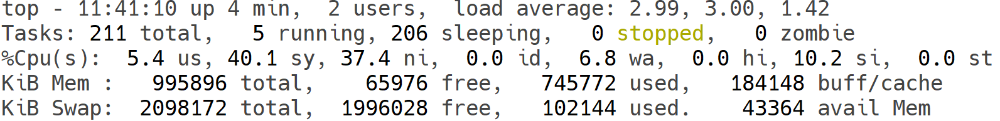
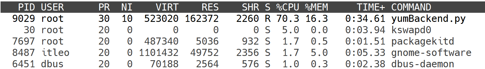

# 第四章-10-进程管理

在Linux系统中，进程是==程序的一次执行过程==，是系统进行资源分配和调度的基本单位。理解并有效管理进程是Linux系统管理的核心技能之一。

## 1. 什么是进程？

当你在Linux中运行一个程序时，操作系统会创建==一个或多个进程==来执行它。每个进程都有一个唯一的数字标识符，称为**进程ID (PID)**。此外，进程之间存在父子关系，创建新进程的进程被称为父进程，新进程则被称为子进程。父进程的ID称为**父进程ID (PPID)**。

## 2. 查看进程信息

Linux提供了多种命令来查看当前系统中运行的进程。

### 2.1 `ps` 命令：==查看进程快照==

`ps` 命令（process status）用于报告当前系统的进程状态。它提供的是一个静态的进程信息快照，而不是实时更新。

**常用选项：**
*   `-e`: 显示所有进程。
*   `-f`: 显示完整的格式列表。
*   `-u user`: 显示指定用户的所有进程。
*   `aux`: (BSD风格) 显示所有用户的进程，包括没有控制终端的进程。

**示例：**
*   显==示所有进程的详细信息：==
    ```bash
    ps -ef
    ```
    输出示例：
    ```
    UID        PID  PPID  C STIME TTY          TIME CMD
    root         1     0  0 08:30 ?        00:00:02 /sbin/init
    root         2     0  0 08:30 ?        00:00:00 [kthreadd]
    user      1234  1230  0 09:00 pts/0    00:00:00 bash
    user      1250  1234  0 09:05 pts/0    00:00:00 ps -ef
    ```
    字段解释：
    *   `UID`: ==用户ID==
    *   `PID`: ==进程ID==
    *   `PPID`: ==父进程ID==
    *   `C`: ==CPU使用率==
    *   `STIME`: ==进程启动时间==
    *   `TTY`: ==启动该进程的终端==：？则不是终端启动的
    *   `TIME`: ==进程占用CPU的总时间==
    *   `CMD`: ==启动进程的命令==

*   显示当前终端的所有进程：
    ```bash
    ps aux
    ```

*   ==查找特定进程==（例如nginx）：
    ```bash
    ps -ef | grep nginx
    ```
    **注意：** 使用 `grep` 查找时，`grep` ==命令本身也会作为一个进程出现==，所以通常会过滤掉 `grep` 进程。
    ```bash
    ps -ef | grep nginx | grep -v grep
    ```

### 2.2 `top` 命令：==实时查看进程状态==

`top` 命令提供了一个动态的、实时更新的进程视图。它会周期性地刷新显示当前系统中CPU、内存的使用情况以及各个进程的资源占用情况。 ^5c68ce

**基本用法：**
```bash
top
```

- 第一行已经在11说过[uptime](第四章-11-主机状态监控.md#^6b0db4)
- 第二行：Tasks：211个进程；5个进程子在运行；206个进程睡眠；0个停止进程；0个僵尸进程
- 第三行：%Cpu：cpu使用率；us:用户CPU使用率,sv:系统CPU使用率,ni:高优先级进程占用CPU时间百分比,id: 空闲CPU率,wa: 10等待CPU占用率,hi: CPU硬件中断率，si:CPU软件中断率,st:强制等待占用CPU率
- 第四五行：Kib Mem:物理内存, total: 总量,free:空闲,used:使用,buff/cache:buff和cache占用；Kibswap:虚拟内存(交换空间),total:总量,free:空闲,used:使用,buffrtache:buff和cache占用


- PID:进程id
- USER: 进程所属用户
- PR: 进程优先级,越小越高
- N1:负值表示高优先级，正表示低优先级
- VIRT:进程使用虚拟内存，单位KB
- RES:进程使用物理内存，单位KB
- SHR:进程使用共享内存，单位KB
- S:进程状态(S休眠，R运行,Z僵死状态，N负数优先级，空闲状态
- %CPU:进程占用CPU率
- %MEM:进程占用内存率
- TIME+:进程使用CPU时间总计，单位10毫秒
- COMMAND:进程的命令或名称或程序的文件路径

在 `top` 界面中，可以输入不同的键进行操作：
*   `q`: ==退出== `top`==。ctrl+c==
*   `k`: 终止一个进程（输入PID后回车）。
*   `r`: 重新调整进程的优先级（nice值）。
*   `M`: 按内存使用量排序。
*   `P`: 按CPU使用量排序。
*   `1`: 显示每个CPU核心的使用情况。

### 2.3 `htop` 命令：交互式进程查看器

`htop` 是一个更现代化、更用户友好的交互式进程查看器，提供了彩色界面、垂直和水平滚动，并且可以直接用鼠标操作。它通常不预装，需要额外安装。

**安装 (以Ubuntu为例)：**
```bash
sudo apt update
sudo apt install htop
```

**基本用法：**
```bash
htop
```

## 3. 进程控制与管理

### 3.1 `kill` 命令：==终止进程==

`kill` 命令用于向进程发送信号，最常用的信号是终止信号。

**基本用法：**
```bash
kill [信号] PID
```

**常用信号：**
*   `1 (SIGHUP)`: 挂起信号，通常用于重新加载配置。
*   `9 (SIGKILL)`: ==强制终止进程，进程无法捕获或忽略此信号==。
    `kill -9 PID`
*   `15 (SIGTERM)`: 正常终止进程，进程可以捕获并处理此信号，从而优雅地关闭。这是默认信号。
    `kill PID` 或 `kill -15 PID`

**示例：**
*   优雅地终止PID为1234的进程：
    ```bash
    kill 1234
    ```
*   ==强制终止PID为5678的进程：==
    ```bash
    kill -9 5678
    ```

### 3.2 `killall` 命令：按名称终止进程

`killall` 命令根据进程的名称来终止所有匹配的进程。

**基本用法：**
```bash
killall [信号] 进程名称
```

**示例：**
*   终止所有名为 `nginx` 的进程：
    ```bash
    killall nginx
    ```
*   强制终止所有名为 `apache2` 的进程：
    ```bash
    killall -9 apache2
    ```

### 3.3 `pkill` 命令：更灵活地终止进程

`pkill` 命令允许使用更复杂的模式匹配来选择要终止的进程。

**基本用法：**
```bash
pkill [选项] [模式]
```

**示例：**
*   终止所有属于用户 `user1` 的进程：
    ```bash
    pkill -u user1
    ```
*   终止所有名称中包含 `http` 的进程：
    ```bash
    pkill http
    ```

### 3.4 `nice` 和 `renice` 命令：调整进程优先级

`nice` 命令用于在启动时设置进程的优先级。`renice` 命令用于修改已运行进程的优先级。优先级的范围通常是-20（最高优先级）到19（最低优先级）。

**`nice` 示例：**
*   以较低优先级启动命令：
    ```bash
    nice -n 10 mycommand
    ```
**`renice` 示例：**
*   将PID为1234的进程优先级设置为15：
    ```bash
    sudo renice 15 1234
    ```

## 4. 后台运行进程

有时需要让程序在后台运行，即使关闭终端也不会停止。

### 4.1 `&` 符号

在命令的末尾加上 `&` 符号，可以将命令放到后台运行，但如果关闭终端，进程可能会随之终止。

```bash
mycommand &
```

### 4.2 `nohup` 命令

`nohup` 命令（no hang up）运行一个命令，使其在用户退出或关闭终端后仍能继续运行。

**基本用法：**
```bash
nohup command &
```
输出通常会重定向到 `nohup.out` 文件。

**示例：**
```bash
nohup python my_script.py > output.log 2>&1 &
```
这将把 `my_script.py` 的标准输出和标准错误都重定向到 `output.log`，并在后台运行。

### 4.3 `screen` 或 `tmux`

`screen` 和 `tmux` 是终端复用器，它们允许在一个终端会话中创建和管理多个伪终端。你可以在其中运行程序，然后“分离”会话，即使关闭SSH连接，会话中的程序也会继续运行。当你重新连接时，可以“恢复”会话。

这些工具在管理远程服务器上的长时间运行任务时非常有用。

通过掌握这些进程管理命令，你可以有效地监控、控制和优化Linux系统的资源使用，确保系统的稳定性和高效性。
