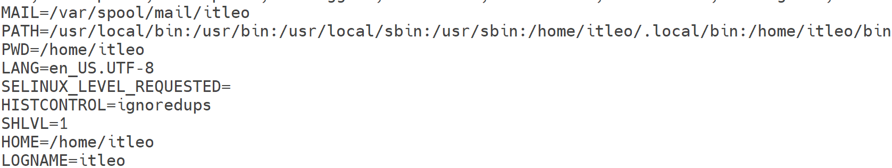
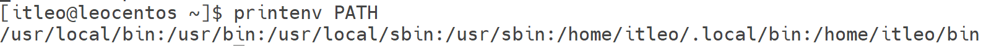

# 第四章-12-环境变量

在Linux系统中，环境变量是操作系统运行环境的重要组成部分，它们是动态命名的值，可以在shell会话、子进程和各种应用程序中访问。理解和管理环境变量对于配置系统行为、定制用户环境以及运行脚本和程序至关重要。

## 1. 什么是环境变量？

环境变量是存储在操作系统中，用于描述系统运行环境的一些参数。它们可以是任何类型的数据，例如路径、用户名、语言设置或程序配置。==当你在终端中执行命令或运行脚本时，这些进程可以读取并使用这些环境变量==。例如cd命令

环境变量通常分为两类：

*   **全局环境变量 (Global Environment Variables)：** 对==所有用户进程都可见==。当一个用户登录到系统时，它们会被设置。
*   **局部环境变量 (Local Environment Variables)：** ==只对当前shell会话或子进程==可见。

## 2. 查看环境变量

### 2.1 `env` 命令

`env` 命令用于显示==当前shell会话的所有环境变量==。

```bash
env
```

### 2.2 `printenv` 命令

`printenv` 命令与 `env` 类似，也可以显示所有环境变量，或者显示指定环境变量的值。

*   显示所有环境变量：
    ```bash
    printenv
    ```
*   显示==指定环境变量==（例如 `PATH`）的值：
    ```bash
    printenv PATH
    ```

PATH==记录了系统任何执行命令的搜索路径==，用：隔开。
在前面提出的问题中,我们说无论==当前工作目录是什么,都能执行/usr/bin/cd这个程序==,这个就是借助环境变量中PATH这个项目的值来做到的，
当执行任何命令,都会按照顺序,从上述路径中搜索要执行的程序的本体比如执行cd命令，==就从第二个目录/usr/bin中搜索到了cd命令,并执行==
### 2.3 `echo` 命令

 `echo` 命令可以用来==打印指定环境变量的值==。环境变量通常以 `$` ==符号开头==。

**示例：**
*   ==打印 `PATH` 环境变量的值==：
    ```bash
    echo $PATH
    ```
-   打印完==我还要加东西==
	```bash
	echo ${PATH}ABC
	```
*   打印 `HOME` 环境变量的值：
    ```bash
    echo $HOME
    ```
*   打印 `USER` 环境变量的值：
    ```bash
    echo $USER
    ```

**常用环境变量：**
*   `PATH`: 指定可执行程序的搜索路径。当你在终端输入一个命令时，shell会在`PATH`指定的目录中查找该命令。
*   `HOME`: 用户主目录的路径。
*   `USER`: 当前登录用户的用户名。
*   `LANG`: 语言和字符集设置。
*   `SHELL`: 当前使用的shell程序。
*   `PWD`: 当前工作目录。

## 3. 设置环境变量

### 3.1 ==临时设置（只对当前shell会话有效==）

*   **设置新的环境变量：**
    ```bash
    MY_VARIABLE="Hello World"
    ```
    这只是定义了一个shell变量。

*   **将shell变量导出为环境变量：**
    为了让子进程也能访问到这个变量，需要使用 `export` 命令将其导出。
    ```bash
    export MY_VARIABLE
    ```
    或者==直接一步到位==：
    ```bash
    export ANOTHER_VARIABLE="This is another variable"
    ```
    ==**验证：**==
    ```bash
    echo $MY_VARIABLE
    echo $ANOTHER_VARIABLE
    ```

*   **修改现有环境变量：**
    例如，将新的路径添加到 `PATH` 环境变量中。为了不覆盖原有路径，通常会使用 `${PATH}` 来引用旧值。
    ```bash
    export PATH=$PATH:/opt/my_app/bin
    ```
    这会在 `PATH` 的末尾添加 `/opt/my_app/bin`。如果希望新路径优先，可以放在前面：
    ```bash
    export PATH=/opt/my_app/bin:$PATH
    ```

### 3.2 永久设置（持久化）

要使环境变量在系统重启或新shell会话中依然有效，需要将它们写入特定的配置文件。

#### 3.2.1 ==用户级别（只对当前用户有效）==

*   **`~/.bashrc` 或 `~/.zshrc` (根据你的shell类型)：**
    这是==最常用的配置文件==，用于设置shell启动时执行的命令和环境变量。对于大多数用户来说，将自定义环境变量添加到这个文件的末尾是合适的。
    ==vim ~/.bashrc==:进入之后在最后一行进行编辑[vim](../Linus常见命令.md#^f3ff22)
    ```bash
    # 在文件末尾添加
    export MYNAME=itleo
    ```
    修改文件后，需要使配置生效：
    ```bash
    source ~/.bashrc  # 或者 source ~/.zshrc
    ```
    或者重新打开终端。

*   **`~/.profile` 或 `~/.bash_profile`：**
    这些文件在用户登录时执行，通常用于设置全局性的环境变量。`~/.profile` 在多种shell中通用，而 `~/.bash_profile` 专用于Bash。在某些系统中，`~/.bash_profile` 可能会调用 `~/.bashrc`。

#### 3.2.2 系统级别（对所有用户有效）

*   **`/etc/profile`：**
    这个文件在所有用户登录时执行，用于设置全局环境变量和执行全局登录脚本。
    ```bash
    # 在文件末尾添加
    export SYSTEM_WIDE_VAR="Global Value"
    ```
    修改后需要重启系统或手动 `source /etc/profile`。

*   **`/etc/environment`：**
    这是一个简单的文件，用于设置系统范围内的环境变量。每行一个变量，格式为 `VAR=VALUE`，不能包含命令。
    ```
    SYSTEM_VAR="Another Global Value"
    ```
    修改后通常需要重启系统才能完全生效。

*   **`/etc/profile.d/` 目录：**
    这是一个目录，其中包含的脚本会在用户登录时被 `/etc/profile` 调用执行。这是一个推荐的方法，可以为不同的应用程序或服务创建独立的配置文件。
    例如，创建一个 `/etc/profile.d/my_app.sh` 文件：
    ```bash
    # /etc/profile.d/my_app.sh
    export MY_APP_HOME="/opt/my_app"
    export PATH=$PATH:$MY_APP_HOME/bin
    ```
    确保文件有执行权限 `sudo chmod +x /etc/profile.d/my_app.sh`。

## 4. 删除环境变量

要删除一个环境变量，可以使用 `unset` 命令。

```bash
unset MY_VARIABLE
```
这只会从当前shell会话中删除变量。如果该变量是永久设置的，则需要从相应的配置文件中删除其定义。

## 5. 最佳实践

*   **用户级与系统级：** 优先在用户级别设置环境变量，除非确实需要对所有用户生效。
*   **`PATH` 管理：** 添加新路径时，最好使用 `${PATH}:/new/path` 或 `/new/path:${PATH}` 来避免覆盖现有路径。
*   **配置文件的选择：** 对于交互式shell，`~/.bashrc` (或 `.zshrc`) 是最常见的选择；对于非交互式脚本或系统启动时，`/etc/profile` 或 `/etc/environment` 可能更合适。
*   **安全性：** 不要将敏感信息（如密码）直接存储在环境变量中。

通过熟练掌握环境变量的管理，你可以更好地控制Linux系统环境，提高工作效率并避免潜在的配置问题。
