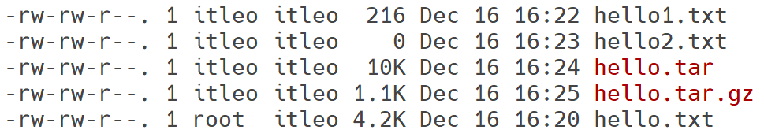

# 第四章-14-压缩和解压

在Linux系统中，为了节省存储空间、方便文件传输或进行数据备份，我们经常需要对文件和目录进行压缩和解压操作。Linux提供了多种强大的工具来处理不同格式的压缩文件。

tar gzip压缩格式==linux最常用==zip也有

.tar .gz后缀
## 1. `tar` 命令：打包与解包（tarball）

`tar` 命令（tape archive）最初用于将文件打包到磁带上，==现在主要用于将多个文件或目录打包成一个文件（称为“tarball”），通常不进行压缩==。但它可以与其他压缩工具（如`gzip`或`bzip2`）结合使用，以创建压缩的归档文件。

**基本语法：**
```bash
tar [选项] [文件名]
```

**常用选项：**
*   `-c`: ==创建归档文件==。
*   `-x`: 提取归档文件==解压==。
*   `-f <archive_file>`: ==指定归档文件名==最后一个文件。
*   `-v`: ==显示详细信息==压缩解压进度。
*   `-z`: 通过`gzip`进行压缩/解压缩。
*   `-j`: 通过`bzip2`进行压缩/解压缩。
*   `-J`: 通过`xz`进行压缩/解压缩。
*   `-C <directory>`: 解压到指定目录。
*   `-t`: 列出归档文件内容。

### 1.1 打包与压缩

*   **==打包文件==为 `.tar`：**
    ```bash
    tar -cvf archive.tar file1.txt directory1/
    ```
    （==将 `file1.txt` 和 `directory1` 打包成 `archive.tar`==）

*   **==打包并用 `gzip` 压缩为 `.tar.gz` 或== `.tgz`：**
    ```bash
    tar -zcvf archive.tar.gz file1.txt directory1/
    ```
    （`-z` 等同于 `gzip`）

*   **打包并用 `bzip2` 压缩为 `.tar.bz2` 或 `.tbz`：**
    ```bash
    tar -cjvf archive.tar.bz2 file1.txt directory1/
    ```
    （`-j` 等同于 `bzip2`）

*   **打包并用 `xz` 压缩为 `.tar.xz`：**
    ```bash
    tar -cJvf archive.tar.xz file1.txt directory1/
    ```
    （`-J` 等同于 `xz`）

### 1.2 解包与解压缩

*   **查看 `.tar.gz` 文件的内容：**
    ```bash
    tar -tzvf archive.tar.gz
    ```

*   **解压 `.tar.gz` 文件：**
    ```bash
    tar -xzvf archive.tar.gz
    ```

*   **解压 `.tar.bz2` 文件到指定目录：**
    ```bash
    tar -xjvf archive.tar.bz2 -C /tmp/my_extracted_files/
    ```

*   **解压 `.tar.xz` 文件：**
    ```bash
    tar -xJvf archive.tar.xz
    ```

## 2. `gzip` 和 `gunzip` 命令：单个文件压缩与解压缩

`gzip` 是最常用的文件压缩工具之一，==它通常用于压缩单个文件==，生成 `.gz` 扩展名的文件。`gunzip` 用于解压缩 `gzip` 文件。

**基本语法：**
```bash
gzip [选项] 文件
gunzip [选项] 文件.gz
```

**常用选项：**
*   `-d`: 解压缩。`gunzip` 命令本身就是 `gzip -d` 的别名。
*   `-r`: 递归压缩或解压缩目录中的所有文件。
*   `-k`: 压缩或解压缩时保留原始文件。
*   `-v`: 显示详细信息。
*   `-#`: 指定压缩级别，1是速度最快压缩比最低，9是速度最慢压缩比最高，默认是6。

**示例：**
*   **压缩文件：**
    ```bash
    gzip file.txt    # 压缩后生成 file.txt.gz，原始文件被删除
    gzip -k file2.log # 压缩后生成 file2.log.gz，保留原始文件
    ```
*   **解压缩文件：**
    ```bash
    gunzip file.txt.gz # 解压后生成 file.txt，原始文件被删除
    gzip -d -k file2.log.gz # 解压后生成 file2.log，保留原始文件
    ```

## 3. `bzip2` 和 `bunzip2` 命令：高压缩比

`bzip2` 提供了比 `gzip` 更高的压缩比，但压缩和解压缩的速度通常较慢。它生成的压缩文件扩展名为 `.bz2`。`bunzip2` 用于解压缩 `bzip2` 文件。

**基本语法：**
```bash
bzip2 [选项] 文件
bunzip2 [选项] 文件.bz2
```

**常用选项：**
*   `-d`: 解压缩。`bunzip2` 命令本身就是 `bzip2 -d` 的别名。
*   `-k`: 压缩或解压缩时保留原始文件。

**示例：**
*   **压缩文件：**
    ```bash
    bzip2 large_file.log # 压缩后生成 large_file.log.bz2，原始文件被删除
    ```
*   **解压缩文件：**
    ```bash
    bunzip2 large_file.log.bz2 # 解压后生成 large_file.log，原始文件被删除
    ```

## 4. `zip` 和 `unzip` 命令：跨平台压缩

`zip` 和 `unzip` 命令用于创建和提取 `.zip` 格式的归档文件。这种格式在Windows系统中非常常见，因此在Linux和Windows之间交换文件时特别有用。

**基本语法：**
```bash
zip [选项] 归档文件.zip 文件/目录...
unzip [选项] 归档文件.zip
```

**常用选项：**
*   `zip`：
    *   `-r`: 递归地包含子目录中的文件。
    *   `-q`: 安静模式（不显示详细信息）。
*   `unzip`：
    *   `-d <directory>`: 将文件解压到指定目录。
    *   `-l`: 列出归档文件内容。

**示例：**
*   **创建 `.zip` 归档文件：**
    ```bash
    zip -r myarchive.zip file1.txt directory1/
    ```
*   **解压 `.zip` 归档文件：**
    ```bash
    unzip myarchive.zip
    ```
*   **解压 `.zip` 到指定目录：**
    ```bash
    unzip myarchive.zip -d /tmp/extracted/
    ```

## 5. 其他压缩工具

*   **`xz` 和 `unxz`：** 提供比 `gzip` 和 `bzip2` 更高的压缩比，但速度也更慢。通常与 `tar` 结合使用，生成 `.tar.xz` 文件。
    ```bash
    xz file.txt
    unxz file.txt.xz
    ```
*   **`7z`：** `7-Zip` 的命令行工具，支持多种压缩格式，包括 `7z`, `zip`, `gzip`, `bzip2` 等。
    `sudo apt install p7zip-full`
    `7z a archive.7z directory/` （创建7z归档）
    `7z x archive.7z` （解压7z归档）

选择合适的压缩和解压工具取决于你的具体需求：是追求最高的压缩比，还是最快的速度，亦或是需要跨平台兼容性。熟练掌握这些命令将使你在Linux文件管理方面更加得心应手。
