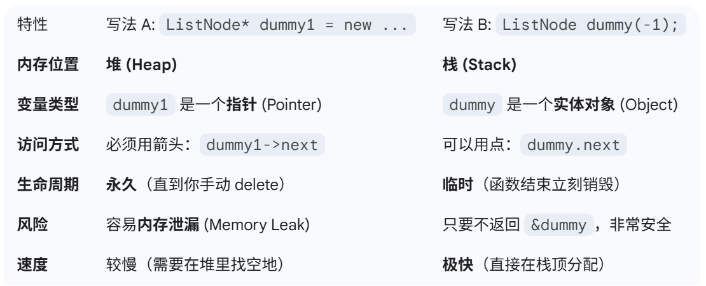

## 21合并有序链表
1. 指针：listnode* l1：一个链表的起点；*****p；声明中用
2. 地址取用（给指针）：&dummy
3. 实例：dummy；dummy（-1）头指针。
4. p->next：顺着网线找。
5. p->val这个表示当前指针位置的值；；:p是指针（当前位置的地址）；
6. p =p->next：让本身的指针往前；右边才是变化的
7. 如果最后留下一串，直接p->next = p1;收留了剩下的一串。
8. 非空 要 return dummy 
	1. ListNode* mergeTwoLists要的是指针
	2. dummy是对象实体（带着-1）；dummy.next才是指针。
9. 
## 86分隔链表