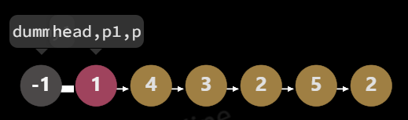
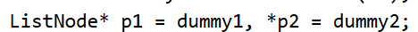

## 21合并有序链表
1. 指针：listnode* l1：一个链表的起点；*****p；声明中用
2. 地址取用（给指针）：&dummy
3. 实例：dummy；dummy（-1）头指针。
4. p->next：顺着网线找。
5. p->val这个表示当前指针位置的值；；:p是指针（当前位置的地址）；
6. p =p->next：让本身的指针往前；右边才是变化的
7. 如果最后留下一串，直接p->next = p1;收留了剩下的一串。
8. 非空 要 return dummy 
	1. ListNode* mergeTwoLists要的是指针
	2. dummy是对象实体（带着-1）；dummy.next才是指针。
9. 
## 86分隔链表
1. 链表往下走的逻辑就是p1 =p1->next;我现在
2. p1 -> next =p;先牵头
3. listnode temp = p.next;先找个本子记下来，剩下的
4. p.next =null;==把剩下的车全部丢了==[[节点的操作]]
5. p =temp；head又回来了
6. p2
星号不能忘掉；先进行定义头指针，再把头指针给p1、p2。
7. 时刻记得p1、p2指针的移动
8. 记住是大于等于
## 23合并K个有序链表
[堆：金字塔等级设置](数据结构.md#堆：金字塔等级设置)
### **[[虚拟头节点]]**
```
for (ListNode* head : lists) {
	if (head != nullptr) {
		pq.push(head); 
	} 
}
```
Lists;本来就是装头节点的数组
ListNode* head已经完成了定义；叫head的临时指针

p->next = Node;不用担心来的是一个链表
下一次执行的时候就会被覆盖掉

不要忘了将下一个节点放入循环

## 142环形链表
先判断是否存在环
快慢指针相遇则存在，那么==停止条件==是什么呢？
快慢指针相遇return；==无环的话则fast会变成null或者fast的next会变成null==

以上任意一个满足都不能是环了，==true false 必须是false。所以是&&。==
