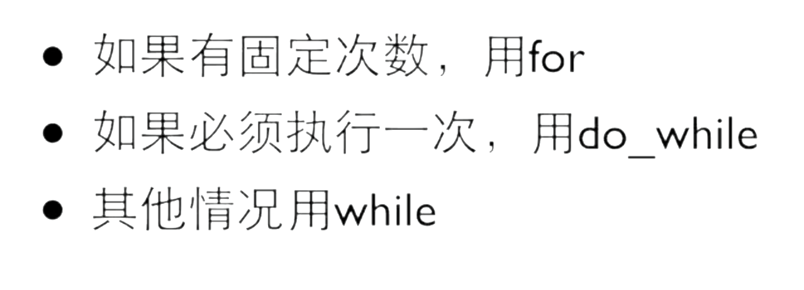

# 第3-4章：判断与循环 (逻辑核心)

## 1. 条件判断

### if-else
适用于范围判断或复杂的逻辑组合。

```c
if (score >= 90) {
    printf("优秀");
} else if (score >= 60) {
    printf("及格");
} else {
    printf("不及格");
}
```

### switch-case (状态机基础)
适用于**离散值**的判断，代码结构更清晰，且编译器通常会对其进行优化（跳转表）。

**嵌入式应用：状态机 (State Machine)**
这是嵌入式系统中==最常见的编程模式==，用于处理复杂的设备状态流转。
必须搭配break

```c
// 假设 state 是当前设备的运行状态
switch (state) {
    case IDLE: // 待机状态
        led_off();
        if (button_pressed) state = WORK;
        break;
    
    case WORK: // 工作状态
        motor_run();
        if (job_done) state = FINISH;
        break;
        
    case FINISH: // 结束状态
        beep_once();
        state = IDLE;
        break;
        
    default: // 异常处理
        error_handler();
        break;
}
```

## 2. 循环结构（循环结束的条件的相反）

### while 循环
适用于==**不知道具体循环次数**==，只知道终止条件的场景。例如：等待用户输入、等待按键按下、等待传感器数据就绪。

```c
// 嵌入式常用：死循环（主循环）
while (1) {
    // 这里的代码会永远执行
    // 类似 Arduino 的 loop() 函数
}
do{

}while(1);先执行后判断
```

### for 循环
适用于**已知循环次数**的场景。

```c
// 遍历 0 到 9
for (int i = 0; i < 10; i++) {
    printf("%d ", i);
}
```
==循环结束后i=10==
### 重点：边界条件 (Off-by-one error)
新手最容易犯的错误是搞错 `<` 和 `<=`，导致多循环一次或少循环一次。
- `for (int i=0; i < 10; i++)`：循环 10 次 (0~9)。
- `for (int i=0; i <= 10; i++)`：循环 11 次 (0~10)。

**建议**：习惯从 `0` 开始计数，使用 `< N` 的写法，这与数组下标是一致的。
