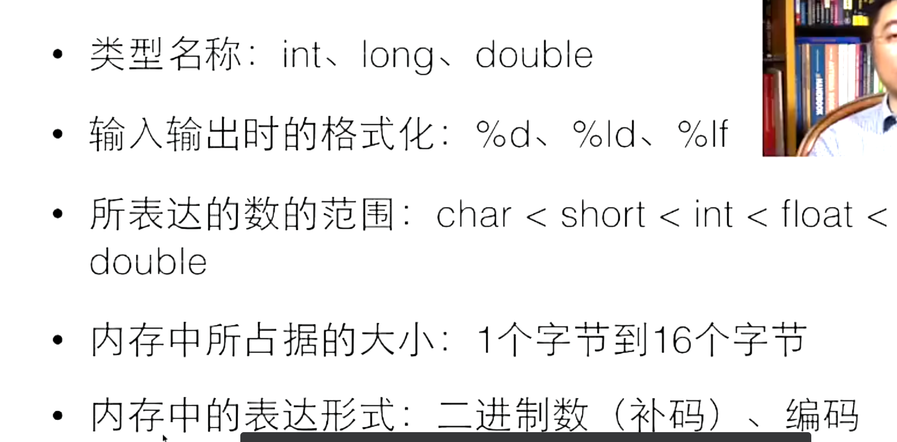

# 第5章：数据类型 (嵌入式必修)

## 1. C 语言的==基本数据类型==
在嵌入式开发中，清楚知道每个变量占用多少字节是**至关重要**的。C 标准并未严格规定 `int` 的长度，它取决于编译器和 CPU 架构。

| 类型          | 常见大小 (32位系统)       | 说明                      |
| :---------- | :----------------- | :---------------------- |
| `char`      | 1 字节               | 通常用于字符或小整数 (-128 ~ 127) |
| `short`     | 2 字节               | 短整数                     |
| `int`       | 4 字节               | 最常用的整数类型（==一个寄存器==）     |
| `long`      | 4 字节 (Win/Linux32) | 在 64位 Linux 下通常是 8 字节   |
| `long long` | 8 字节               | 64位整数（拼起来）              |
| `float`     | 4 字节               | 单精度浮点数                  |
| `double`    | 8 字节               | 双精度浮点数                  |
|             |                    |                         |
|             |                    |                         |

**推荐习惯**：在嵌入式中，为了明确位宽，我们通常使用 `<stdint.h>` 中的类型别名：
- `uint8_t` (unsigned char)
- `int16_t` (short)
- `uint32_t` (unsigned int)

## 2. ==sizeof 运算符==

`sizeof` 是**编译器在编译时**计算的，不是函数。它返回变量或类型所占的字节数。

```c
int a = 10;
printf("int size: %d\n", sizeof(int)); // 输出 4 (在常见32位系统中)
printf("var size: %d\n", sizeof(a));
```

**移植性问题**：
如果你的代码在 STM32 (32位) 上写 `int` 认为是 4 字节，移植到 8 位单片机 (如 51) 上 `int` 可能是 2 字节。这会导致数据截断。**解决方法是尽量使用 `uint32_t` 等明确类型的定义。**


==小数点默认是double==，a+1.0并==未被执行==
## 3. 数据溢出 (Overflow)

当数值超过了类型能表示的最大范围，会发生“回绕” (Wrap around)。

```c
uint8_t count = 255; // uint8_t 范围是 0~255
count = count + 1;   // 结果变成 0 ！
```

**危险场景**：
假设你用一个 `uint8_t` 变量记录电机转动的步数，如果超过 255 步，变量归零，程序可能误以为电机回到了原点，导致机械结构撞击损坏。

## 4. 浮点数 (float/double)

- 尽量少用浮点数，除非必须。
- 单片机通常没有硬件浮点单元 (FPU)，使用 float 会导致 CPU 运算极慢。
- 浮点数不能直接用 `==` 比较相等，因为存在精度误差。

```
