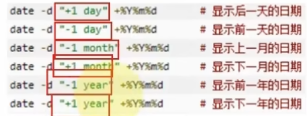
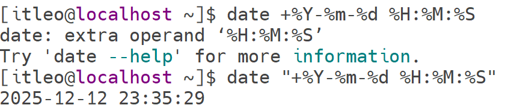

# date命令
语法：date -d +格式化的字符串
- -d：按照给定的字符串显示日期，一般用于日期计算
	- 
	- 支持的标记有
		- year
		- month
		- day
		- hour
		- minute
		- second
	- 可以与格式化字符串一起工作
	- 示例：
- 格式化字符串:通过特定的字符串标记，来控制显示的日期格式
	- %Y：年
	- %y:年的后两位
	- %m：月
	- %d：日
	- %H：小时
	- %M: 分钟
	- %S:秒
	- %s:自1970-01-01到现在的秒数
- 示例 
不难发现==双引号==的重要性“”