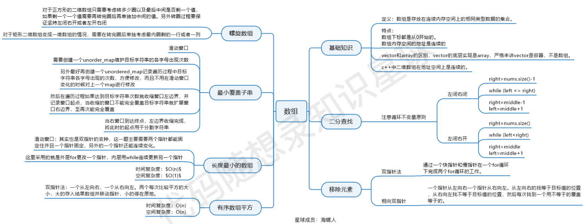

## 209.最小子数组
最小则最大==INT_MAX==;若最后还是他，则就是0，否则res；

只要 `right` 代表结束位置的下一位；right - left就是窗口长度。

res取在缩窗口的开头；res只有在达标的之后进行记录

## 59.螺旋矩阵
定义二维数组：
`vector<vector<int>> res(n, vector<int>(n, 0));`
n%2:判断是不是奇数
n/2：几圈；
offset：缩圈；
startx、starty：转了一圈会变
i，j则是进行遍历的变量。
## 58.区间和
前缀和，先算了，方便后续的操作；presum：中间值；

