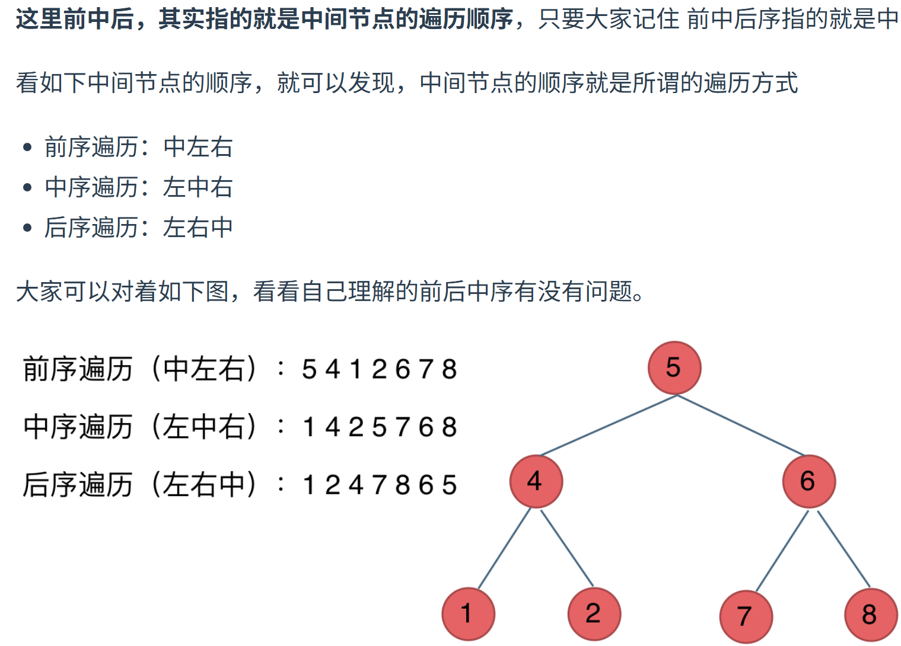

## 二叉树理论学习
[二叉树](../../二叉树.md#^5ea7f7)

### 深度遍历（到叶子节点返回）

## 二叉树的递归遍历
[[递归算法]]
### 前序遍历
```cpp
void travesal(TreeNode* cur, vector<int>& vec){
	if(cur == nullptr) return;
	vec.push_back(cur-> val);
	travesal(cur->left, vec);
	travesal(cur->right, vec);
}
vector<int> preorderTraversal(TreeNode* root){
	vector<int> result;
	traversal(root, result);
	return result;
}
```
`vector<int>& vec` &是取地址，节省空间。

void是因为他是在内部进行修改的。

### 迭代法
