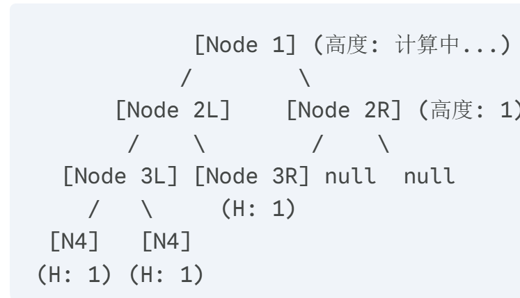

## 110.平衡二叉树

### 递归法

```cpp
class Solution {
public:
    // 返回以该节点为根节点的二叉树的高度，如果不是平衡二叉树了则返回-1
    int getHeight(TreeNode* node) {
        if (node == NULL) {
            return 0;
        }
        int leftHeight = getHeight(node->left);
        if (leftHeight == -1) return -1;
        int rightHeight = getHeight(node->right);
        if (rightHeight == -1) return -1;
        return abs(leftHeight - rightHeight) > 1 ? -1 : 1 + max(leftHeight, rightHeight);
    }
    bool isBalanced(TreeNode* root) {
        return getHeight(root) == -1 ? false : true;
    }
};
```
图例



#### 逐层计算高度表：

|**节点**|**左子树高度**|**右子树高度**|**差值**|**是否平衡？**|**返回给父节点的值**|
|---|---|---|---|---|---|
|**Node 4**|0|0|0|是|**1**|
|**Node 3L**|1 (来自N4)|1 (来自N4)|0|是|**2**|
|**Node 3R**|0|0|0|是|**1**|
|**Node 2L**|2 (来自3L)|1 (来自3R)|**1**|**是**|**3**|
|**Node 2R**|0|0|0|是|**1**|
|**Node 1**|**3** (来自2L)|**1** (来自2R)|**2**|**否！**|**-1**|
**关键词**：

1. **逐层上报高度**
    
2. **差值阈值 1**
    
3. **根节点定胜负**（把自己当根）局部思维