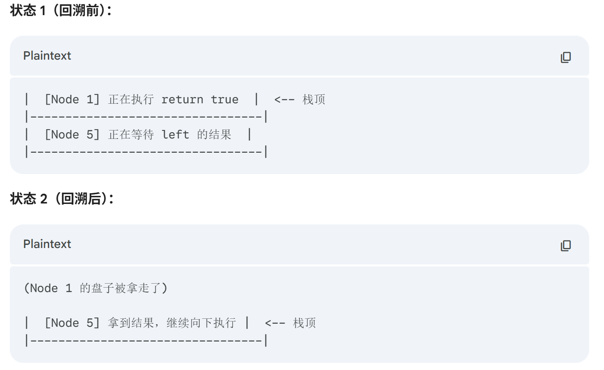

## 106.从中序与后序遍历序列构造二叉树
### demo
```cpp
class Solution {
private:
    // 中序区间：[inorderBegin, inorderEnd)，后序区间[postorderBegin, postorderEnd)
    TreeNode* traversal (vector<int>& inorder, int inorderBegin, int inorderEnd, vector<int>& postorder, int postorderBegin, int postorderEnd) {
        if (postorderBegin == postorderEnd) return NULL;

        int rootValue = postorder[postorderEnd - 1];
        TreeNode* root = new TreeNode(rootValue);

        if (postorderEnd - postorderBegin == 1) return root;

        int delimiterIndex;
        for (delimiterIndex = inorderBegin; delimiterIndex < inorderEnd; delimiterIndex++) {
            if (inorder[delimiterIndex] == rootValue) break;
        }
        // 切割中序数组
        // 左中序区间，左闭右开[leftInorderBegin, leftInorderEnd)
        int leftInorderBegin = inorderBegin;
        int leftInorderEnd = delimiterIndex;
        // 右中序区间，左闭右开[rightInorderBegin, rightInorderEnd)
        int rightInorderBegin = delimiterIndex + 1;
        int rightInorderEnd = inorderEnd;

        // 切割后序数组
        // 左后序区间，左闭右开[leftPostorderBegin, leftPostorderEnd)
        int leftPostorderBegin =  postorderBegin;
        int leftPostorderEnd = postorderBegin + delimiterIndex - inorderBegin; // 终止位置是 需要加上 中序区间的大小size
        // 右后序区间，左闭右开[rightPostorderBegin, rightPostorderEnd)
        int rightPostorderBegin = postorderBegin + (delimiterIndex - inorderBegin);
        int rightPostorderEnd = postorderEnd - 1; // 排除最后一个元素，已经作为节点了

        root->left = traversal(inorder, leftInorderBegin, leftInorderEnd,  postorder, leftPostorderBegin, leftPostorderEnd);
        root->right = traversal(inorder, rightInorderBegin, rightInorderEnd, postorder, rightPostorderBegin, rightPostorderEnd);

        return root;
    }
public:
    TreeNode* buildTree(vector<int>& inorder, vector<int>& postorder) {
        if (inorder.size() == 0 || postorder.size() == 0) return NULL;
        // 左闭右开的原则
        return traversal(inorder, 0, inorder.size(), postorder, 0, postorder.size());
    }
};
```
## 654.最大二叉树
构造二叉树中左右，前序排列

vector遵循的就是左闭右开

下次当你写递归或者处理数组/字符串题目时，问自己三个问题：

1. **只读吗？** (我需要修改原数据吗？如果不需要，大概率不用拷贝。)
    
2. **连续吗？** (我要处理的是不是一段连续的区间？如果是，大概率可以用 `left/right` 下标。)
    
3. **很贵吗？** (如果数据量 `N` 很大，拷贝的代价我付得起吗？)

left已经是假想敌了，所有从left+1开始。
### demo下标型
```cpp
class Solution {
private:
    // 在左闭右开区间[left, right)，构造二叉树
    TreeNode* traversal(vector<int>& nums, int left, int right) {
        if (left >= right) return nullptr;

        // 分割点下标：maxValueIndex
        int maxValueIndex = left;
        for (int i = left + 1; i < right; ++i) {
            if (nums[i] > nums[maxValueIndex]) maxValueIndex = i;
        }

        TreeNode* root = new TreeNode(nums[maxValueIndex]);

        // 左闭右开：[left, maxValueIndex)
        root->left = traversal(nums, left, maxValueIndex);

        // 左闭右开：[maxValueIndex + 1, right)
        root->right = traversal(nums, maxValueIndex + 1, right);

        return root;
    }
public:
    TreeNode* constructMaximumBinaryTree(vector<int>& nums) {
        return traversal(nums, 0, nums.size());
    }
};
```

## 617.合并二叉树
### demo前序遍历
```cpp
class Solution {
public:
    TreeNode* mergeTrees(TreeNode* t1, TreeNode* t2) {
        if (t1 == NULL) return t2; // 如果t1为空，合并之后就应该是t2
        if (t2 == NULL) return t1; // 如果t2为空，合并之后就应该是t1
        // 修改了t1的数值和结构
        t1->val += t2->val;                             // 中
        t1->left = mergeTrees(t1->left, t2->left);      // 左
        t1->right = mergeTrees(t1->right, t2->right);   // 右
        return t1;
    }
};
```

### 迭代法demo
```cpp
class Solution {
public:
    TreeNode* mergeTrees(TreeNode* t1, TreeNode* t2) {
        if (t1 == NULL) return t2;
        if (t2 == NULL) return t1;
        queue<TreeNode*> que;
        que.push(t1);
        que.push(t2);
        while(!que.empty()) {
            TreeNode* node1 = que.front(); que.pop();
            TreeNode* node2 = que.front(); que.pop();
            // 此时两个节点一定不为空，val相加
            node1->val += node2->val;

            // 如果两棵树左节点都不为空，加入队列
            if (node1->left != NULL && node2->left != NULL) {
                que.push(node1->left);
                que.push(node2->left);
            }
            // 如果两棵树右节点都不为空，加入队列
            if (node1->right != NULL && node2->right != NULL) {
                que.push(node1->right);
                que.push(node2->right);
            }

            // 当t1的左节点 为空 t2左节点不为空，就赋值过去
            if (node1->left == NULL && node2->left != NULL) {
                node1->left = node2->left;
            }
            // 当t1的右节点 为空 t2右节点不为空，就赋值过去
            if (node1->right == NULL && node2->right != NULL) {
                node1->right = node2->right;
            }
        }
        return t1;
    }
};
```

## 700.二叉搜索树中的搜索

### demo递归法
```cpp
class Solution {
public:
    TreeNode* searchBST(TreeNode* root, int val) {
        if (root == NULL || root->val == val) return root;
        TreeNode* result = NULL;
        if (root->val > val) result = searchBST(root->left, val);
        if (root->val < val) result = searchBST(root->right, val);
        return result;
    }
};
```

### demo迭代法
```cpp
class Solution {
public:
    TreeNode* searchBST(TreeNode* root, int val) {
        while (root != NULL) {
            if (root->val > val) root = root->left;
            else if (root->val < val) root = root->right;
            else return root;
        }
        return NULL;
    }
};
```

## 28.验证二叉搜索树

#### 第一阶段：搞定 5 的左边

1. **来到 5**：想处理 5？不行，代码第一行说 `isValidBST(root->left)`，先去左边。
    
2. **来到 1**：想处理 1？不行，先去左边。
    
    - 1 的左边是 `NULL`，返回 true。
        
3. **回到 1**：左边搞定了，**现在处理 1**。
    
    - 当前序列：`[1]`
        
    - `maxVal` 更新为 1。
        
4. **1 的右边**：是 `NULL`，返回 true。
    
5. **1 结束**：返回到 5。
    
#### 第二阶段：搞定 5 (转折点)

6. **回到 5**：5 的左边（也就是 1 那一坨）全部执行完了。
    
    - **现在处理 5**。
        
    - 当前序列：`1 -> 5`
        
    - 比较：`5 > 1` (通过)。`maxVal` 更新为 5。
        
    - **下一步**：代码执行到 `isValidBST(root->right)`，也就是去访问节点 **4**。