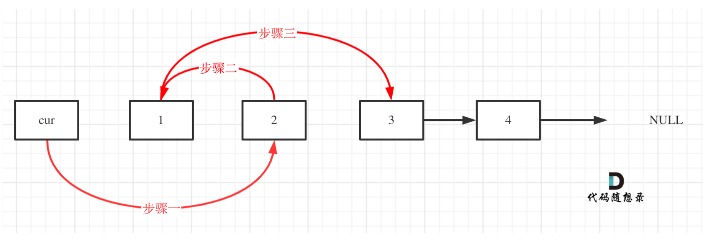

## 24.两两交换链表中的节点

步骤一不需要记录节点，但步骤二三都需要记录节点。
## 19.删除链表的倒数第N个节点
n+1：fast先走n+1，slow走，直到null。

## 链表相交
swap（len还有cur）
遍历链表的长度==NULL==
```cpp
while(cur != nullptr){
	len++;
	cur = cur->next;
}
```
curA = heada；两次，其中一次是复位。
## 142.环形链表II
[链表](../链表指针.md#^aa7bcf)

## 242.有效的字母异位词
`s[i]` 是一个字符（char），`'a'` 也是一个字符。在 C++ 中，`char` 类型参与运算时会被视为整数（ASCII 码）。
假设 `s[i]` 是字符 `'b'`：`'b' - 'a' = 98 - 97 = 1` -> 对应数组下标 `record[1]`。
```cpp
class Solution {
public:
    bool isAnagram(string s, string t) {
        int record[26] = {0};
        if(s.size() != t.size()) return false;
        for(int i = 0; i < s.size(); i++){
            record[s[i] - 'a']++;
        }
        for(int i = 0; i < t.size(); i++){
            record[t[i] - 'a']--;
        }
        for(int i = 0; i < 26; i++){
            if(record[i] != 0){
                return false;
            }
        }
        return true;
    }
};
```
## 349.两个数组的交集
**使用数组来做哈希的题目，是因为题目都限制了==数值的大小==。**

而这道题目没有限制数值的大小，就无法使用数组来==做哈希表==了。

**而且如果哈希值比较少、特别分散、跨度非常大，使用数组就造成空间的极大浪费。**
unordered_set:无限数组；（去重）取值，映射效率最高。
mult_set:红黑树
set: