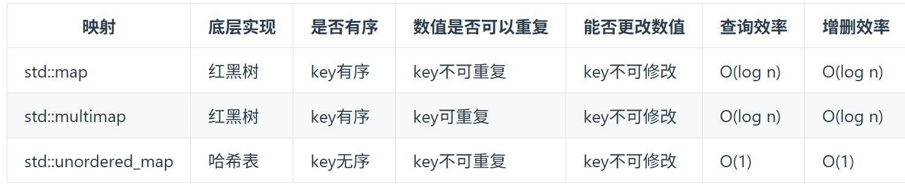

## 24.两两交换链表中的节点

步骤一不需要记录节点，但步骤二三都需要记录节点。
## 19.删除链表的倒数第N个节点
n+1：fast先走n+1，slow走，直到null。

## 链表相交
swap（len还有cur）
遍历链表的长度==NULL==
```cpp
while(cur != nullptr){
	len++;
	cur = cur->next;
}
```
curA = heada；两次，其中一次是复位。
## 142.环形链表II
[链表](../链表指针.md#^aa7bcf)

## 242.有效的字母异位词
`s[i]` 是一个字符（char），`'a'` 也是一个字符。在 C++ 中，`char` 类型参与运算时会被视为整数（ASCII 码）。
假设 `s[i]` 是字符 `'b'`：`'b' - 'a' = 98 - 97 = 1` -> 对应数组下标 `record[1]`。
```cpp
class Solution {
public:
    bool isAnagram(string s, string t) {
        int record[26] = {0};
        if(s.size() != t.size()) return false;
        for(int i = 0; i < s.size(); i++){
            record[s[i] - 'a']++;
        }
        for(int i = 0; i < t.size(); i++){
            record[t[i] - 'a']--;
        }
        for(int i = 0; i < 26; i++){
            if(record[i] != 0){
                return false;
            }
        }
        return true;
    }
};
```
## 349.两个数组的交集
**使用数组来做哈希的题目，是因为题目都限制了==数值的大小==。**

而这道题目没有限制数值的大小，就无法使用数组来==做哈希表==了。

**而且如果哈希值比较少、特别分散、跨度非常大，使用数组就造成空间的极大浪费。**

unordered_set:无限数组；==（去重）==取值，映射效率最高。
mult_set:红黑树
set:红黑树

```cpp
unordered_set<int> result_set;//去重符合要求
unordered_set<int> nums_set(nums1.begin(), nums1.end());
for (int num : nums2) {
    // nums_set.find(num) 返回的是一个迭代器
    // nums_set.end() 指向的是集合末尾之后的一个位置（表示没找到）
    if (nums_set.find(num) != nums_set.end()) {
        result_set.insert(num);
    }
}
return vector<int>(result_set.begin(), result_set.end());
利用 `vector` 的构造函数，把 `result_set` 里的所有元素倒出来，装进一个新的 `vector` 里返回。
```
**作用**：将 `nums1` 里的所有元素直接拷贝到 `nums_set` 中。

**效果**：如果 `nums1` 是 `[4, 7, 9, 7, 9, 7]`，执行完这行代码，`nums_set` 里就只剩下 `{4, 7, 9}`。这一步同时也构建了哈希表，为后面的快速查找做好了准备。

==**数组**==
```cpp
vector<int> intersection(vector<int>& nums1, vector<int>& nums2) {
        unordered_set<int> result_set; // 存放结果，之所以用set是为了给结果集去重
        int hash[1005] = {0}; // 默认数值为0
        for (int num : nums1) { // nums1中出现的字母在hash数组中做记录
            hash[num] = 1;
        }
        for (int num : nums2) { // nums2中出现话，result记录
            if (hash[num] == 1) {
                result_set.insert(num);
            }
        }
        return vector<int>(result_set.begin(), result_set.end());
    }
```
## 202.快乐数
`set.end()`它指向的是**最后一个元素后面的那个位置(无效位置)**。
**`begin()`**：指向第 1 个元素。
动作：`set.find(sum)` (搜寻者):它会返回一个**迭代器 (Iterator)**（你可以把它简单理解为一个**指针**）。
	**找到了**：它返回指向那个元素的“==指针==”（比如指向第 3 个位置）。
    **没找到**：它非常诚实，它会一路找下去，直到走出了后门。这时，它返回的就是 `set.end()`。
```cpp
// C++20 新特性
if (set.contains(sum)) {
    return false;
}
```
`set.insert(sum);`:记录
```cpp
int getSum(int n) {
    int sum = 0;
    while (n) {              // 当 n 不为 0 时循环
        sum += (n % 10) * (n % 10); // 1. 取出最后一位 (n%10)，平方，累加
        n /= 10;             // 2. 删掉最后一位 (整数除法)
    }
    return sum;
}
bool isHappy(int n) {
    unordered_set<int> set; // 定义一个哈希集合，用来存放“出现过的数字”
    
    while(1) { // 开启一个死循环，直到触发 return 才会停止
        int sum = getSum(n); // 算出下一步的数
        
        // 【出口 1】如果是 1，恭喜，是快乐数
        if (sum == 1) {
            return true;
        }
        
        // 【出口 2】检测是否进入死循环
        // set.find(sum) != set.end() 意思是：在集合里找到了 sum
        if (set.find(sum) != set.end()) {
            return false; // 以前出现过这个数，说明我们在绕圈圈，不是快乐数
        } else {
            set.insert(sum); // 没出现过，赶紧记在小本本（set）上
        }
        
        n = sum; // 更新 n，准备进行下一轮计算
    }
}
```
## 1.两数之和
首先我再强调一下 什么时候使用哈希法，当我们需要查询==一个元素是否出现过，或者一个元素是否在集合里==的时候，就要第一时间想到哈希法。

本题呢，我就需要一个集合来存放我们遍历过的元素，然后在遍历数组的时候去询问这个集合，某元素是否遍历过，也就是 是否出现在这个集合。

因为本题，我们不仅要知道元素有没有遍历过，还要知道这个元素对应的下标，**需要使用 key value结构来存放，==key来存元素，value来存下标==，那么使用map正合适**。

**这道题目中并不需要key有序，选择std::unordered_map 效率更高！**
- 为什么会想到用哈希表
- 哈希表为什么用map
- 本题map是用来存什么的
- map中的key和value用来存什么的