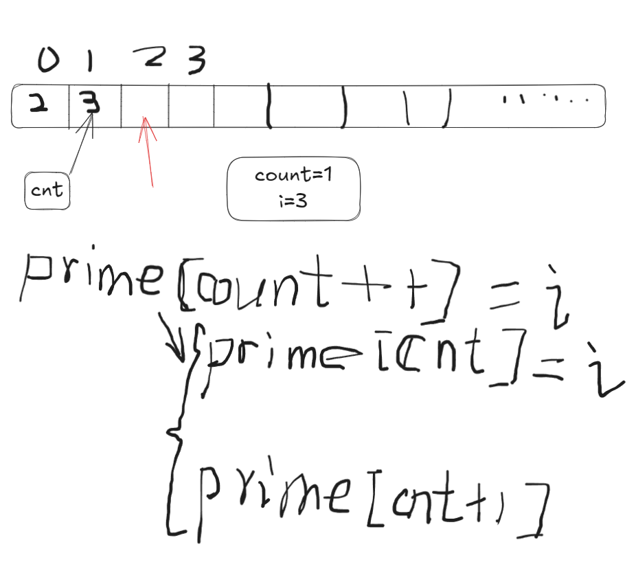
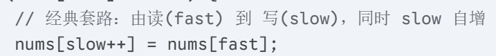

## 后缀自增
先使用当前值作为下标进行赋值，然后再将变量加 1


## 双指针：原地修改数组（快慢指针）
- **`fast` (快指针)**：像侦察兵，负责遍历数组，寻找“合格”的元素。
    
- **`slow` (慢指针)**：像接收员（也就是你图中的 `count`），只接收合格的元素，并紧紧守着下一个空位。
```
// 这里的 slow 就相当于你图里的 count
int slow = 0; 
for (int fast = 0; fast < nums.size(); fast++) {
    if (nums[fast] 是我们需要保留的元素) {
        // 这一行就是你图片中的精髓：
        // 1. 把快指针找到的值给慢指针
        // 2. 慢指针向前移动一步，准备接下一个
        nums[slow++] = nums[fast]; 
    }
}
// 此时，数组的前 slow 个元素就是我们要的结果
return slow;
```

slow 总是指向下一个“空位”，当循环结束时，slow 的数值正好等于它前面已经填入的有效元素个数

## 滑动窗口
滑动窗口是==同向双指针的一种高级应用形式==，维护一个动态的窗口 `[left, right]`，像一只毛毛虫一样在数组上爬行：头部（right）先向前探路，身体变长；当吃太饱或条件不满足时，尾巴（left）向前收缩。

- 连续子数组/子串问题 (Contiguous Subarray/Substring)
    
- 窗口伸缩机制 (Window Expansion & Shrinkage)
    
- 时间复杂度优化 $O(N^2) \to O(N)$
    
- 经典模板代码 (The Ultimate Template)
```bash
/* 滑动窗口通用模板 */
int slidingWindow(vector<int>& nums) {
    int n = nums.size();
    int left = 0, right = 0;
    
    // 定义维护窗口数据的变量
    // 例如：int sum = 0; (求和)
    // 例如：unordered_map<char, int> window; (计数)
    
    int ans = ...; // 初始化结果（最大值初始化为最小，最小值初始化为最大）

    // 1. 右指针主动向右扩展 (Expand)
    while (right < n) {
        int val = nums[right]; // 即将移入窗口的数据
        right++; // 右指针前移
        
        // --- 进行窗口内数据的更新 ---
        // window.add(val);
        
        // 2. 判断左指针是否需要收缩 (Shrink)
        // while ( 窗口需要收缩的条件 ) {
            int d = nums[left]; // 即将移出窗口的数据
            left++; // 左指针前移
            
            // --- 进行窗口内数据的更新 ---
            // window.remove(d);
        // }
        
        // 3. 在这里更新最终结果 (根据题目要求，有时在收缩完更新，有时在扩张后更新)
        // ans = min(ans, right - left);
    }
    return ans;
}
```
- **入窗 (Expand):** `right` 指针向右走，把数据加进窗口，让窗口变大。通常是为了**找到**解。
    
- **出窗 (Shrink):** `left` 指针向右走，把数据移出窗口，让窗口变小。通常是为了**优化**解（找最短）或者**修复**条件（比如窗口里有重复字符了，必须缩减直到没重复）。
    
- **时机 (Timing):** 结果的更新位置很重要。
    
    - 求**最大**窗口（如最长子串）：通常在**每次扩张后**（while循环外）更新结果。
        
    - 求**最小**窗口（如最小覆盖子串）：通常在**收缩窗口的 while 循环内**更新结果。