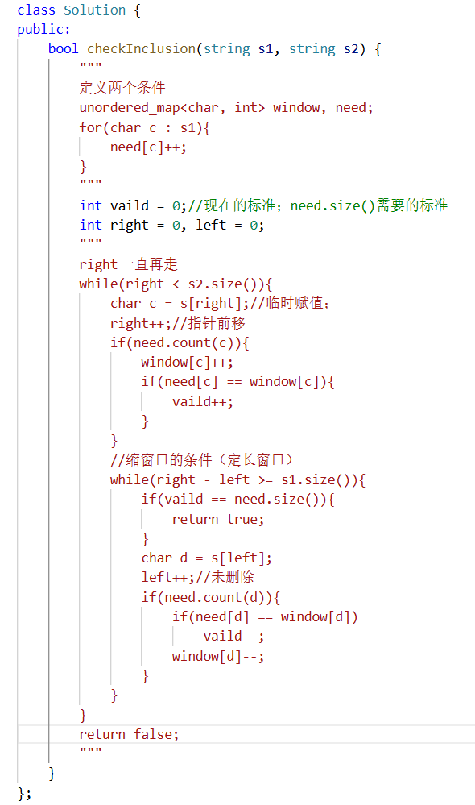

## 76.最小覆盖字串
`for(char c: t)`拿出字符串t（==也可以是其他容器==）下标为i的那个字符，并把它赋值给c（==临时变量==）；

`need[c]++`哈希表==计数各个c的个数==。

`need[c],window[c]`都是==表示值==，后面加上++代表值加一。

`need.count(c)`哈希表==计算键个数==，与值没有关系。==这里来看有没有这个键==

`need.size()`表示元素的多少。

INT_MAX;   INT_MIN

```bash
char c = s[right]; 临时赋值
right++;指针后移
```
```cpp
if (need.count(c)) { 
	window[c]++; 
	if (window[c] == need[c]) 
		valid++; 
}//更新有用数据
```
只关心==有用数据的删除与增加==


## 438.找所有字母异位词
```cpp
class Solution {
public:
    vector<int> findAnagrams(string s, string p) {
        unordered_map<char, int> need, window;
        for(char c : p){
            need[c]++;
        }
        int vaild = 0;
        int right = 0, left = 0;
        vector<int> nums;
        int i = 0;
        while(right < s.size()){
            char c = s[right];
            right++;
            if(need.count(c)){
                window[c]++;
                if(need[c] == window[c]){
                    vaild++;
                }
            }
            while(right - left >= p.size()){
                if(need.size() == vaild){
                    nums[i] = left;
                    i++;
                }
                char d = s[left];
                left++;
                if(need.count(d)){
                    if(need[d] == window[d]){
                        vaild--;
                    }
                    window[d]--;
                }
            }
        }
        return nums;
    }
};
```
nums:数组为空，只能推入不能赋值。
`nums.push_back(left)`