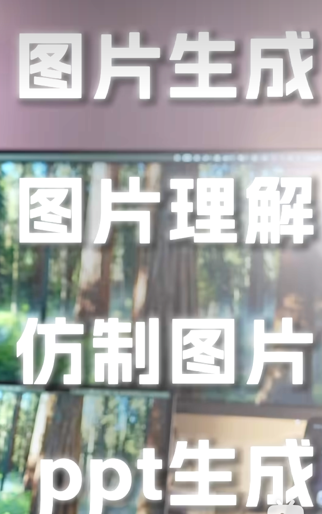

## gemini科研绘图prompt
[GPT5.2发布了，为什么我还在用Gemini3?-最强科研牛马_哔哩哔哩_bilibili](https://www.bilibili.com/video/BV11nm1BpEGH/?spm_id_from=333.1007.tianma.1-2-2.click&vd_source=8d5eee5c6e0d0eb8e6a95aa0683f45e0)

文献综述
论文去ai与润色
一键制作ppt
科普动画
写代码
复现的能力
纠错能力