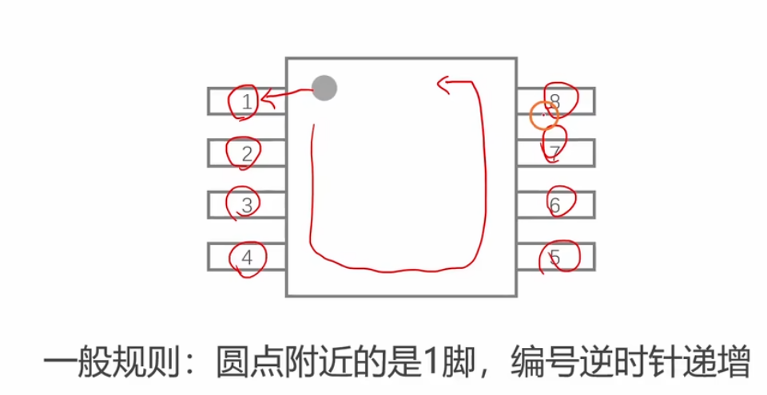

# 1.2 [准备]STM32的引脚分布
数据手册C8T6：LQFP48
参考手册
## 主要内容
以 STM32F103C8T6 为例，详细介绍芯片的引脚功能和分布。

### 引脚分类
1.  **电源引脚**：
    *   **VBAT**：==备用电池供电==，维持 RTC 和备份寄存器数据。
    *   **VDD（电）/VSS（接地）**：数字电源正/负 (3.3V)。
    *   **VDDA/VSSA**：模拟电源正/负 (供 ADC、复位电路等使用)。
2.  **晶振引脚**：
    *   **OSC_IN/OSC_OUT**：主晶振 (HSE) 接口，通常接 8MHz。
    *   **OSC32_IN/OSC32_OUT**：RTC 晶振 (LSE) 接口，接 32.768kHz。
3.  **复位引脚**：
    *   **NRST**：低电平复位。
4.  **下载/调试引脚 (SWD)**：
    *   **PA13 (SWDIO)**：数据线。
    *   **PA14 (SWCLK)**：时钟线。
5.  **启动配置引脚 (BOOT)**：
    *   **BOOT0, BOOT1**：决定启动模式 (Flash启动, System Memory启动, SRAM启动)。
6.  **GPIO 引脚**：
    *   PA0~PA15, PB0~PB15, PC13~PC15 等。
    *   大部分 GPIO 支持 5V 容忍 (FT)，但在模拟输入模式下除外。

### 最小系统电路
*   **供电电路**：3.3V 稳压。
*   **复位电路**：电容+电阻+按键。
*   **时钟电路**：晶振+起振电容。
*   **启动配置**：BOOT 引脚跳线帽。
*   **下载接口**：SWD 排针。
