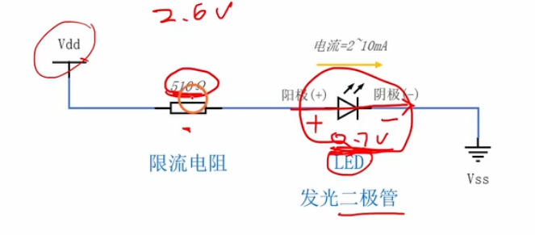
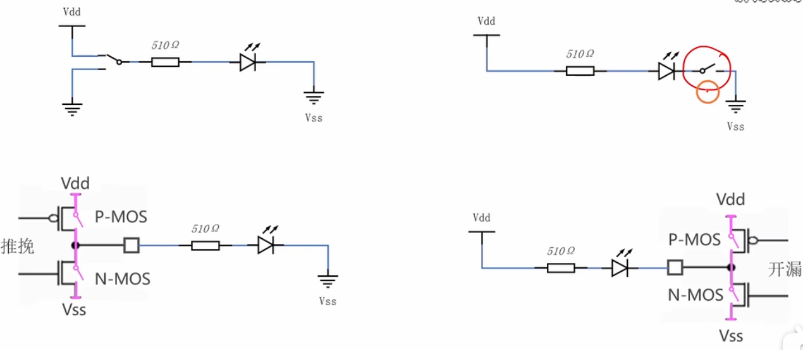
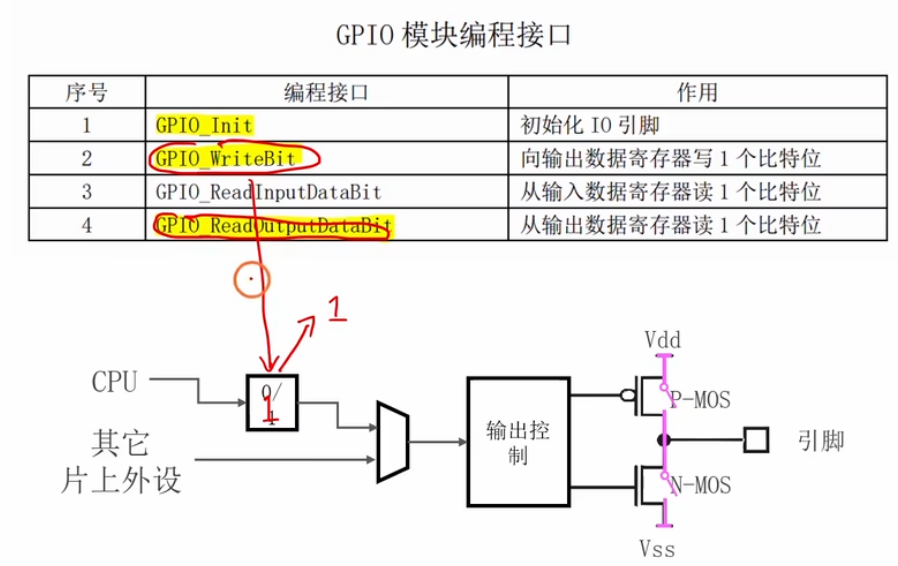
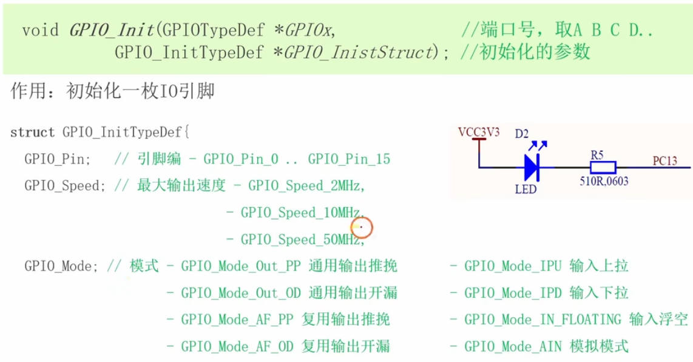

# 2.3 [GPIO]LED闪灯实验

## 主要内容
通过代码实现控制 LED 闪烁，学习 GPIO 输出库函数的使用。板子上有一个PA13的led

### 硬件连接
*   LED 正极接 3.3V，负极串联限流电阻接 GPIO (如 PA0)。
*   或者：LED 正极接 GPIO，负极接地 (取决于驱动能力，推荐低电平驱动即第一种)。

### 编程步骤
1.  **开启时钟(心跳)**：调用 `RCC_APB2PeriphClockCmd` 开启 GPIOC时钟。

1.  **配置 GPIO**：
    *   定义 `GPIO_InitTypeDef` 结构体。
    *   Pin = GPIO_Pin_0。
    *   Mode = GPIO_Mode_Out_PP (==推挽输出==)。
    *   Speed = GPIO_Speed_50MHz（==最大速度==）。
    *   调用 `GPIO_Init` ==初始化==。
    
2.  **主循环**：
    *   `GPIO_ResetBits(GPIOA, GPIO_Pin_0)` -> 点亮 (低电平)。
    *   `Delay_ms(500)` -> 延时。
    *   `GPIO_SetBits(GPIOA, GPIO_Pin_0)` -> 熄灭 (高电平)。
    *   `Delay_ms(500)` -> 延时。

### 常用函数
*   `GPIO_SetBits()`: 置高电平。
*   `GPIO_ResetBits()`: 置低电平。
*   `GPIO_WriteBit()`: 写某一位。
