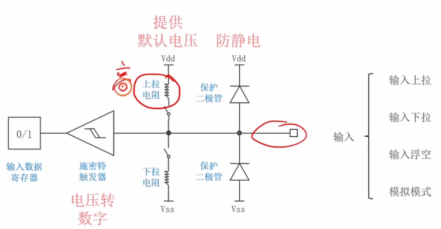

# 2.4 [GPIO]4种输入模式

## 主要内容
详解 STM32 GPIO 的四种输入配置。

施密特触发器，==将电压转换为数据1/0==
### 1. 浮空输入 (Floating Input)
*   **原理**：引脚内部既不接上拉也不接下拉电阻，电平完全由外部电路决定。
*   **特点**：输入阻抗高。如果外部悬空，读取到的电平不确定 (易受干扰)。
*   **应用**：I2C 数据线接收 (双向)、外部已确定电平的信号。

### 2. 上拉输入 (Pull-up Input)
*   **原理**：==内部连接弱上拉电阻到 VDD==。
*   **特点**：==外部悬空时，默认为**高电平**==。
*   **应用**：连接**低电平触发**的按键 (按键一端接地)、UART RX 引脚。

### 3. 下拉输入 (Pull-down Input)
*   **原理**：内部连接弱下拉电阻到 VSS。
*   **特点**：外部悬空时，默认为**低电平**。
*   **应用**：连接**高电平触发**的按键 (按键一端接电源)。

### 4. 模拟输入 (Analog Input)
*   **原理**：关闭施密特触发器，信号直接进入内部 ADC 模块。
*   **特点**：数字输入寄存器读取值为 0，用于采集电压信号。
*   **应用**：ADC 电压采集。
