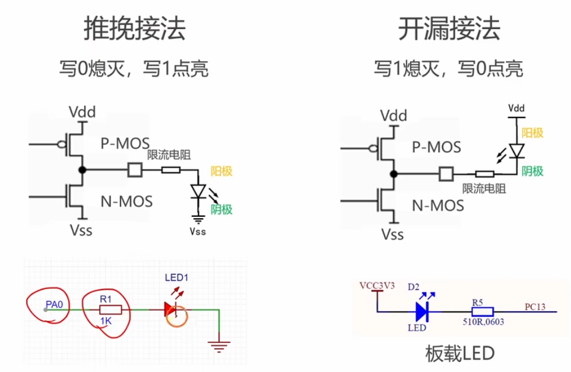
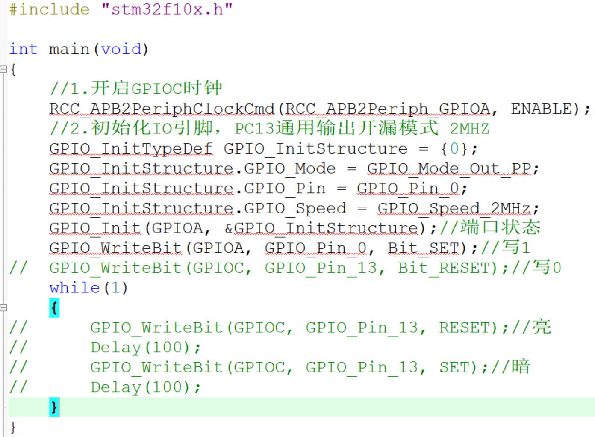
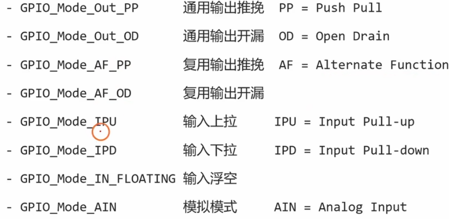
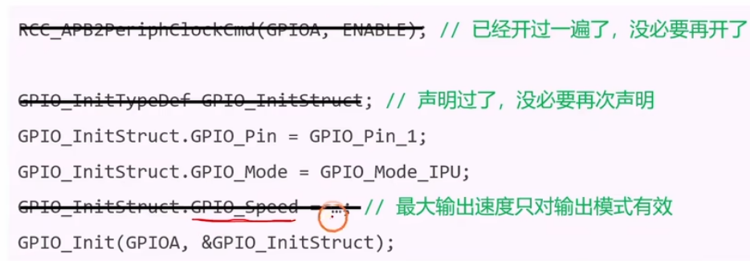
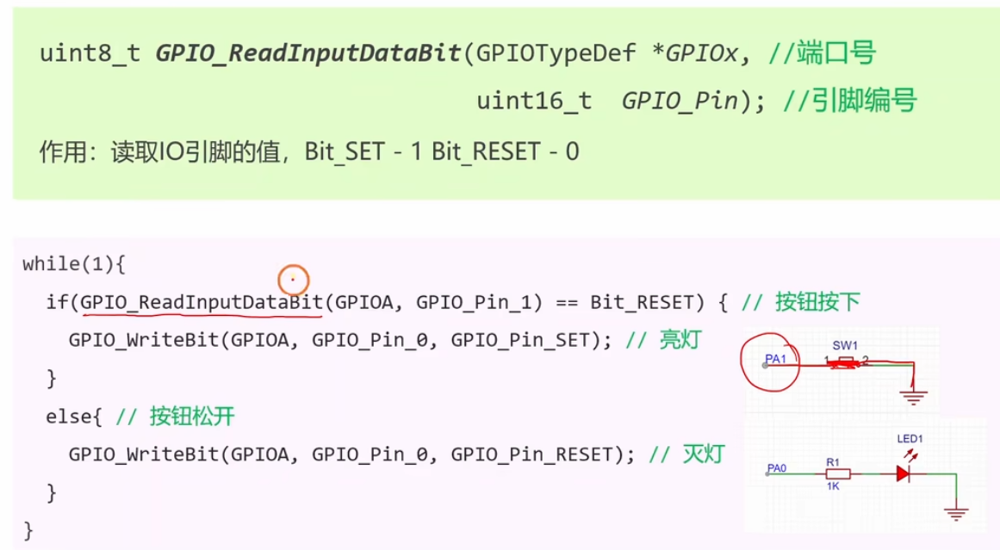

# 2.5 [GPIO]按钮实验

## 主要内容
学习如何读取 GPIO 输入电平，处理按键信号。

### 硬件连接
*   按键一端接 GPIO (如 PA0)，另一端接地。

### 编程步骤
1.  **开启时钟**：开启 GPIOB 时钟。
2.  **配置 GPIO**：
    *   Pin = GPIO_Pin_0。
    *   Mode = **GPIO_Mode_IPU** (上拉输入)。
        *   *解释*：因为按键接地，按下为低电平；松开时希望是高电平，所以用上拉。
3.  **读取电平**：
    *   使用 `GPIO_ReadInputDataBit(GPIOB, GPIO_Pin_1)`。

### 按键消抖
*   **现象**：机械按键按下和松开瞬间会有抖动，导致误判为多次按键。
*   **软件消抖**：
    1.  检测到按键按下 (低电平)。
    2.  `Delay_ms(20)` (延时 10-20ms 避开抖动)。
    3.  再次检测，如果还是低电平，确认为按下。
    4.  (可选) 等待按键松开 `while(GPIO_ReadInputDataBit(...) == 0);`。

