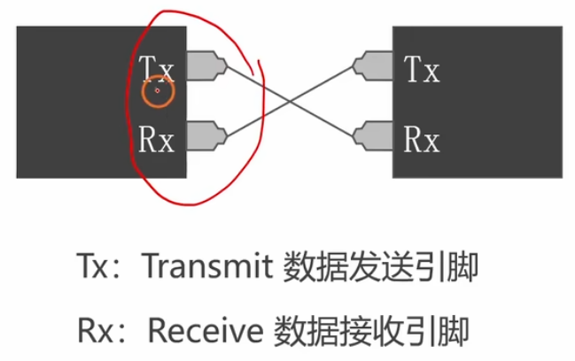
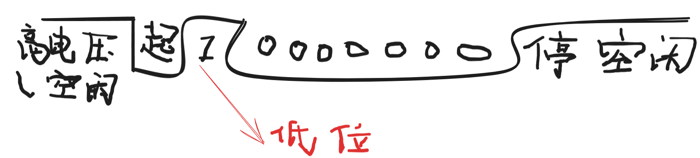
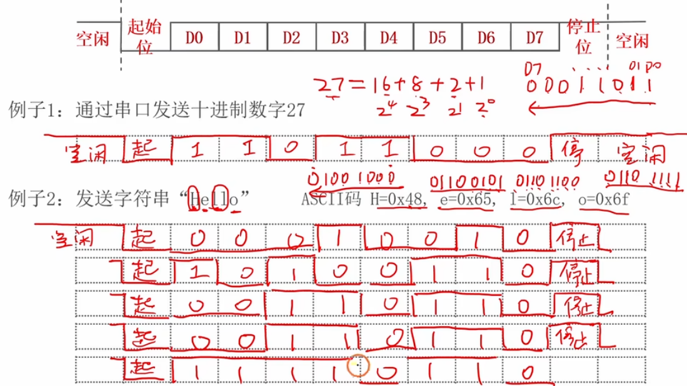

# 3.1 [串口]通信协议

## 主要内容
介绍通用异步收发传输器 (UART) 的基本通信概念。

### 通信基础概念
*   **并行 vs 串行**：
    *   并行：多根线同时传输，速度快，距离短，线多。
    *   串行：单根线按位传输，速度慢，距离远，线少 (串口属于此类)。
*   **同步 vs 异步**：
    *   同步：带时钟线 (I2C, SPI)，双方时钟严格同步。
    *   异步：不带时钟线 (UART)，双方约定波特率。
*   **全双工 vs 半双工**：
    *   全双工：能同时收发 (UART: TX/RX 两根线)。
    *   半双工：分时收发 (RS485)。

### 串口物理层标准
*   **TTL 电平** (MCU 直接连接)：
    *   逻辑 1: 3.3V / 5V
    *   逻辑 0: 0V
*   **RS-232 电平** (PC 串口)：
    *   逻辑 1: -3V ~ -15V
    *   逻辑 0: +3V ~ +15V
    *   *注*：连接电脑需要电平转换芯片 (如 MAX3232)。

### 串口协议层 (数据帧)
*   **空闲状态**：高电平。
*   **起始位**：1 位低电平。
*   **数据位**：5~8 位 (通常 8 位)，低位在前。
*   **校验位**：==奇/偶/无校验。==
*   **停止位**：1 / 1.5 / 2 位高电平。
*   **波特率**：每秒传输的 bit 数 (如 9600, 115200)。
