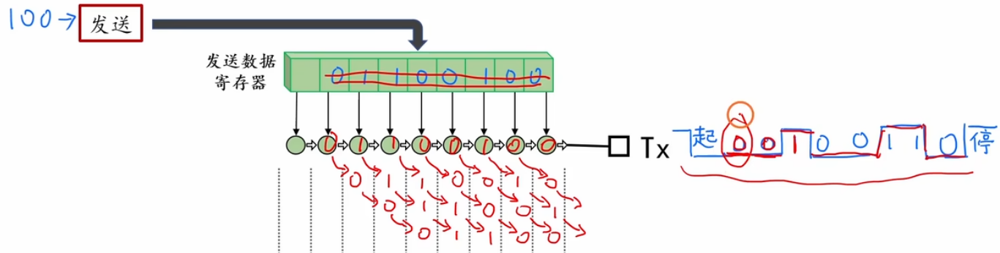
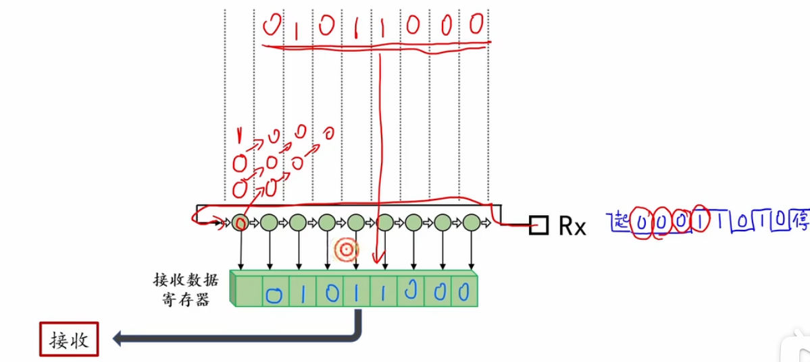
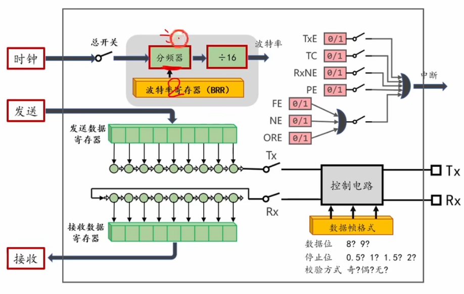
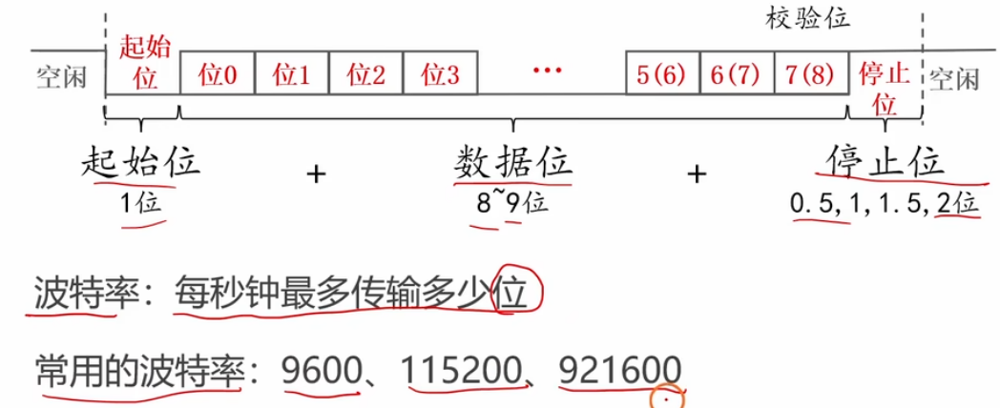
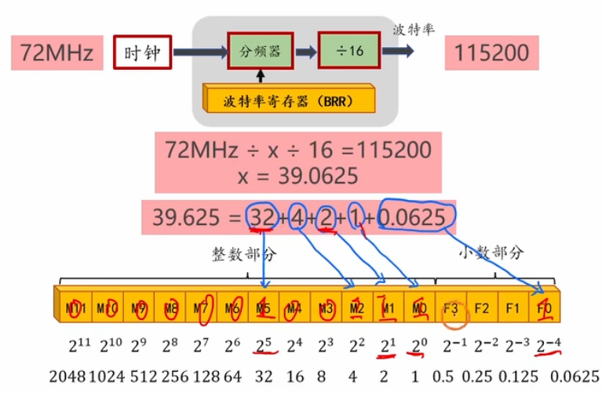

# 3.2 [串口]UART模块的使用方法

## 1. USART模块简介==嘴巴与耳朵==
**USART** (Universal Synchronous/Asynchronous Receiver/Transmitter) 即通用同步/异步收发器。
*   **资源分布**：STM32F103通常包含3个USART资源（USART1、USART2、USART3）和2个UART资源（UART4、UART5）。
*   **总线挂载**：
    *   **USART1** 挂载在 **APB2** 总线上（高速总线，==最高72MHz==）。
    *   **USART2, USART3** 挂载在 **APB1** 总线上（低速总线，最高36MHz）。
*   **功能特点**：
    *   支持全双工通信（由于有独立的TX和RX数据通道）。
    *   支持异步通信（UART模式，最常用，无需时钟线）。
    *   支持同步通信（SCLK时钟输出，较少用）。
    *   内置波特率发生器，支持精准的波特率控制。
    *   具有硬件流控制（RTS/CTS，可选）。

## 2. USART的基本用法（==转变数据帧格式==）
在异步通信（UART）模式下，USART主要用于==点对点通信==。
*   **硬件连接**：
    *   **TX (Transmit)**：发送数据脚，连接对端的 RX。
    *   **RX (Receive)**：接收数据脚，连接对端的 TX。
    *   **GND**：通信双方必须共地。
*   **电平标准**：STM32的引脚为TTL电平（0V/3.3V），如果连接电脑USB需通过USB转TTL模块（如CH340）；如果连接RS232设备需通过MAX232进行电平转换。


## 3. 移位寄存器和串并转换
USART底层工作的核心在于==**移位寄存器**==，它负责将CPU处理的==**并行数据**==与通信线路上的==**串行数据**==进行相互转换。

*   **发送过程 (==并 -> 串==)**：
    1.  CPU 将数据写入 **TDR (Transmit Data Register)**。
    2.  硬件检测到 **发送移位寄存器** 空闲时，自动将 TDR 的数据一次性转运到发送移位寄存器（此时 TXE 标志置1，表示 TDR 空，可以写入下一个数据）。
    3.  发送移位寄存器在波特率时钟的驱动下，将数据一位一位地向右移出到 TX 引脚（低位先行）。

*   **接收过程 (==串 -> 并==)**：
    1.  RX 引脚探测到==起始位==，开始接收数据。
    2.  数据在波特率时钟驱动下，一位一位地进入 **接收移位寄存器**。
    3.  当接收完一帧数据（如8位）后，硬件自动将数据整体转运到 **RDR (Receive Data Register)**（此时 RXNE 标志置1，表示 RDR 非空，CPU可以读取）。

> **双缓冲机制**：STM32的 DR 寄存器在硬件上对应 TDR 和 RDR 两个物理寄存器。发送时写入的是 TDR，接收时读取的是 RDR。这种机制允许在发送/接收当前数据的同时，CPU准备下一个数据或读取上一个数据，提高了效率。


## 4. 数据帧格式的设置方法
通过结构体 `USART_InitTypeDef` 进行配置：
*   **起始位**：固定为==1位逻辑0==（硬件自动处理，无需配置）。
*   **数据位 (WordLength)**：
    *   `USART_WordLength_8b`：==8位数据位==（最常用）。
    *   `USART_WordLength_9b`：9位数据位（通常用于带==奇偶校验==的情况，或者多机通信）。
*   **校验位 (Parity)**：
    *   `USART_Parity_No`：无校验（最常用）。
    *   `USART_Parity_Odd`：奇校验。
    *   `USART_Parity_Even`：偶校验。
    *   *注意：开启校验位时，通常需要将 WordLength 设置为 9b，因为校验位会占用最高位。*
*   **停止位 (StopBits)**：
    *   `USART_StopBits_1`：1位停止位（最常用）。
    *   `USART_StopBits_2`：2位停止位。



## 5. 波特率的设置方法
*   **概念**：波特率（Baud Rate）决定了数据传输的速率，单位是 bps (bit per second)。
*   **配置**：通过结构体成员 `USART_BaudRate` 直接赋值，例如 `9600`、`115200`。
*   **原理**：STM32内部根据总线时钟（PCLK2或PCLK1）和设置的波特率，自动计算分频系数写入 **BRR (Baud Rate Register)**。
    *   计算公式：$Tx/Rx baud = \frac{f_{PCLK}}{16 \times USARTDIV}$

## 6. 编程接口
参考标准库配置流程，通常封装为 `Serial_Init` 函数。

### 6.1 初始化代码示例
```c
#include "stm32f10x.h"

void Serial_Init(void)
{
    // 1. 开启时钟
    // USART1 在 APB2，GPIOA 也在 APB2
    RCC_APB2PeriphClockCmd(RCC_APB2Periph_USART1, ENABLE);
    RCC_APB2PeriphClockCmd(RCC_APB2Periph_GPIOA, ENABLE);
    
    // 2. 配置 GPIO
    GPIO_InitTypeDef GPIO_InitStructure;
    
    // TX 引脚 (PA9): 复用推挽输出 (AF_PP)
    // 只有配置为复用推挽，引脚控制权才交给片上外设 USART
    GPIO_InitStructure.GPIO_Mode = GPIO_Mode_AF_PP;
    GPIO_InitStructure.GPIO_Pin = GPIO_Pin_9;
    GPIO_InitStructure.GPIO_Speed = GPIO_Speed_50MHz;
    GPIO_Init(GPIOA, &GPIO_InitStructure);
    
    // RX 引脚 (PA10): 浮空输入 (IN_FLOATING) 或 上拉输入 (IPU)
    GPIO_InitStructure.GPIO_Mode = GPIO_Mode_IPU; 
    GPIO_InitStructure.GPIO_Pin = GPIO_Pin_10;
    GPIO_InitStructure.GPIO_Speed = GPIO_Speed_50MHz;
    GPIO_Init(GPIOA, &GPIO_InitStructure);
    
    // 3. 配置 USART
    USART_InitTypeDef USART_InitStructure;
    USART_InitStructure.USART_BaudRate = 9600;                // 波特率
    USART_InitStructure.USART_HardwareFlowControl = USART_HardwareFlowControl_None; // 无流控
    USART_InitStructure.USART_Mode = USART_Mode_Tx | USART_Mode_Rx; // 发送+接收模式
    USART_InitStructure.USART_Parity = USART_Parity_No;       // 无校验
    USART_InitStructure.USART_StopBits = USART_StopBits_1;    // 1位停止位
    USART_InitStructure.USART_WordLength = USART_WordLength_8b; // 8位字长
    USART_Init(USART1, &USART_InitStructure);
    
    // 4. 使能 USART
    USART_Cmd(USART1, ENABLE);
}
```

### 6.2 发送数据函数
```c
// 发送一个字节
void Serial_SendByte(uint8_t Byte)
{
    USART_SendData(USART1, Byte); // 写入 TDR
    // 等待发送数据寄存器为空 (TXE=1)，表示数据已转入移位寄存器，可以写入下一个
    while (USART_GetFlagStatus(USART1, USART_FLAG_TXE) == RESET);
}

// 发送数组
void Serial_SendArray(uint8_t *Array, uint16_t Length)
{
    uint16_t i;
    for (i = 0; i < Length; i ++)
    {
        Serial_SendByte(Array[i]);
    }
}

// 发送字符串
void Serial_SendString(char *String)
{
    uint8_t i;
    for (i = 0; String[i] != '\0'; i ++)
    {
        Serial_SendByte(String[i]);
    }
}
```

### 6.3 接收数据函数（查询法）
```c
// 在主循环中检查标志位
if (USART_GetFlagStatus(USART1, USART_FLAG_RXNE) == SET) // RXNE=1 表示收到数据
{
    uint8_t RxData = USART_ReceiveData(USART1); // 读取 RDR，同时会自动清除 RXNE 标志
    // 处理 RxData...
}
```