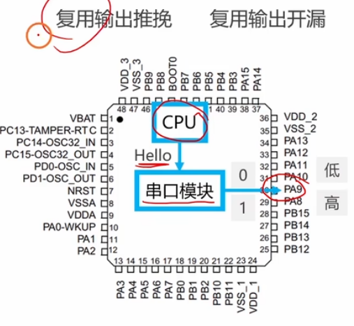
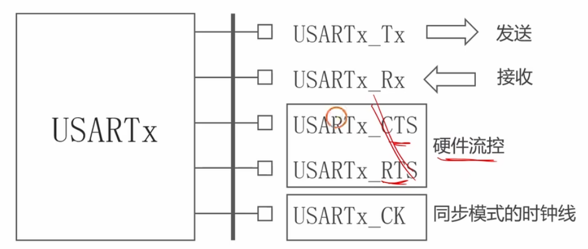
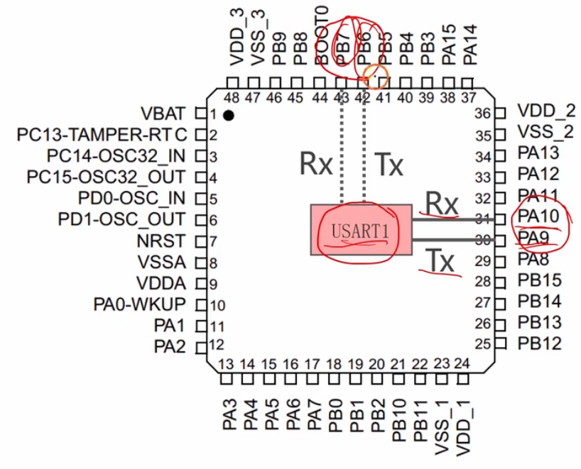
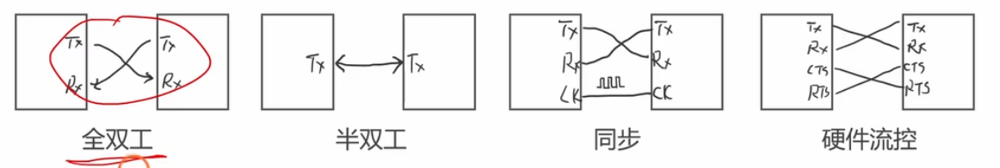

# 3.3 [串口]为串口初始化IO引脚

## 1. USART 模块有哪些引脚
一个标准的 USART 外设通常包含以下几个引脚，但在最常用的**异步串行通信 (UART)** 模式下，我们只需要关注 TX 和 RX。

*   ==**TX ==(Transmit Data Output)**: 发送数据输出引脚。
*   ==**RX== (Receive Data Input)**: 接收数据输入引脚。
*   **SW_RX**: 数据接收引脚 (单线模式)，属于内部引脚，不常对外使用。
*   **nRTS (Request To Send)**: 请求发送，用于硬件流控制。
*   **nCTS (Clear To Send)**: 清除发送，用于硬件流控制。
*   ==**CK (Clock)**==: 发送时钟输出，用于同步模式 (SmartCard 等)。

## 2. 引脚分布表 (默认复用功能)
在 STM32F103 系列中，USART 的默认引脚分布如下表所示。使用这些引脚时，无需开启 AFIO 时钟，也无需配置重映射。

| 外设 | TX | RX | CTS | RTS | CK | 总线时钟 |
| :--- | :--- | :--- | :--- | :--- | :--- | :--- |
| **USART1** | **PA9** | **PA10** | PA11 | PA12 | PA8 | **APB2** (72M) |
| **USART2** | **PA2** | **PA3** | PA0 | PA1 | PA4 | **APB1** (36M) |
| **USART3** | **PB10** | **PB11** | PB13 | PB14 | PB12 | **APB1** (36M) |

## 3. 重映射表 (Remap)
当默认引脚被其他外设占用时，可以通过**端口重映射 (Remap)** 功能将 ==USART 的信号映射到其他 GPIO== 上。使用重映射功能**必须开启== AFIO 时钟**。==

| 外设         | 重映射类型     | TX       | RX       | CTS  | RTS  | CK   |
| :--------- | :-------- | :------- | :------- | :--- | :--- | :--- |
| **USART1** | **完全重映射** | **PB6**  | **PB7**  | -    | -    | -    |
| **USART2** | **完全重映射** | **PD5**  | **PD6**  | PD3  | PD4  | PD7  |
| **USART3** | **部分重映射** | **PC10** | **PC11** | PB13 | PB14 | PC12 |
| **USART3** | **完全重映射** | **PD8**  | **PD9**  | PD11 | PD12 | PD10 |
|            |           |          |          |      |      |      |
|            |           |          |          |      |      |      |

> *注：STM32F103C8T6 (小容量/中容量) 可能不完全支持所有重映射，具体请查阅数据手册。例如 PD 端口在 48 脚封装的 C8T6 上是不存在的。*

## 4. IO 配置表
在初始化 GPIO 时，需要根据引脚的功能选择正确的 `GPIO_Mode`。

| 串口模式 | GPIO配置 (TX 引脚) | GPIO配置 (RX 引脚) |
| :--- | :--- | :--- |
| **全双工 (常用)** | **复用推挽输出 (AF_PP)** | **浮空输入 (IN_FLOATING) / 上拉输入 (IPU)** |
| 半双工 | 复用开漏输出 (AF_OD) | (不使用) |
| 硬件流控制 | 复用推挽输出 (AF_PP) | (不使用) |

## 5. 编写代码 (默认: PA9, PA10)
这是最常见的使用方式，使用 USART1 的默认引脚。

```c
#include "stm32f10x.h"

void Serial_Init_Default(void)
{
    // 1. 开启时钟
    // USART1 和 GPIOA 都在 APB2 总线上
    RCC_APB2PeriphClockCmd(RCC_APB2Periph_USART1 | RCC_APB2Periph_GPIOA, ENABLE);
    
    GPIO_InitTypeDef GPIO_InitStructure;
    
    // 2. 配置 TX 引脚 (PA9) -> 复用推挽输出
    GPIO_InitStructure.GPIO_Pin = GPIO_Pin_9;
    GPIO_InitStructure.GPIO_Speed = GPIO_Speed_50MHz;
    GPIO_InitStructure.GPIO_Mode = GPIO_Mode_AF_PP; 
    GPIO_Init(GPIOA, &GPIO_InitStructure);
    
    // 3. 配置 RX 引脚 (PA10) -> 浮空输入或上拉输入
    GPIO_InitStructure.GPIO_Pin = GPIO_Pin_10;
    GPIO_InitStructure.GPIO_Mode = GPIO_Mode_IPU; // 推荐上拉
    GPIO_Init(GPIOA, &GPIO_InitStructure);
    
    // 4. USART 参数配置 (省略，详见上一节)
}
```

## 6. 编写代码 (重映射: PB6, PB7)
当 PA9/PA10 被占用时，我们可以将 USART1 重映射到 PB6/PB7。
**关键步骤**：
1.  开启 **GPIOB** 时钟（新引脚所在端口）。
2.  开启 **USART1** 时钟。
3.  **开启 AFIO 时钟**（重映射必须步骤）。
4.  调用 `GPIO_PinRemapConfig` 进行重映射。

```c
#include "stm32f10x.h"

void Serial_Init_Remap(void)
{
    // 1. 开启时钟
    // GPIOB, USART1, AFIO 都在 APB2
    RCC_APB2PeriphClockCmd(RCC_APB2Periph_GPIOB, ENABLE);  // 开启 GPIOB 时钟
    RCC_APB2PeriphClockCmd(RCC_APB2Periph_USART1, ENABLE); // 开启 USART1 时钟
    RCC_APB2PeriphClockCmd(RCC_APB2Periph_AFIO, ENABLE);   // 【关键】开启 AFIO 时钟
    
    // 2. 配置重映射
    // 将 USART1 映射到 PB6, PB7
    GPIO_PinRemapConfig(GPIO_Remap_USART1, ENABLE);
    
    GPIO_InitTypeDef GPIO_InitStructure;
    
    // 3. 配置 TX 引脚 (PB6) -> 复用推挽输出
    // 注意：这里是对 GPIOB 进行操作
    GPIO_InitStructure.GPIO_Pin = GPIO_Pin_6;
    GPIO_InitStructure.GPIO_Speed = GPIO_Speed_50MHz;
    GPIO_InitStructure.GPIO_Mode = GPIO_Mode_AF_PP; 
    GPIO_Init(GPIOB, &GPIO_InitStructure);
    
    // 4. 配置 RX 引脚 (PB7) -> 浮空输入或上拉输入
    GPIO_InitStructure.GPIO_Pin = GPIO_Pin_7;
    GPIO_InitStructure.GPIO_Mode = GPIO_Mode_IPU; 
    GPIO_Init(GPIOB, &GPIO_InitStructure);
    
    // 5. USART 参数配置 (同上，USART 外设本身配置不变，只是引脚变了)
}
```
