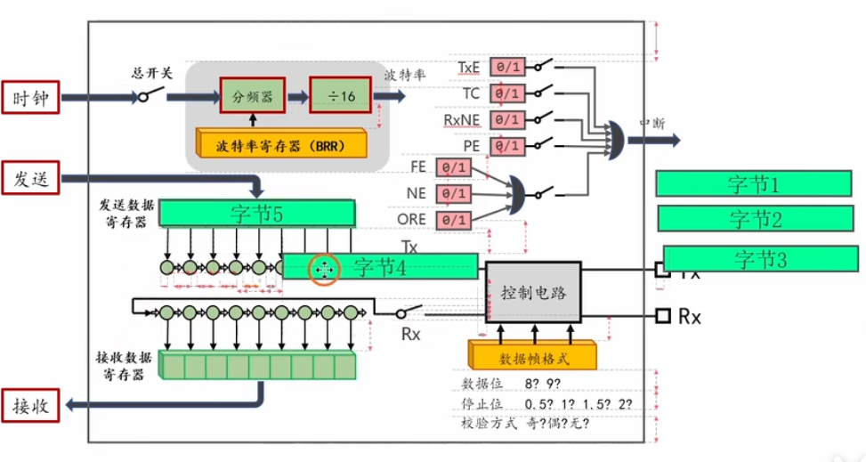
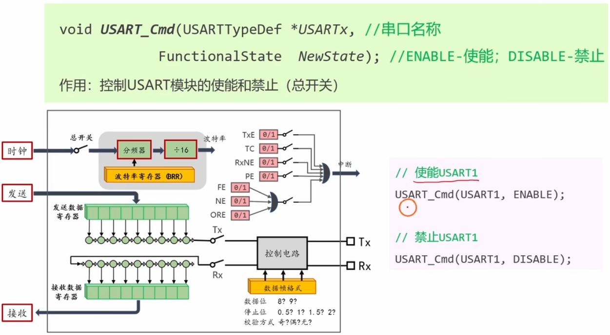

# 3.4 [串口]发送数据


## 1. 回顾串口数据发送的过程
STM32 的串口发送不仅仅是“代码写入数据”那么简单，底层硬件经历了两个缓冲阶段，这对于理解标志位至关重要。

1.  **CPU 写入**：代码调用 `USART_SendData`，将数据写入 **DR (Data Register)**。虽然软件上看到的是 DR，硬件内部实际是写入了 **TDR (Transmit Data Register)**。
2.  **转运 (TDR -> 移位寄存器)**：
    *   串口控制器检查 **发送移位寄存器** 是否空闲。
    *   如果空闲，数据瞬间从 TDR 并行“掉入”移位寄存器。
    *   **关键点**：一旦数据离开 TDR，TDR 就变空了，**TXE (Transmit Empty)** 标志位立即置 1。此时移位寄存器正在忙着发送数据，但 TDR 已经准备好接收下一个字节了。
3.  **串行移位发送**：
    *   移位寄存器在波特率时钟驱动下，将数据一位一位地推送到 TX 引脚。
    *   当最后一位停止位发送完毕，如果此时 TDR 也是空的，说明所有数据都发完了，**TC (Transmission Complete)** 标志位置 1。

## 2. TXE 标志位 (Transmit Data Register Empty)
*   **含义**：发送数据寄存器空。
*   **作用**：==1==表示“==当前可以写入下一个数据了==”。
*   **置位时刻**：TDR 中的数据被硬件转移到移位寄存器时。当TDR空时，TxE=1;否则TxE-0
*   **清除方法**：写入 `USART_DR` 寄存器会自动清除该标志。
*   **应用场景**：**连续发送数据**。为了追求最高的发送效率，我们不需要等待数据在物理线上发完，只要 TDR 空了，就立马填入下一个。这就是为什么 `Serial_SendByte` 中等待的是 TXE 而不是 TC。

## 3. TC 标志位 (Transmission Complete)
*   **含义**：==发送完成==（物理层面上）。
*   **作用**：表示“==所有数据都已经从引脚上发出去了==”。
*   **置位时刻**：==发送移位寄存器发送完成，**并且** TDR 也是空的==。
*   **清除方法**：先读 SR，再写 DR；或者软件手动清除。
*   **应用场景**：
    *   **RS485 通信**：在发送完数据后需要切换回接收模式。如果只等待 TXE 就切换，最后一位数据可能还在移位寄存器里没发出去就被截断了。必须等待 TC 才能切换。
    *   **进入休眠**：在关闭串口时钟或进入低功耗模式前，必须等待 TC，确保数据发完。

## 4. 编程接口
使用标准库函数进行操作。

*   **发送数据**：
    ```c
    void USART_SendData(USART_TypeDef* USARTx, uint16_t Data);
    ```
*   **获取标志位状态**：
    ```c
    FlagStatus USART_GetFlagStatus(USART_TypeDef* USARTx, uint16_t USART_FLAG);
    ```
    *   `USART_FLAG_TXE`: 发送数据寄存器空标志。
    *   `USART_FLAG_TC`: 发送完成标志。

## 5. 编写代码

### 5.1 发送一个字节 (Serial_SendByte)
这是最基础的函数，后续函数都依赖它。
```c
void Serial_SendByte(uint8_t Byte)
{
    USART_SendData(USART1, Byte); // 将数据写入 TDR
    
    // 等待 TDR 为空 (TXE=1)，表示数据已放入移位寄存器，TDR 可写入新数据
    // 如果不等待，连续调用会导致前一个数据还没转移走就被覆盖
    while (USART_GetFlagStatus(USART1, USART_FLAG_TXE) == RESET);
}
```

### 5.2 发送数组 (Serial_SendArray)
用于发送原始的二进制数据流。
```c
void Serial_SendArray(uint8_t *Array, uint16_t Length)
{
    uint16_t i;
    for (i = 0; i < Length; i ++)
    {
        Serial_SendByte(Array[i]);
    }
}
```

### 5.3 发送字符串 (Serial_SendString)
C语言字符串以 `'\0'` 结尾，利用这一特性进行遍历。
```c
void Serial_SendString(char *String)
{
    uint8_t i;
    for (i = 0; String[i] != '\0'; i ++)
    {
        Serial_SendByte(String[i]);
    }
}
```

### 5.4 发送数字 (Serial_SendNumber)
将数字转换成字符串形式发送（简易版，不支持负数，建议后续移植 `printf`）。
```c
// 这里的 Pow 是简单的整数幂函数，需自己实现或包含 math.h
uint32_t Serial_Pow(uint32_t X, uint32_t Y)
{
    uint32_t Result = 1;
    while (Y --) Result *= X;
    return Result;
}

void Serial_SendNumber(uint32_t Number, uint8_t Length)
{
    uint8_t i;
    for (i = 0; i < Length; i ++)
    {
        // 依次取出最高位到最低位对应的数字字符
        Serial_SendByte(Number / Serial_Pow(10, Length - i - 1) % 10 + '0');
    }
}
```