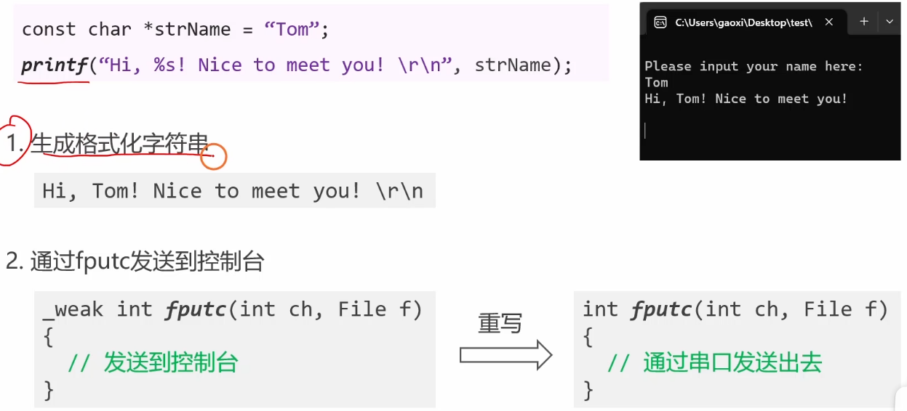
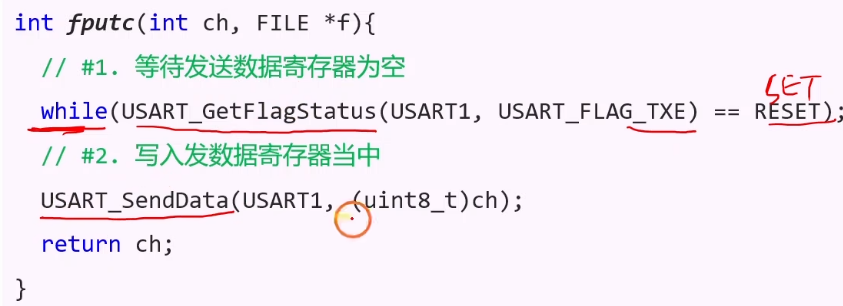
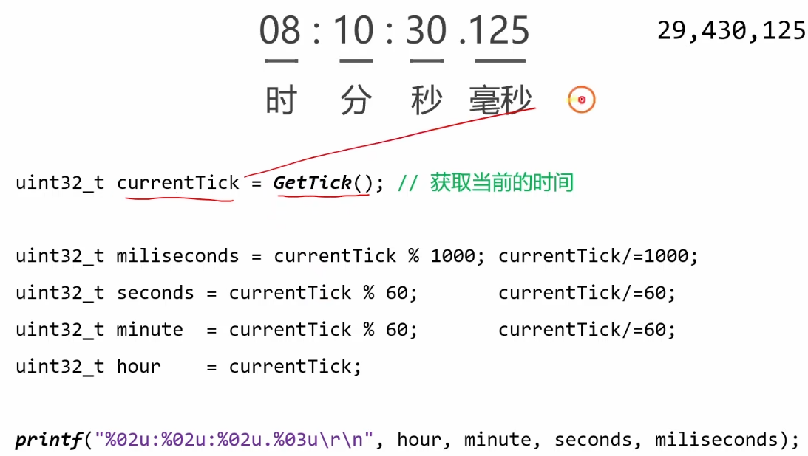

# 3.5 [串口]格式化打印字符串

## 1. 给工程重命名
为了保持工程结构的清晰，每进行一个新的实验，建议将旧工程复制一份并重命名，保留历史记录。
1.  **复制文件夹**：将上节课的工程文件夹（例如 `3-4 Serial_Send`）复制一份。
2.  **重命名**：将其重命名为 `3-5 Serial_Printf`。
3.  **清理中间文件**：进入工程目录，==删除 `Listing` 和 `Objects` 文件夹==。这些是编译产生的中间文件，删除后可以减小体积，且不影响工程打开（重新编译会自动生成）。
4.  **修改工程名**：打开 Keil 工程，点击 "Manage Project Items" (品字形图标)，也可以修改 Project Targets 名称，但这步不是必须的，主要为了美观。

## 2. 整理之前的代码 (封装 Serial 模块)
为了方便后续移植和调用，我们将串口相关的代码封装成独立的模块 `Serial.c` 和 `Serial.h`。

### 2.1 Serial.h
```c
#ifndef __SERIAL_H
#define __SERIAL_H

#include <stdio.h> // 引入标准IO库以支持 printf

void Serial_Init(void);
void Serial_SendByte(uint8_t Byte);
void Serial_SendArray(uint8_t *Array, uint16_t Length);
void Serial_SendString(char *String);
void Serial_SendNumber(uint32_t Number, uint8_t Length);
void Serial_Printf(char *format, ...); // 自定义封装的 printf

#endif
```

### 2.2 Serial.c
```c
#include "stm32f10x.h"
#include "Serial.h"
#include <stdarg.h> //用于处理变长参数

/**
  * @brief  串口初始化
  * @param  无
  * @retval 无
  */
void Serial_Init(void)
{
    // ... (初始化代码保持不变，开启时钟、配置GPIO、配置USART) ...
}

/**
  * @brief  发送一个字节
  * @param  Byte 要发送的字节数据
  * @retval 无
  */
void Serial_SendByte(uint8_t Byte)
{
    USART_SendData(USART1, Byte);
    while (USART_GetFlagStatus(USART1, USART_FLAG_TXE) == RESET);
}

// ... (其他 Serial_SendArray, Serial_SendString, Serial_SendNumber 实现同上节课) ...
```

## 3. 格式化字符串的编程原理
在 C 语言中，`printf` 是一个极其强大的函数，它可以将各种类型的数据（整数、浮点数、字符等）按照指定的格式转换成一串字符流。

*   **标准库的工作方式**：`printf` 处理完格式化后，最终需要将产生的每一个字符输出到某个地方。在 PC 上，是输出到控制台/屏幕。
*   **重定向 (Redirection)**：在嵌入式系统中，没有屏幕。C 语言标准库（Standard Library）设计了一个底层接口函数 `fputc` (File Put Character)。`printf` 的每生成一个字符，都会调用一次 `fputc`。
*   **我们的任务**：**重写 `fputc` 函数**。只要我们在代码中定义了这个函数，并将==字符通过串口发送出去== (`Serial_SendByte`)，`printf` 就会自动把格式化好的字符串通过串口发出来。

## 4. 重写 fputc 函数 (方法一：MicroLIB)
这是最简单常用的方法。MicroLIB 是 Keil 为嵌入式系统优化的精简 C 库。

### 4.1 代码实现
在 `Serial.c` 或 `main.c` 中添加以下代码（建议放在 `Serial.c` 底部，并包含 `<stdio.h>`）：

```c
/* 重写 fputc 函数，printf 会调用此函数 */
int fputc(int ch, FILE *f)
{
    Serial_SendByte(ch); // 将字符发送到串口
    return ch;           // 返回发送的字符
}
```

### 4.2 关键设置
**必须**在 Keil 中勾选 "Use MicroLIB"：
1.  点击 "Options for Target" (魔术棒图标)。
2.  选择 **Target** 选项卡。
3.  勾选 **Use MicroLIB**。
4.  重新编译工程。
    *如果不勾选，程序可能会卡死在半路，无法运行。*

### 4.3 使用方法
在 `main.c` 中：
```c
#include "Serial.h" // 包含 stdio.h 的头文件

int main(void)
{
    Serial_Init();
    
    printf("Hello STM32!\r\n");
    int num = 666;
    printf("Number = %d\r\n", num);
    
    while(1);
}
```

## 5. 格式化==时间字符串== (方法二：sprintf)
如果不使用 MicroLIB，或者想把格式化后的字符串存起来而不是直接打印，可以使用 `sprintf`。
`sprintf` (String Print F) 不直接打印，而是将结果“打印”到一个字符数组（String Buffer）中。

### 5.1 场景：打印时间
假设我们有一个时钟变量，需要显示 `HH:MM:SS` 的格式。

```c
char StringBuf[100]; // 定义一个足够大的缓冲区
uint8_t Hour = 12, Min = 30, Sec = 5;

// %02d 表示：输出整数，不足2位时在前面补0
sprintf(StringBuf, "Time: %02d:%02d:%02d\r\n", Hour, Min, Sec);

Serial_SendString(StringBuf); // 将生成好的字符串一次性发送
```
*   **输出结果**：`Time: 12:30:05`
*   **优点**：灵活，不依赖 MicroLIB，可以对生成的字符串做进一步处理（如显示到 OLED 屏幕）。
*   **缺点**：需要手动定义缓冲区，且不能像 `printf` 那样一行代码搞定输出。

## 6. (进阶) 封装 Serial_Printf
结合 `sprintf` 和可变参数列表 (`stdarg.h`)，我们可以自己封装一个类似 `printf` 但直接定向到串口的函数，既不需要 MicroLIB，也不用每次手动写 buffer。

```c
#include <stdarg.h>

void Serial_Printf(char *format, ...)
{
    char String[100]; // 局部缓冲区
    va_list arg;
    va_start(arg, format);
    vsprintf(String, format, arg); // 核心：使用 vsprintf 处理变长参数
    va_end(arg);
    
    Serial_SendString(String);
}
```
**调用**：
```c
Serial_Printf("Vol: %.2f V\r\n", 3.3);
```

