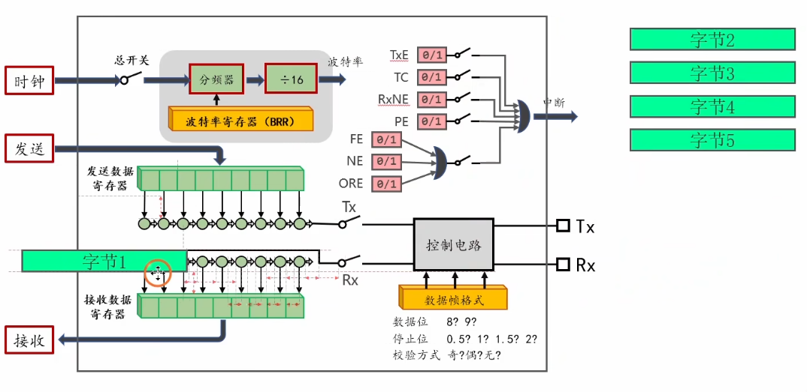
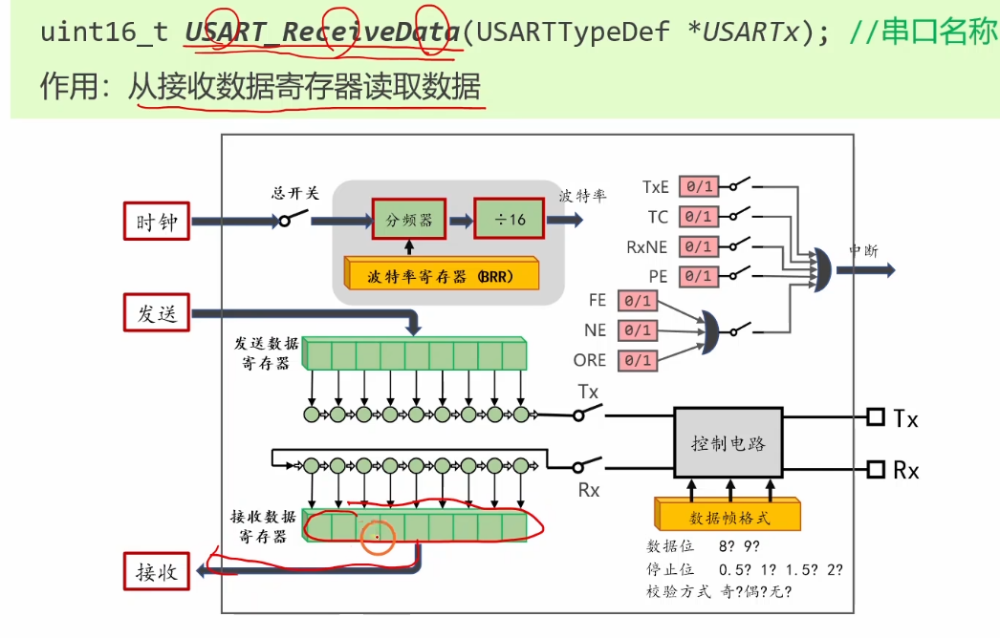
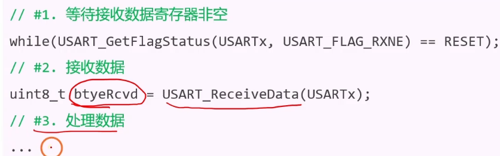

# 3.6 [串口]接收数据

## 1. 回顾接收数据的过程
与发送过程类似，STM32 的接收也是通过两级缓冲实现的：
1.  **物理接收**：外部 RX 引脚上的信号进入 ==**接收移位寄存器**==。
2.  **串行转并行**：硬件按照波特率时钟，一位一位地将信号移入移位寄存器。
3.  **转运 (移位寄存器 -> RDR)**：
    *   当一帧数据（8位或9位）接收完毕（检测到停止位）时。
    *   硬件将移位寄存器中的数据一次性“并行”转移到 **RDR (Receive Data Register)**。
    *   **关键点**：数据转移完成后，硬件自动将 **RXNE (Receive Data Register Not Empty)** 标志位置 1。
    *   *注：发送时的寄存器叫 TDR，接收时叫 RDR。在软件上它们共用同一个地址 `DR`，读操作读的是 RDR，写操作写的是 TDR。*

## 2. RxNE 标志位 (Receive Data Register ==Not Empty==)
*   **含义**：接收数据寄存器==非空==。=1；
*   **作用**：告诉 CPU “==数据到了，快来读==”。
*   **置位时刻**：移位寄存器把数据转运到 RDR 时。
*   **清除方法**：
    1.  **读数据**：软件调用 `USART_ReceiveData(USART1)` 读取 DR 寄存器时，硬件自动清除 RXNE。
    2.  **手动清除**：调用 `USART_ClearFlag` (不常用，因为读数据就顺便清了)。

## 3. 接收代码的编写方法
接收数据主要有两种方式：**查询法** 和 **中断法**。

### 3.1 查询法 (Polling)
在主循环 `while(1)` 中不断死循环检查 RXNE 标志位。
*   **优点**：代码简单，逻辑直观。
*   **缺点**：
    *   CPU 占用率极高（一直在空转查询）。
    *   实时性差：如果 CPU 在处理其他耗时任务（如 Delay），数据来了可能没及时去读。
    *   **数据覆盖风险**：如果前一个数据还没读走，后一个数据又来了，会导致“溢出错误”，前一个数据丢失。

```
// 在 main.c 的 while(1) 中
if (USART_GetFlagStatus(USART1, USART_FLAG_RXNE) == SET)
{
    uint8_t RxData = USART_ReceiveData(USART1); // 读取数据，同时自动清除 RXNE
    // 在这里处理 RxData
}
```
### 3.2 中断法 (Interrupt) - 推荐
配置 NVIC，当 RXNE 置 1 时，硬件自动打断主程序，跳转到中断服务函数 (ISR) 执行读取操作。
*   **优点**：CPU 可以专心做别的事，数据来了才处理，实时性高。

**配置步骤**：
1.  **开启中断**：在串口初始化代码中，开启 RXNE 中断。
    ```c
    USART_ITConfig(USART1, USART_IT_RXNE, ENABLE);
    ```
2.  **配置 NVIC**：配置优先级组，设置 USART1 的通道优先级并使能。
    ```c
    NVIC_InitTypeDef NVIC_InitStructure;
    NVIC_InitStructure.NVIC_IRQChannel = USART1_IRQn;
    NVIC_InitStructure.NVIC_IRQChannelPreemptionPriority = 1;
    NVIC_InitStructure.NVIC_IRQChannelSubPriority = 1;
    NVIC_InitStructure.NVIC_IRQChannelCmd = ENABLE;
    NVIC_Init(&NVIC_InitStructure);
    ```
3.  **编写中断服务函数**：
    ```c
    void USART1_IRQHandler(void)
    {
        // 再次检查标志位，确保是 RXNE 触发的中断
        if (USART_GetITStatus(USART1, USART_IT_RXNE) == SET)
        {
            uint8_t RxData = USART_ReceiveData(USART1); // 关键：读取数据清除标志位
            
            // 可以在这里处理数据，或者把数据存到缓冲区供主循环处理
            // Serial_RxPacket(RxData); 
            
            // 既然读了数据，RXNE 就自动清零了，通常不需要手动 ClearITPendingBit
            // 但为了保险或特定逻辑，手动清除也可以：
            USART_ClearITPendingBit(USART1, USART_IT_RXNE);
        }
    }
    ```

## 4. 使用串口控制 LED
这是一个经典的交互实验：电脑通过串口助手发送命令，STM32 接收并控制 LED。

**功能定义**：
*   发送字符 `'1'` -> LED 点亮
*   发送字符 `'0'` -> LED 熄灭

**代码实现 (中断法)**：
```c
// 假设 LED 连接在 PA1，低电平点亮

void USART1_IRQHandler(void)
{
    if (USART_GetITStatus(USART1, USART_IT_RXNE) == SET)
    {
        uint8_t RxData = USART_ReceiveData(USART1);
        
        if (RxData == '1')
        {
            GPIO_ResetBits(GPIOA, GPIO_Pin_1); // LED ON
            Serial_SendString("LED ON OK\r\n"); // 回显状态
        }
        else if (RxData == '0')
        {
            GPIO_SetBits(GPIOA, GPIO_Pin_1);   // LED OFF
            Serial_SendString("LED OFF OK\r\n");
        }
        
        USART_ClearITPendingBit(USART1, USART_IT_RXNE);
    }
}
```

## 5. 错误标志位
在接收过程中，最常见的错误是 **ORE (Overrun Error, 溢出错误)**。

*   **产生原因**：RDR 里已经有一个数据了（RXNE=1），CPU 还没来得及读走，此时移位寄存器里的下一个数据又接收完了，准备往 RDR 里转运。
*   **后果**：硬件为了保护 RDR 里没读走的数据，会丢弃移位寄存器里的新数据。RDR 里的旧数据保留。同时 **ORE** 标志位置 1。
*   **影响**：一旦 ORE 置位，如果不及时清除，后续的接收中断可能会受到影响（部分型号会持续触发中断或无法触发）。
*   **清除方法**：
    1.  读取 `USART_SR` (状态寄存器)。
    2.  读取 `USART_DR` (数据寄存器)。
    *顺序执行这两步读操作，即可清除 ORE 标志。*

