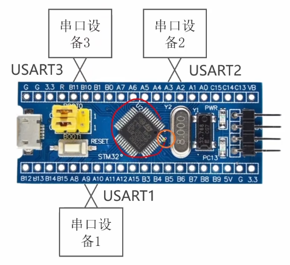

# 4.1 [I2C]基本电路结构

## 1. 串口的缺点与 I2C 的引入

在之前的课程中，我们学习了串口 (UART)。虽然它简单好用，但在复杂的嵌入式系统中有明显的局限性：
*   **点对点通信**：通常只能连接两个设备（一个 TX 接另一个 RX）。如果 STM32 要连接多个传感器（如陀螺仪、温湿度计、屏幕），串口就不够用了，因为引脚资源有限。
*   **缺乏寻址机制**：串口数据包中没有标准的“地址”字段，很难区分总线上挂载了哪个设备。
*   **抗干扰能力**：异步通信对波特率的精度要求高，时钟稍有偏差就可能乱码。

**I2C (Inter-Integrated Circuit)** 就是为了解决这些问题而生的。它只需要两根线，就可以挂载几十上百个设备（只要地址不冲突）。

## 2. I2C 总线的电路结构
I2C 的物理层极其简洁，所有设备都并联在两条总线上。
*   **总线拓扑**：所有设备的 SCL 引脚连在一起，SDA 引脚连在一起。
*   **设备角色**：
    *   **主机 (Master)**：掌握总线控制权，负责产生时钟信号 (SCL) 和发起通信。通常是 MCU (如 STM32)。
    *   **从机 (Slave)**：被动响应主机的命令。如 MPU6050、OLED、EEPROM 等。
*   **物理连接**：
    *   **电源**：VCC (3.3V/5V) 和 GND。
    *   **SCL (Serial Clock)**：时钟线。
    *   **SDA (Serial Data)**：数据线。

## 3. 关键硬件规范：开漏输出 + 上拉电阻
这是 I2C 最核心的硬件特征，初学者必须理解。
*   **开漏输出 (Open-Drain)**：所有连接到 I2C 总线的设备引脚（SCL 和 SDA）都必须配置为**开漏输出模式**。
    *   *回顾*：推挽输出可以输出强高电平和强低电平；而**开漏输出只能输出强低电平，无法主动输出高电平**。
*   **上拉电阻 (Pull-up Resistor)**：既然设备无法输出高电平，那么高电平从哪来？答案是外部的上拉电阻。
    *   SCL 和 SDA 线必须分别通过一个电阻（通常 4.7kΩ 或 10kΩ）连接到 VCC。

## 4. 逻辑线与 (Wired-AND)
“开漏+上拉”的结构实现了“逻辑线与”的功能：
*   **只要有一个设备**拉低了总线（输出 0，MOS 管导通接地），整条总线电压就是**低电平**。
*   **只有所有设备**都释放总线（输出 1，MOS 管截止，呈高阻态），总线才会被上拉电阻拉到**高电平**。

**这个设计的精妙之处**：
1.  **防止短路**：如果使用推挽输出，一个设备输出高，另一个输出低，电源和地直接短路，会烧毁芯片。开漏输出就不会，大家只是把线拉到地，或者断开，永远不会短路。
2.  **多主机仲裁**：如果两个主机同时想发数据，检测到线电平与自己发的不一致，就知道冲突了。

## 5. 通信原理：如何发送 0 和 1
在 I2C 硬件层面上，发送逻辑“1”和“0”的操作如下：

### 5.1 主机如何发送时钟信号 (SCL)
*   **发送低电平 (Logic 0)**：主机控制 SCL 引脚的 MOS 管**导通**，将 SCL 线强行拉低到 GND。
*   **发送高电平 (Logic 1)**：主机控制 SCL 引脚的 MOS 管**截止**（释放引脚）。此时 SCL 线处于高阻态，被外部上拉电阻拉高到 VCC。

### 5.2 主机如何发送数据 (SDA)
当主机需要向从机写入数据时：
*   **发送 Bit 0**：主机拉低 SDA 引脚。
*   **发送 Bit 1**：主机释放 SDA 引脚（由电阻拉高）。

### 5.3 从机如何发送数据 (SDA)
当主机读取数据时，主机释放 SDA 线（交出控制权），由从机控制 SDA：
*   **发送 Bit 0**：从机拉低 SDA 引脚。
*   **发送 Bit 1**：从机释放 SDA 引脚。

*注意：SCL 永远由主机控制（但在时钟延展 Clock Stretching 特殊情况下，从机可以拉低 SCL 迫使主机等待）。*

