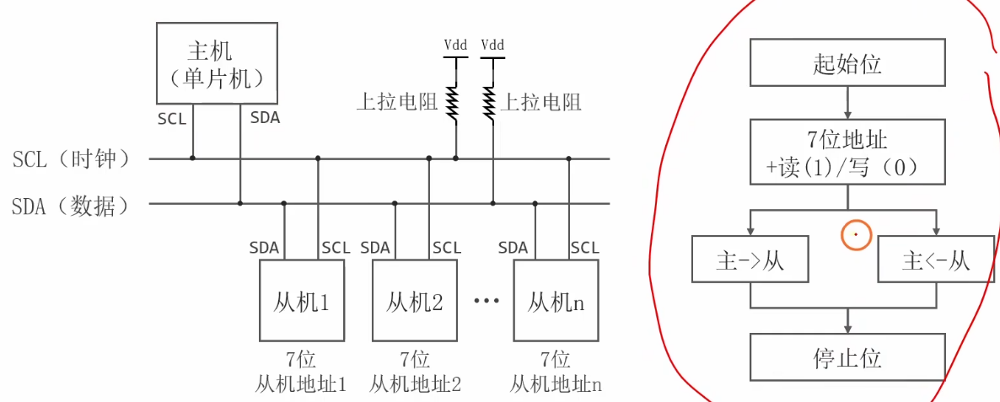
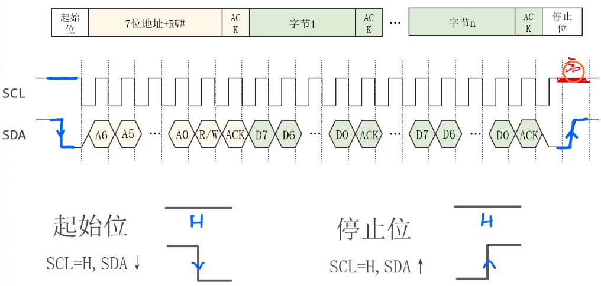
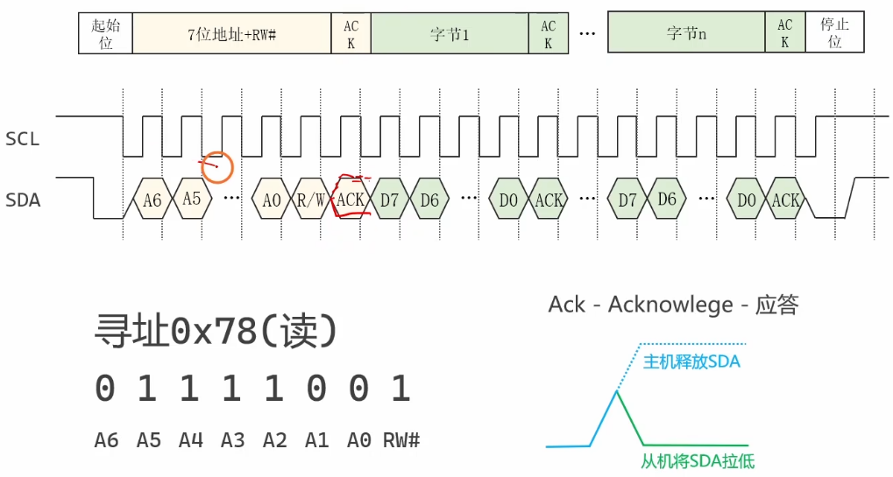

# 4.2 [I2C]通信协议

## 1. I2C 通信的基本流程
I2C 的通信就像打电话，必须遵循一套标准的“开场白”、“对话”和“挂断”流程。所有的 I2C 通信都由**主机**发起。

**基本步骤**：
1.  **空闲状态**：SCL 和 SDA 都由上拉电阻拉高，处于高电平。
2.  **开始**：主机发送一个**起始信号 (Start)**，告诉所有从机“我要说话了”。
3.  **找人 (寻址)**：主机发送它想对话的==**从机地址**和**读写方向**==。
4.  **应答**：被叫到的从机回应一个 ==**ACK**== (Acknowledge)，表示“我在”。
5.  **传输数据**：主机与从机之间交换一个或多个字节的数据。每发送一个字节，接收方都要回一个 ==ACK==。
6.  **结束**：主机发送一个**停止信号 (Stop)**，结束本次通话，释放总线。

## I2C数据帧格式

## 2. 起始位和停止位 (Start & Stop)
这两个信号是唯一不遵守“SCL 高电平期间数据稳定”规则的特殊信号，用于标志通信的开始和结束。

*   **起始条件 (Start)**：
    *   **定义**：当 ==**SCL 为高电平**期间，**SDA 从高电平切换到低电平**。==
    *   **作用**：唤醒总线上的所有设备，准备接收后续的==地址信息。==
*   **停止条件 (Stop)**：
    *   **定义**：当 **SCL 为高电平**期间，**SDA 从低电平切换到高电平**。
    *   **作用**：宣布通信结束，总线回到==空闲状态==。

## 3. 寻址 (Addressing)
I2C 总线上的每个设备都有一个唯一的地址（通常是 7 位）。
在起始信号后的**第一个字节**，必须是寻址字节。

**寻址字节格式**：`[ 从机地址(7位) ] + [ 读写位(1位) ]`

*   **从机地址 (7 Bit)**：例如 MPU6050 的地址是 `0x68` (二进制 `1101000`)。
*   **读写位 (R/W Bit)**：占据最低位 (Bit 0)。
    *   `0`：表示**主机写入数据** (Write)。
    *   `1`：表示**主机读取数据** (Read)。

*   **举例**：
    *   主机想**写** MPU6050：发送 `0xD0` (`1101000` + `0`)。
    *   主机想**读** MPU6050：发送 `0xD1` (`1101000` + `1`)。

## 4. 传输数据 (Data Transmission)
I2C 是以**字节 (8位)** 为单位进行数据传输的，**高位在前 (MSB First)**。

### 4.1 数据有效性规则
为了保证数据传输的准确性，I2C 规定：
*   **SCL 高电平期间**：SDA 线上的数据必须**保持稳定**，接收方在此时读取数据。
*   **SCL 低电平期间**：发送方才能**改变 SDA 的电平**（准备下一位数据）。

### 4.2 应答机制 (ACK/NACK)
每发送完一个字节（8位），发送方释放 SDA 线，在**第 9 个时钟周期**等待接收方的反馈。
*   **ACK (应答)**：接收方在第 9 个时钟将 SDA **拉低**。表示“我收到了，请继续”。
*   **NACK (非应答)**：接收方在第 9 个时钟让 SDA **保持高电平**。表示“没收到”或“数据传输结束，别发了”。

## 5. 通信例子 (完整时序)

### 5.1 主机向从机写入一个字节 (Write Byte)
通常用于配置寄存器。
**流程**：
1.  **Start**
2.  发送 **从机地址 + 写位(0)** -> 收到 ACK
3.  发送 **寄存器地址** -> 收到 ACK (告诉从机写哪里)
4.  发送 **数据** -> 收到 ACK
5.  **Stop**

### 5.2 主机从从机读取一个字节 (Read Byte)
读取传感器数据的标准流程（复合格式）。
**流程**：
1.  **Start**
2.  发送 **从机地址 + 写位(0)** -> 收到 ACK
3.  发送 **寄存器地址** -> 收到 ACK (先指定要读哪个寄存器)
4.  **Start** (重复起始条件，Restart)
5.  发送 **从机地址 + 读位(1)** -> 收到 ACK (现在改为读模式)
6.  接收 **数据** -> 主机发送 **NACK** (告诉从机：我读完了，别发了)
7.  **Stop**
