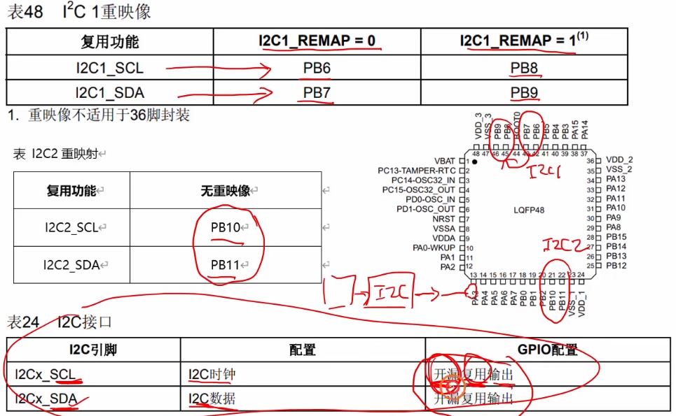
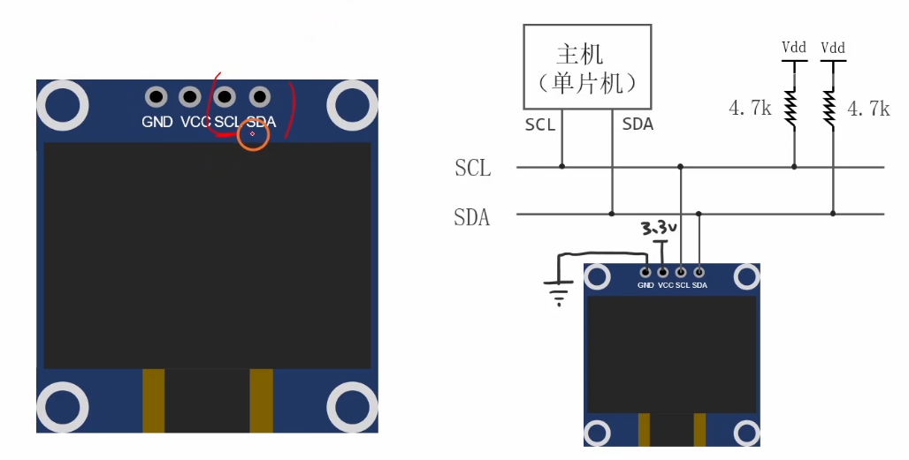
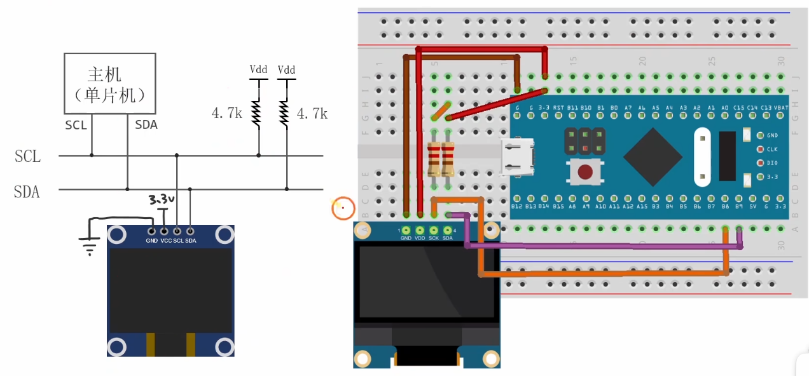
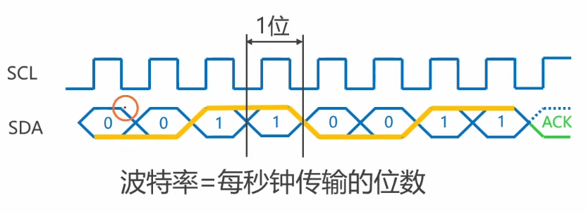
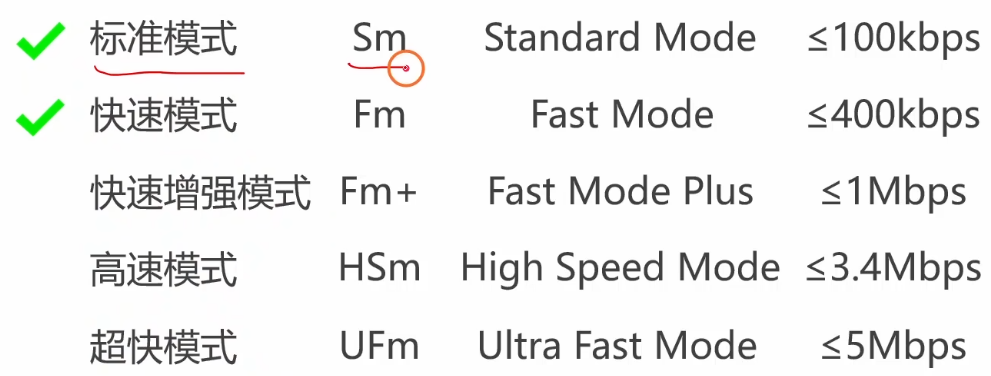
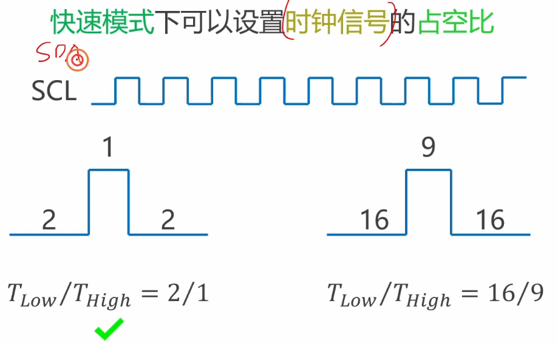
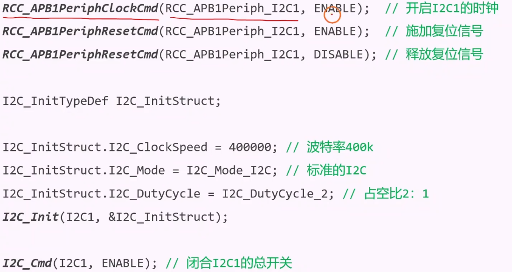
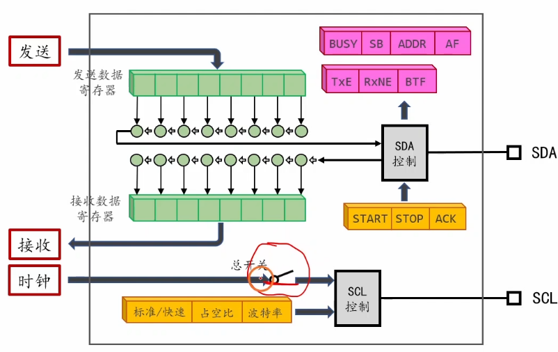

# 4.3 [I2C]I2C模块的使用方法

## 1. I2C 模块简介 (硬件 I2C)
STM32 内部集成了硬件 I2C 接口，可以自动处理 I2C 通信协议的时序（如起始位、停止位、数据收发、应答位检测等）。
*   **对比软件 I2C**：软件 I2C 需要 CPU 翻转 GPIO 模拟时序，占用 CPU 资源高；硬件 I2C 由专用电路执行，减轻 CPU 负担，速度更快更稳定。
*   **资源**：STM32F103C8T6 拥有两个 I2C 接口：`I2C1` 和 `I2C2`。
*   **功能**：
    *   支持主机模式和从机模式。
    *   支持 7 位或 10 位寻址。
    *   支持 DMA 数据传输。
    *   支持 CRC 校验。
    *   兼容 SMBus 协议。

## 2. 连接电路与引脚定义
使用硬件 I2C 必须连接到指定的 GPIO 引脚。
*   **I2C1**: SCL -> `PB6`, SDA -> `PB7` (可重映射到 PB8, PB9)
*   **I2C2**: SCL -> `PB10`, SDA -> `PB11`
*   **外部电路**：务必记得在 SCL 和 SDA 线上各接一个 **上拉电阻** (4.7kΩ) 到 3.3V。

## 3. IO 引脚的初始化
I2C 的引脚需要配置为 **复用开漏输出 (Alternate Function Open-Drain)**。
*   **复用 (AF)**：引脚的控制权交给片上外设 (I2C 控制器)，而不是由 CPU 控制 GPIO 数据寄存器。
*   **开漏 (OD)**：符合 I2C 协议的“线与”特性。

```c
// 1. 开启时钟
RCC_APB2PeriphClockCmd(RCC_APB2Periph_GPIOB, ENABLE);
RCC_APB1PeriphClockCmd(RCC_APB1Periph_I2C1, ENABLE); // I2C 是 APB1 外设

// 2. 配置 GPIO (PB6-SCL, PB7-SDA)
GPIO_InitTypeDef GPIO_InitStructure;
GPIO_InitStructure.GPIO_Mode = GPIO_Mode_AF_OD; // 复用开漏
GPIO_InitStructure.GPIO_Pin = GPIO_Pin_6 | GPIO_Pin_7;
GPIO_InitStructure.GPIO_Speed = GPIO_Speed_50MHz;
GPIO_Init(GPIOB, &GPIO_InitStructure);
```


## 4. I2C 的速度模式
STM32 的 I2C 支持两种速度模式：
*   **标准模式 (Standard Mode, Sm)**：速率高达 100 kHz。
*   **快速模式 (Fast Mode, Fm)**：速率高达 400 kHz。



## 5. 时钟信号的占空比 (Duty Cycle)
在**标准模式**下，时钟的高低电平时间通常是 1:1。
在**快速模式** (400k) 下，由于上拉电阻和导线电容的影响，时钟上升沿较慢。为了保证数据传输的稳定性（满足建立时间和保持时间），通常需要让==低电平时间 (T_low) 比高电平时间 (T_high) 长一些。==
*   `I2C_DutyCycle_2`: 低电平时间是高电平的 2 倍 (T_low / T_high = 2)。
*   `I2C_DutyCycle_16_9`: 低电平时间是高电平的 16/9 (T_low / T_high = 16/9)。
*   *注：标准模式下该参数不起作用，默认 1:1。*

## 6. I2C 模块的初始化
使用 `I2C_Init` 函数进行核心配置。


```c
I2C_InitTypeDef I2C_InitStructure;

// 1. 模式选择
// I2C_Mode_I2C: 标准 I2C 协议
// I2C_Mode_SMBusDevice / I2C_Mode_SMBusHost: SMBus 协议
I2C_InitStructure.I2C_Mode = I2C_Mode_I2C;

// 2. 时钟速度
// 设置为 100000 (100k) 或 400000 (400k)
// 库函数会自动计算分频系数
I2C_InitStructure.I2C_ClockSpeed = 100000;

// 3. 占空比 (仅快速模式有效)
// I2C_DutyCycle_2 或 I2C_DutyCycle_16_9
I2C_InitStructure.I2C_DutyCycle = I2C_DutyCycle_2;

// 4. 应答使能
// I2C_Ack_Enable: 主机接收一个字节后自动发送 ACK
// I2C_Ack_Disable: 不发送 ACK
I2C_InitStructure.I2C_Ack = I2C_Ack_Enable;

// 5. 自身地址 (作为从机时使用)
// 作为主机时，这个地址随意设置，只要不和总线上其他设备冲突即可
I2C_InitStructure.I2C_OwnAddress1 = 0xA0;

// 6. 应答地址长度
// I2C_AcknowledgedAddress_7bit 或 10bit
I2C_InitStructure.I2C_AcknowledgedAddress = I2C_AcknowledgedAddress_7bit;

I2C_Init(I2C1, &I2C_InitStructure);

// 7. 使能 I2C
I2C_Cmd(I2C1, ENABLE);
```
