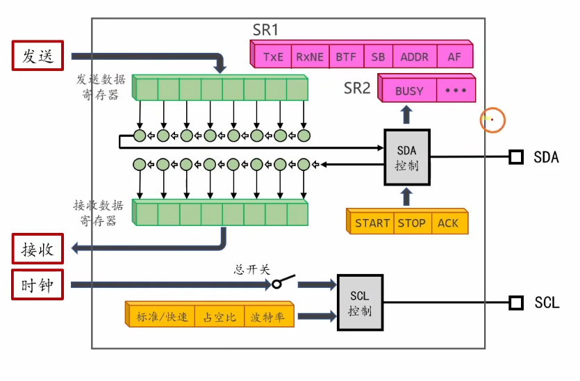
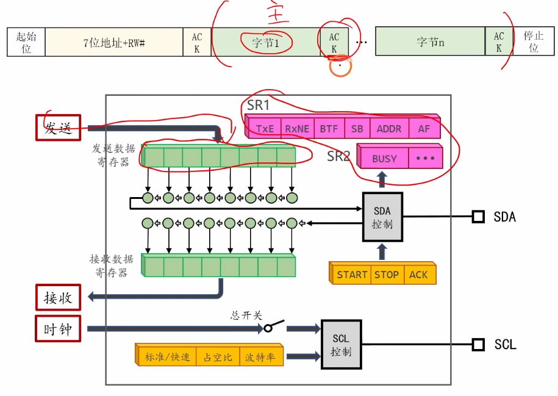
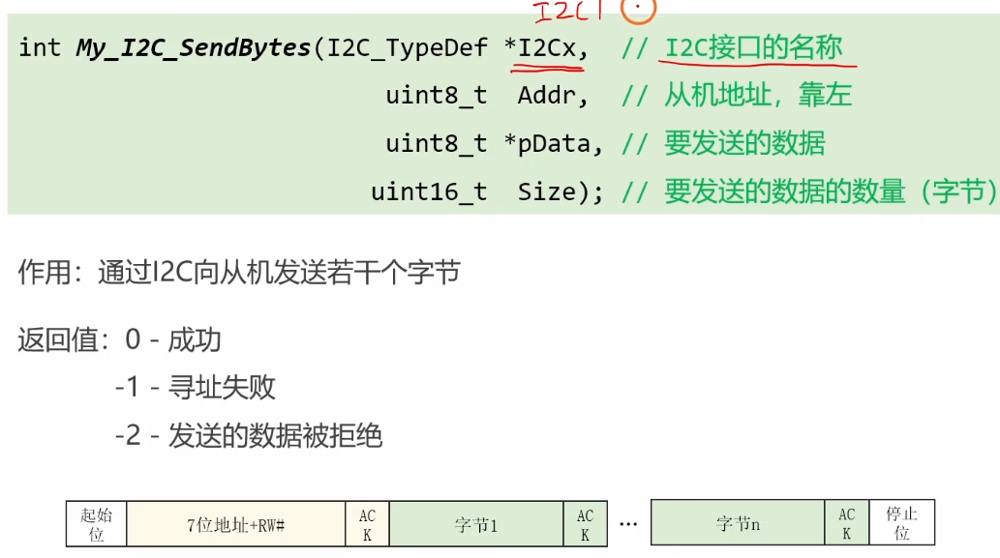
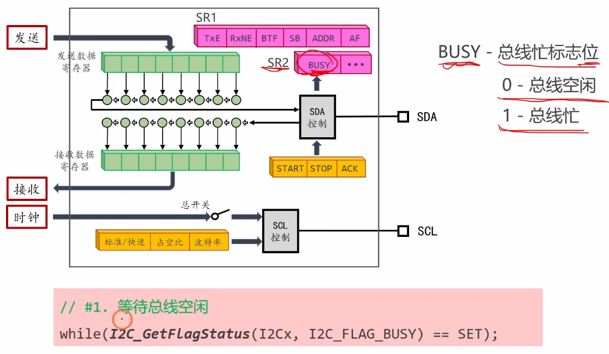
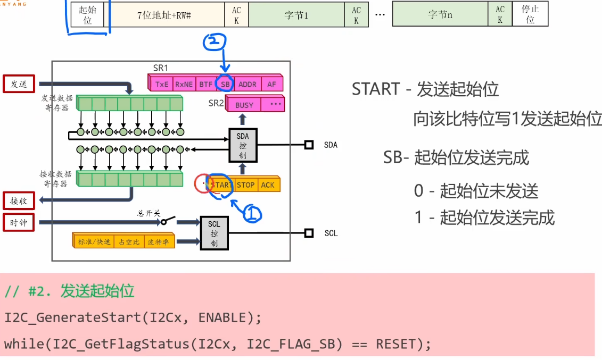
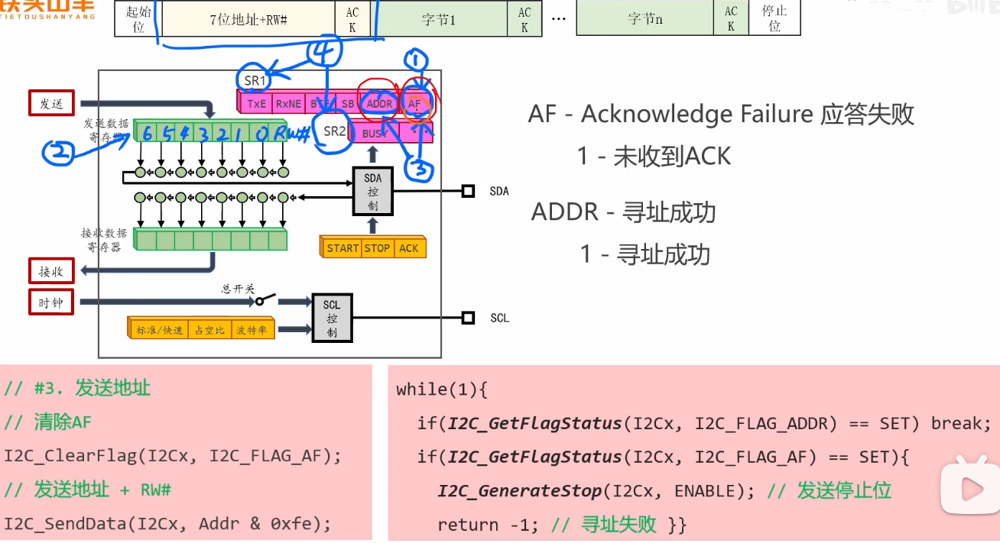
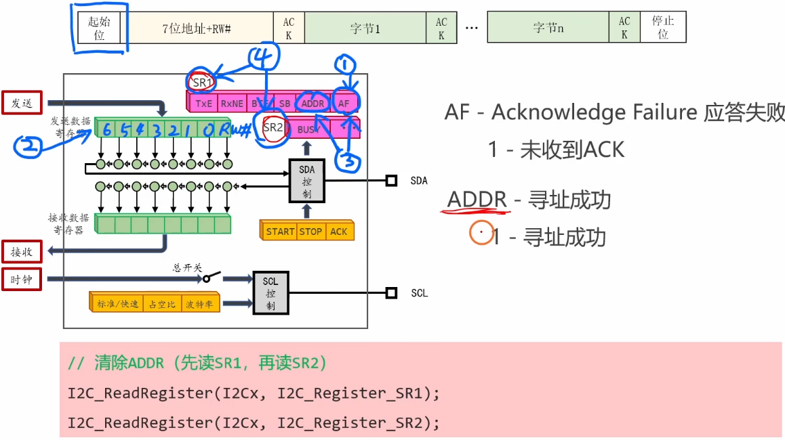
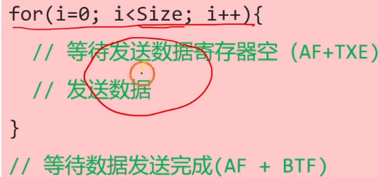

# 4.4 [I2C]写数据

## 1. I2C 模块的内部结构框图
要理解 STM32 硬件 I2C 的工作原理，必须了解其内部数据的流向。主要涉及两个核心寄存器：
*   **数据寄存器 (Data Register, DR)**：这是 CPU 与 I2C 模块通信的“窗口”。
    *   **发送时**：CPU 把数据写入 DR，硬件会自动把 DR 的数据转移到“移位寄存器”进行发送。
    *   **接收时**：移位寄存器收满一个字节后，硬件自动将其转移到 DR，供 CPU 读取。
*   **移位寄存器 (Shift Register)**：幕后英雄。它连接着 SDA 线，负责将数据一位一位地移出（发送）或移入（接收）。
*   **状态寄存器 (SR1, SR2)**：包含各种标志位（如 TXE, RXNE, BUSY, AF 等），我们通过检查这些标志位（Event）来判断当前硬件处于什么状态。

## 2. 数据发送过程简介
硬件 I2C 的发送过程是一个流水线操作：
1.  CPU 写入数据到 **DR**。
2.  若 **移位寄存器** 空闲，硬件立刻把 DR 的数据转运到移位寄存器，并置位 **TXE** (Transmit Empty) 标志，告诉 CPU：“DR 空了，你可以准备下一个数据了”。
3.  **移位寄存器** 开始在 SCL 时钟的驱动下，一位位发送数据到 SDA。
4.  发送完 8 位数据后，硬件等待从机的 **ACK**。
5.  收到 ACK 后，如果 DR 里有新数据，继续重复步骤 2；如果没有，硬件置位 **BTF** (Byte Transfer Finished) 标志，表示“所有活都干完了”。

## 3. 等待总线空闲
在发起新的通信前，最稳妥的做法是检查总线是否忙碌。
```c
// 检查 I2C_FLAG_BUSY，如果置位说明总线被占用，需等待
while (I2C_GetFlagStatus(I2C1, I2C_FLAG_BUSY));
```


## 4. 发送起始位 (Start)
```c
// 1. 产生起始条件
I2C_GenerateSTART(I2C1, ENABLE);

// 2. 等待 EV5 (Event 5)
// EV5 含义：SB=1 (Start Bit sent)，表示起始位已发送，且模式切换为主机模式
while (!I2C_CheckEvent(I2C1, I2C_EVENT_MASTER_MODE_SELECT));
```

## 5. 发送地址 (Slave Address)
```c
// 1. 发送 7 位地址，方向为发送 (Transmitter)
// 内部会将 0xD0 (假设地址) 和 0 (写位) 组合发送
I2C_Send7bitAddress(I2C1, 0xD0, I2C_Direction_Transmitter);

// 2. 等待 EV6 (Event 6)
// EV6 含义：ADDR=1 (Address sent)，表示地址发送完毕，且收到了从机的 ACK
// 读 SR1 后读 SR2 会自动清除 ADDR 标志
while (!I2C_CheckEvent(I2C1, I2C_EVENT_MASTER_TRANSMITTER_MODE_SELECTED));
```


## 6. 发送数据 (Write Data)
可以连续发送多个字节。

```c
// 发送第一个字节
I2C_SendData(I2C1, 0x19); // 假设写入寄存器地址 0x19

// 等待 EV8 (Event 8)
// EV8 含义：TXE=1 (Data Register Empty)，表示数据已移入移位寄存器，DR 空了
// 此时移位寄存器正在发数据，CPU 可以赶紧把下一个字节写入 DR
while (!I2C_CheckEvent(I2C1, I2C_EVENT_MASTER_BYTE_TRANSMITTING));

// 发送第二个字节 (数据内容)
I2C_SendData(I2C1, 0xAA);

// 等待 EV8
while (!I2C_CheckEvent(I2C1, I2C_EVENT_MASTER_BYTE_TRANSMITTING));
```

## 7. 发送停止位 (Stop)
当最后一个字节发送完成后，需要发送停止条件。
*注意*：这里通常等待 **EV8_2** (TXE=1 且 BTF=1)，确保最后一个字节不仅离开了 DR，而且真正从移位寄存器发完了。

```c
// 等待 EV8_2 (Byte Transfer Finished)
// 确保最后一个字节完全发出去，且收到了 ACK
while (!I2C_CheckEvent(I2C1, I2C_EVENT_MASTER_BYTE_TRANSMITTED));

// 产生停止条件
I2C_GenerateSTOP(I2C1, ENABLE);
```
