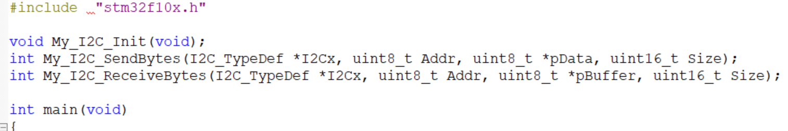
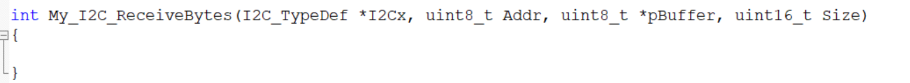
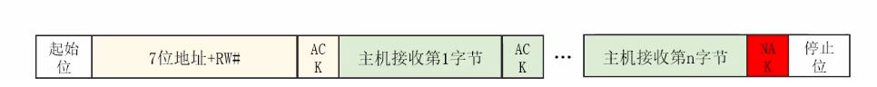
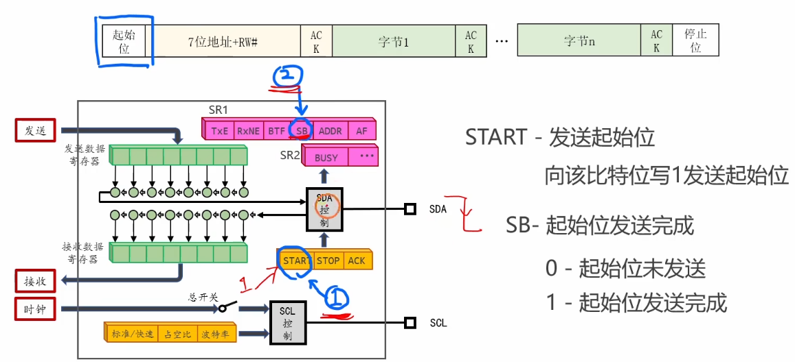
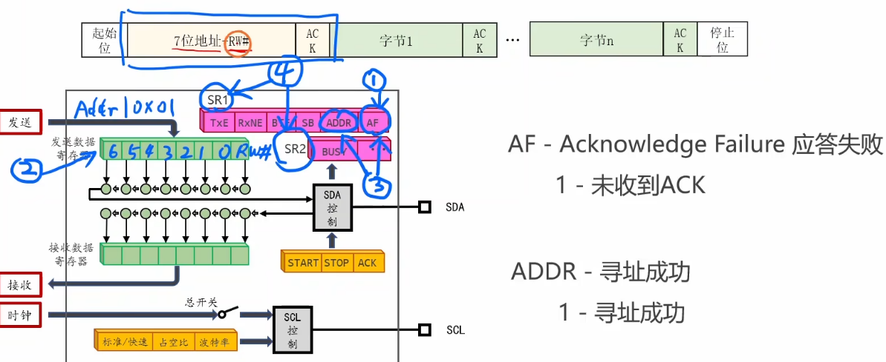
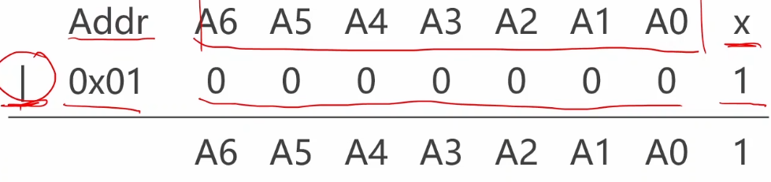

# 4.5 [I2C]读数据

buffer就是数组，set是1，reset是0；

1.声明


2.实现（）函数体

## 1. 数据读取的流程
STM32 硬件 I2C 的读取过程比发送过程要复杂一些。核心难点在于**主机必须在接收最后一个字节之前，提前告诉从机“好了，够了，别发了”**。
*   如果主机回了 ACK，从机就会继续发下一个字节。
*   如果主机回了 ==NACK==，从机就知道数据发完了，释放 SDA 线（==拉高==）。
*   因此，配置 ACK/NACK 和 STOP 信号的时机至关重要，尤其是当读取的数据量很小（1个或2个字节）时。

## 2. 发送起始位和地址
这部分与“写数据”非常相似，区别在于地址的最低位是 **1 (Read)**。

```c
// 1. 发送 Start
I2C_GenerateSTART(I2C1, ENABLE);
while(I2C_GetFlagStatus(I2Cx, I2C_FLAG_SB) == RESET); // 等待 EV5

// 2. 发送地址 (读模式)
//# 2.寻址阶段
	I2C_ClearFlag(I2Cx, I2C_FLAG_AF);//清空AF标志位
	I2C_SentData(I2Cx, Addr | 0x01);//向发送寄存器写数据
	while(1)
	{
		if(I2C_GetFlagStatus(I2Cx, I2C_FLAG_AF) == SET)
		{
			I2C_GenerateSTOP(I2Cx, ENABLE);
			return -1;//寻址失败。
		}
		if(I2C_GetFlagStatus(I2Cx, I2C_FLAG_ADDR) == SET)
		{
			break;
		}
	} // 等待 EV6
```


2.向最后一个比特位写1；我要读数据
## 3. 如何发送 ACK 和 NACK
STM32 硬件 I2C 自动根据 `I2C_CR1` 寄存器的 `ACK` 位来决定回复什么。
*   **发送 ACK**: `I2C_AcknowledgeConfig(I2C1, ENABLE);`
*   **发送 NACK**: `I2C_AcknowledgeConfig(I2C1, DISABLE);`
    *   *注意*：默认配置通常是 ENABLE。在接收最后一个字节**之前**，==必须手动改为 DISABLE。==

## 4. 如何发送停止位
*   **发送 STOP**: `I2C_GenerateSTOP(I2C1, ENABLE);`
    *   产生的时机通常紧随 NACK 之后。

## 5. 读取 1 个字节 (Size = 1)
如果要读的只有一个字节，必须在**清除地址标志位 (ADDR) 之前**，就先把 ACK 关掉，并设置 STOP。否则，硬件会在读完这个字节后自动发 ACK，导致从机继续发数据，卡死总线。

**关键步骤**：
1.  等待 **EV6** (ADDR=1，地址已发送)。
2.  **严守时序**：
    *   `I2C_AcknowledgeConfig(I2C1, DISABLE);` (准备发送 NACK)
    *   `I2C_GenerateSTOP(I2C1, ENABLE);` (准备发送 STOP)
    *   清除 ADDR 标志位 (读 SR1, 读 SR2)。
3.  等待 **EV7** (RXNE=1，数据到了 DR)。
4.  读取数据 `I2C_ReceiveData(I2C1)`.
5.  恢复 ACK 为 ENABLE (方便下次通信)。

## 6. 读取 2 个字节 (Size = 2)
读取 2 个字节时，需要利用 **POS (NACK Position)** 标志位（在 `I2C_CR1` 中），或者利用 **BTF (Byte Transfer Finished)** 标志位来精细控制。

**关键步骤**：
1.  等待 **EV6** (ADDR=1)。
2.  `I2C_AcknowledgeConfig(I2C1, DISABLE);` (准备 NACK)
3.  `I2C_NACKPositionConfig(I2C1, I2C_NACKPosition_Next);` (POS=1，表示下一个字节就 NACK)
4.  清除 ADDR 标志位。
5.  等待 **EV7_3** (BTF=1)。此时：
    *   移位寄存器里有 Byte 2。
    *   DR 寄存器里有 Byte 1。
    *   总线被拉伸等待。
6.  `I2C_GenerateSTOP(I2C1, ENABLE);`
7.  读取 Byte 1 (`I2C_ReceiveData`).
8.  读取 Byte 2 (`I2C_ReceiveData`).
9.  恢复配置 (`ACK=ENABLE`, `POS=Current`).
