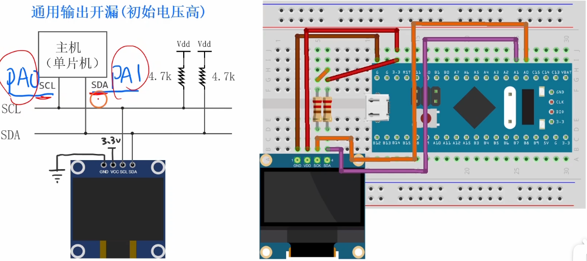

# 4.6 [I2C]软I2C

## 主要内容
由于 STM32 硬件 I2C 在某些版本有稳定性问题或逻辑复杂，**软件模拟 I2C** (Bit-banging) 非常常用。通过 GPIO 的高低电平翻转模拟 I2C 通讯时序，虽然占用 CPU 资源，但代码通用性强，移植方便。

### 核心思想
使用任意两个 GPIO (推挽输出或开漏输出)，通过软件延时控制高低电平，模拟 I2C 时序。
*   **SCL (Serial Clock)**: 时钟线，由主机控制。
*   **SDA (Serial Data)**: 数据线，双向传输。

---

## 1. IO引脚初始化
软件 I2C 需要配置两个 GPIO 引脚。
*   **SCL**: 始终作为输出。
*   **SDA**: 在 I2C 标准中应为**开漏输出** (Open-Drain)，配合外部上拉电阻。如果从机不需要时钟延展且无冲突，**推挽输出** (Push-Pull) 也可以使用，但在读取数据时需要切换输入输出模式（或者使用开漏模式+读取输入数据寄存器，开漏模式下输出寄存器写1时，IO口处于浮空/上拉状态，可以直接读取输入）。
*   **推荐配置**: `GPIO_Mode_Out_OD` (开漏输出)。这样在读取数据时，只需先将 SDA 写 1，即可释放总线，直接读取输入数据寄存器，无需频繁切换 GPIO 模式。

```c
#include "stm32f10x.h"
#include "Delay.h" // 假设有一个延时函数库

// 定义引脚，例如使用 PB6 (SCL) 和 PB7 (SDA)
#define MYI2C_GPIO_PORT    GPIOB
#define MYI2C_SCL_PIN      GPIO_Pin_6
#define MYI2C_SDA_PIN      GPIO_Pin_7
#define MYI2C_RCC_PORT     RCC_APB2Periph_GPIOB

void MyI2C_Init(void)
{
    // 1. 开启 GPIO 时钟
    RCC_APB2PeriphClockCmd(MYI2C_RCC_PORT, ENABLE);

    // 2. 配置 GPIO 结构体
    GPIO_InitTypeDef GPIO_InitStructure;
    GPIO_InitStructure.GPIO_Mode = GPIO_Mode_Out_OD; // 使用开漏输出
    GPIO_InitStructure.GPIO_Pin = MYI2C_SCL_PIN | MYI2C_SDA_PIN;
    GPIO_InitStructure.GPIO_Speed = GPIO_Speed_50MHz;
    
    // 3. 初始化 GPIO
    GPIO_Init(MYI2C_GPIO_PORT, &GPIO_InitStructure);

    // 4. 初始化电平（I2C 空闲时 SCL 和 SDA 均为高电平）
    GPIO_SetBits(MYI2C_GPIO_PORT, MYI2C_SCL_PIN | MYI2C_SDA_PIN);
}
```

## 2. IO读写和延迟函数
为了代码可读性和移植性，封装底层的引脚操作。

```c
// 写 SCL 电平
void MyI2C_W_SCL(uint8_t BitValue)
{
    GPIO_WriteBit(MYI2C_GPIO_PORT, MYI2C_SCL_PIN, (BitAction)BitValue);
    // Delay_us(10); // 根据需要添加延时，防止速度过快
}

// 写 SDA 电平
void MyI2C_W_SDA(uint8_t BitValue)
{
    GPIO_WriteBit(MYI2C_GPIO_PORT, MYI2C_SDA_PIN, (BitAction)BitValue);
    // Delay_us(10);
}

// 读 SDA 电平
uint8_t MyI2C_R_SDA(void)
{
    return GPIO_ReadInputDataBit(MYI2C_GPIO_PORT, MYI2C_SDA_PIN);
}
```

## 3. 发送起始位和停止位
I2C 协议的起始和停止条件：
*   **Start**: SCL 高电平期间，SDA 从高变低。
*   **Stop**: SCL 高电平期间，SDA 从低变高。

```c
void MyI2C_Start(void)
{
    MyI2C_W_SDA(1); // 确保 SDA 初始为高
    MyI2C_W_SCL(1); // 确保 SCL 初始为高
    MyI2C_W_SDA(0); // SCL=1 时，SDA 拉低 -> Start
    MyI2C_W_SCL(0); // 钳住 I2C 总线，准备发送或接收数据
}

void MyI2C_Stop(void)
{
    MyI2C_W_SDA(0); // 确保 SDA 为低
    MyI2C_W_SCL(1); // 释放 SCL
    MyI2C_W_SDA(1); // SCL=1 时，SDA 拉高 -> Stop
}
```

## 4. 发送一个字节
主机将 8 位数据依次放到 SDA 上，每放一位，拉高 SCL 让从机读取，再拉低 SCL 准备下一位。**高位先行 (MSB First)**。

```c
void MyI2C_SendByte(uint8_t Byte)
{
    uint8_t i;
    for (i = 0; i < 8; i++)
    {
        // 取出 Byte 的最高位 (Byte & 0x80) 发送
        MyI2C_W_SDA(Byte & (0x80 >> i)); 
        MyI2C_W_SCL(1); // SCL 拉高，从机读取数据
        MyI2C_W_SCL(0); // SCL 拉低，准备下一位
    }
}
```

*补充：发送应答/接收应答*
通常发送完字节后需要处理应答位 (ACK/NACK)。
```c
// 等待从机应答：0-应答，1-非应答
uint8_t MyI2C_ReceiveAck(void)
{
    uint8_t AckBit;
    MyI2C_W_SDA(1); // 主机释放 SDA，交由从机控制
    MyI2C_W_SCL(1); // SCL 拉高，主机读取 SDA
    AckBit = MyI2C_R_SDA();
    MyI2C_W_SCL(0); // SCL 拉低
    return AckBit;
}
```

## 5. 接收一个字节
主机释放 SDA，从机控制 SDA 发送数据。主机控制 SCL 读取每一位。

```c
uint8_t MyI2C_ReceiveByte(void)
{
    uint8_t i, Byte = 0;
    MyI2C_W_SDA(1); // 主机释放 SDA
    for (i = 0; i < 8; i++)
    {
        MyI2C_W_SCL(1); // SCL 拉高，读取数据
        if (MyI2C_R_SDA() == 1)
        {
            Byte |= (0x80 >> i); // 如果读到 1，置位对应位
        }
        MyI2C_W_SCL(0); // SCL 拉低
    }
    return Byte;
}
```
*补充：主机发送应答*
```c
// 发送应答：0-Ack, 1-Nack
void MyI2C_SendAck(uint8_t AckBit)
{
    MyI2C_W_SDA(AckBit);
    MyI2C_W_SCL(1);
    MyI2C_W_SCL(0);
}
```

## 6. 综合
通常我们将上述功能封装为 `MyI2C.c` 和 `MyI2C.h`。
在需要读写具体的 I2C 设备（如 MPU6050, OLED）时，建立在这些底层函数之上。

**指定地址写数据帧时序**：
Start -> 发送设备地址(写) -> 接收应答 -> 发送寄存器地址 -> 接收应答 -> 发送数据 -> 接收应答 -> Stop

**指定地址读数据帧时序**：
Start -> 发送设备地址(写) -> 接收应答 -> 发送寄存器地址 -> 接收应答 -> 
Start -> 发送设备地址(读) -> 接收应答 -> 接收数据 -> 发送应答(或非应答) -> Stop

## 7. 测试
在 `main.c` 中调用。这里以“扫描 I2C 总线”为例，检测是否有设备挂载。

```c
#include "stm32f10x.h"
#include "Delay.h"
#include "OLED.h"
#include "MyI2C.h"

int main(void)
{
    OLED_Init();
    MyI2C_Init();
    
    OLED_ShowString(1, 1, "I2C Scan:");
    
    // 扫描地址 0x00 ~ 0x7F
    // I2C 7位地址，发送时左移1位，最低位0表示写
    // 如果收到应答(ReceiveAck返回0)，说明有设备存在
    
    uint8_t found = 0;
    for (uint8_t i = 0; i < 0x7F; i++)
    {
        MyI2C_Start();
        MyI2C_SendByte(i << 1); // 发送写地址
        if (MyI2C_ReceiveAck() == 0) // 收到应答
        {
            OLED_ShowHexNum(2, 1, i, 2); // 显示设备地址
            found = 1;
            // MyI2C_Stop(); // 某些设备可能需要立即 Stop
        }
        MyI2C_Stop();
    }
    
    if (!found)
    {
        OLED_ShowString(2, 1, "None");
    }

    while (1)
    {
    }
}
```