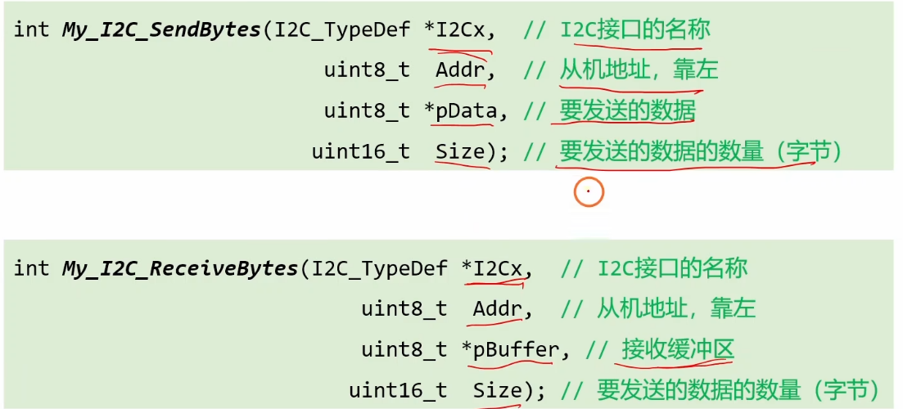
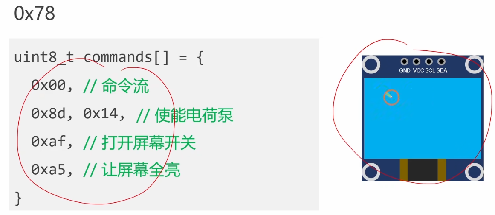
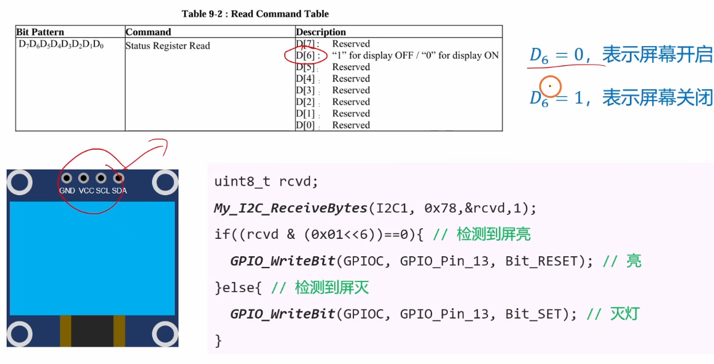

# 4.7 [I2C]封装常用功能

## 主要内容
封装 I2C 读写寄存器的通用函数。
# 1.硬件I2C测试
## 1.I2C的初始化
```c
void My_I2C1_Init(void);// 声明初始化函数

int main(void)
{	
	My_I2C1_Init();//进行调用
	while(1)
	{		
	}
}

void My_I2C1_Init(void)//初始化函数的函数体
{
	//# 1.对PB6与PB7进行初始化
	RCC_APB2PeriphClockCmd(RCC_APB2Periph_GPIOB, ENABLE);//使用引脚的时钟
	
	GPIO_InitTypeDef GPIO_InitStruct;
	GPIO_InitStruct.GPIO_Pin = GPIO_Pin_6 | GPIO_Pin_7;
	GPIO_InitStruct.GPIO_Mode = GPIO_Mode_AF_OD;
	GPIO_InitStruct.GPIO_Speed = GPIO_Speed_2MHz;
	GPIO_Init(GPIOB, &GPIO_InitStruc);
	
	//#2. 对I2C1进行初始化
	RCC_APB1PeriphClockCmd(RCC_APB1Periph_I2C1, ENABLE);//使能I2C的时钟
	RCC_APB1PeriphResetCmd(RCC_APB1Periph_I2C1, ENABLE);//复位
	RCC_APB1PeriphResetCmd(RCC_APB1Periph_I2C1, DISABLE);//释放
	
	I2C_InitTypeDef I2C_InitStruct;
	I2C_InitStruct.I2C_ClockSpeed = 400000;
	I2C_InitStruct.I2C_Mode = I2C_Mode_I2C;
	I2C_InitStruct.I2C_DutyCycle = I2C_DutyCycle_2;
	I2C_Init(I2C1, &I2C_InitStruct);
	
	I2C_Cmd(I2C1, ENABLE);
}
```
默认时钟都是关闭的，==省电==，需要进行使能

进行出厂设置：复位，释放：==清除数据==

外设需要进行`_cmd` 打开外设；

结构体初始化类似。

## 2.发送接受数据

### 1. 为什么地址 `Addr` 是 `uint8_t`？

- **硬件界定：I2C 协议标准**
    
    - 标准的 I2C 设备地址通常是 **7位**（0~127）。
        
    - 在实际传输时，这 7 位地址会左移一位，最后一位留给读/写标志位（R/W）。
        
    - **计算**：$7 \text{ bit (地址)} + 1 \text{ bit (读写位)} = 8 \text{ bit}$。
        
- **结论**：8 个二进制位刚好就是一个字节（Byte），也就是 `uint8_t`（0~255）。
    
    - **界定逻辑**：用 `uint16_t`（2个字节）来存只有 8 位的数据是浪费内存；用 `int`（4个字节）更是巨大的浪费。所以 `uint8_t` 是最完美的容器。
        

### 2. 为什么数据指针 `*pData` 指向 `uint8_t`？

- **硬件界定：通信最小单位**
    
    - I2C 总线传输数据时，是**一个字节一个字节**（Byte-by-Byte）发送的。它不懂什么是“整数(int)”，也不懂什么是“浮点数(float)”，它只认 8 位一组的数据包。
        
- **结论**：`uint8_t` 代表一个标准的“字节”。
    
    - **界定逻辑**：指针告诉函数“去哪里拿数据”。定义为 `uint8_t*` 意味着：“请把内存里的数据切成一块块 8 位的小饼干，一块一块地发出去。”
        

### 3. 为什么数据数量 `Size` 是 `uint16_t`？

这是大家最容易困惑的地方：**为什么不用 `uint8_t`，也不用 `int`（通常是 `uint32_t`）？**

- **界定逻辑：也就是“你要发多少数据？”**
    
    - **如果用 `uint8_t`**：最大值是 **255**。
        
        - 如果你要刷一个 OLED 屏幕，或者读写一块 EEPROM，数据量很容易超过 255 个字节（比如 512 字节）。这时候 `uint8_t` 就会溢出（变成 0），导致数据发不全。所以 `uint8_t` **太小了**。
            
    - **如果用 `uint32_t`**：最大值是 **42亿**。
        
        - I2C 是一个相对低速的协议（通常 100kHz 或 400kHz）。发送 40亿个字节需要几天几夜，而且单片机的 RAM 通常只有几十 KB，根本存不下这么多数据。所以 `uint32_t` **太大了，杀鸡用牛刀**。
            
- **结论**：`uint16_t` 的范围是 **0 ~ 65535**。
    
    - 这个范围（64KB）对于 I2C 通信来说是 **“黄金区间”**——既能满足绝大多数大数据量的传输需求（比如刷屏、传固件），又不会像 `uint32_t` 那样在某些极其紧凑的 8 位单片机上增加处理负担。


### ==控制屏幕数组==

**逐行翻译这些“密码”：**

1. **`0x00` (命令流标志/寄存器地址)**：
    
    - 这是告诉 OLED：“**注意了！后面跟着的数据全是控制命令，不是要显示的图片像素！**”
        
    - 如果没有这个标志，OLED 可能会把后面的指令当成像素点画在屏幕上，导致花屏。
        
2. **`0x8d, 0x14` (电荷泵设置)**：
    
    - **最关键的一步！** OLED 屏幕发光需要较高的电压（比如 7V~9V），但单片机只有 3.3V。
        
    - 这两条指令开启了屏幕内部的“升压电路”（电荷泵），如果没有它，屏幕供电不足，也是黑的。
        
3. **`0xaf` (打开屏幕开关)**：
    
    - 相当于按下了电视机的“电源键”。默认上电时屏幕是休眠的，必须发这个指令它才会开始工作。
        
4. **`0xa5` (全屏点亮)**：
    
    - 这是一个测试指令。它不管显存里有什么数据，强制让屏幕上**每一个像素点都发光**。
        
    - 通常用来检查屏幕有没有坏点，或者证明屏幕已经成功初始化了（如果屏幕全白，说明通讯成功）。
### ==为什么LED是0x78==
- **OLED 的真实身份证号（7位地址）**：`0x3C`
    
    - 二进制是：`0 1 1 1 1 0 0`
        
- **变成写入地址（8位地址）**：
    
    - 为了凑够8位，我们需要把上面的二进制数字**向左移动一位**（相当于乘以 2）。
        
    - 移动后变成：`0 1 1 1 1 0 0` **`0`** (最后补上一位 0，表示“写操作”)
        
    - **计算**：`0x3C * 2 = 0x78`
        
    - 或者是：`0x3C << 1 = 0x78`
### 用13引脚看亮灭（==set是灭==）

0 与 1为0；1与1为1

### 总体代码
```c
#include "stm32f10x.h"                  // Device header
#include "i2c.h"

void My_I2C1_Init(void);

void My_OnBoardLED_Init(void);

int main(void)
{	
	My_I2C1_Init();
	
	My_OnBoardLED_Init();
	
	uint8_t commands[] = {0x00, 0x8d, 0x14, 0xaf, 0xa5};
	
	My_I2C_SendBytes(I2C1, 0x78, commands, 5);//给屏幕send开亮命令
	
	uint8_t rcvd;
	
	My_I2C_ReceiveBytes(I2C1, 0x78, &rcvd, 1);
	
	if((rcvd & (0x01 << 6)) == 0)
	{
		GPIO_WriteBit(GPIOC, GPIO_Pin_13, Bit_RESET);
	}
	else
	{
		GPIO_WriteBit(GPIOC, GPIO_Pin_13, Bit_SET);
	}
	while(1)
	{
		
	}
}

void My_I2C1_Init(void)
{
	//# 1.对PB6与PB7进行初始化
	RCC_APB2PeriphClockCmd(RCC_APB2Periph_GPIOB, ENABLE);
	
	GPIO_InitTypeDef GPIO_InitStruct;
	GPIO_InitStruct.GPIO_Pin = GPIO_Pin_6 | GPIO_Pin_7;
	GPIO_InitStruct.GPIO_Mode = GPIO_Mode_AF_OD;
	GPIO_InitStruct.GPIO_Speed = GPIO_Speed_2MHz;
	GPIO_Init(GPIOB, &GPIO_InitStruct);
	
	//#2. 对I2C1进行初始化
	RCC_APB1PeriphClockCmd(RCC_APB1Periph_I2C1, ENABLE);
	RCC_APB1PeriphResetCmd(RCC_APB1Periph_I2C1, ENABLE);
	RCC_APB1PeriphResetCmd(RCC_APB1Periph_I2C1, DISABLE);
	
	I2C_InitTypeDef I2C_InitStruct;
	I2C_InitStruct.I2C_ClockSpeed = 400000;
	I2C_InitStruct.I2C_Mode = I2C_Mode_I2C;
	I2C_InitStruct.I2C_DutyCycle = I2C_DutyCycle_2;
	I2C_Init(I2C1, &I2C_InitStruct);
	
	I2C_Cmd(I2C1, ENABLE);
}

void My_OnBoardLED_Init(void)
{
	RCC_APB2PeriphClockCmd(RCC_APB2Periph_GPIOC, ENABLE);
	
	GPIO_InitTypeDef GPIO_InitStruct;
	GPIO_InitStruct.GPIO_Pin = GPIO_Pin_13;
	GPIO_InitStruct.GPIO_Mode = GPIO_Mode_Out_OD;
	GPIO_InitStruct.GPIO_Speed = GPIO_Speed_2MHz;
	GPIO_Init(GPIOC, &GPIO_InitStruct);
	
	GPIO_WriteBit(GPIOC, GPIO_Pin_13, Bit_SET);//熄灭
}

```

# 软件I2C

### 总体代码
```c
#include "stm32f10x.h"                  // Device header
#include "i2c.h"
#include "si2c.h"

SI2C_TypeDef si2c;//1.定义一个结构体变量（拿了一个表格）

void My_OnBoardLED_Init(void); //声明板载Led的初始化

int main(void)
{	
	si2c.SCL_GPIOx = GPIOB;//SCL线连在GPIOB组。填表。
	si2c.SCL_GPIO_Pin = GPIO_Pin_6;//SCL线具体在Pin_6
	si2c.SDA_GPIOx = GPIOB;//SDA线连在GPIOB组
	si2c.SDA_GPIO_Pin = GPIO_Pin_7;//SDA线具体在Pin_7
	My_SI2C_Init(&si2c);//调交表格，进行初始化，直接把地址给他，节省空间，方便修改
	
	My_OnBoardLED_Init();//初始化板载LEd
	
	//2.执行控制
	uint8_t commands[] = {0x00, 0x8d, 0x14, 0xaf, 0xa5};//指令数组
	
	My_SI2C_SendBytes(&si2c, 0x78, commands, 5);//给屏幕78、send开亮命令
	
	uint8_t rcvd;
	
	My_SI2C_ReceiveBytes(&si2c, 0x78, &rcvd, 1);
	
	if((rcvd & (0x01 << 6)) == 0)
	{
		GPIO_WriteBit(GPIOC, GPIO_Pin_13, Bit_RESET);
	}
	else
	{
		GPIO_WriteBit(GPIOC, GPIO_Pin_13, Bit_SET);
	}
	while(1)
	{
		
	}
}

void My_OnBoardLED_Init(void)
{
	RCC_APB2PeriphClockCmd(RCC_APB2Periph_GPIOC, ENABLE);
	
	GPIO_InitTypeDef GPIO_InitStruct;
	GPIO_InitStruct.GPIO_Pin = GPIO_Pin_13;
	GPIO_InitStruct.GPIO_Mode = GPIO_Mode_Out_OD;
	GPIO_InitStruct.GPIO_Speed = GPIO_Speed_2MHz;
	GPIO_Init(GPIOC, &GPIO_InitStruct);
	
	GPIO_WriteBit(GPIOC, GPIO_Pin_13, Bit_SET);//熄灭
}

```
这段代码是一个非常典型的 **“配置 -> 执行 -> 反馈”** 的嵌入式程序结构。它展示了如何用 C 语言操作 STM32 的硬件资源（GPIO、I2C协议）来控制外部设备（OLED）和板载资源（LED）。
