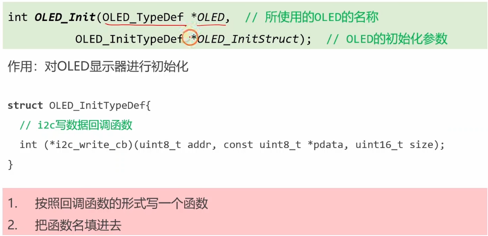
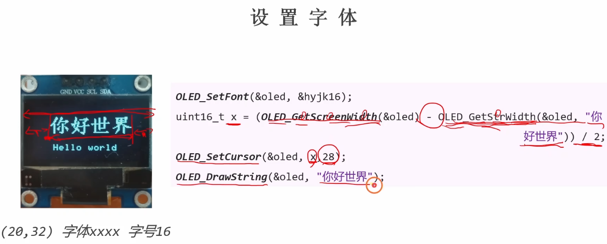
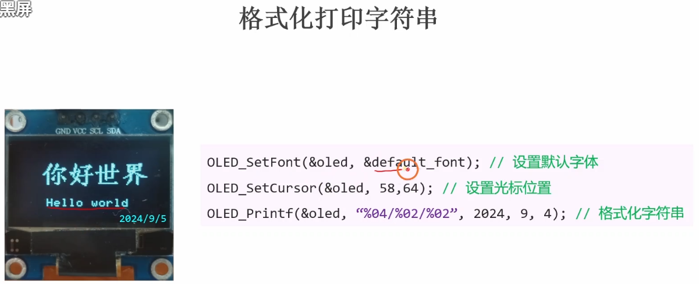
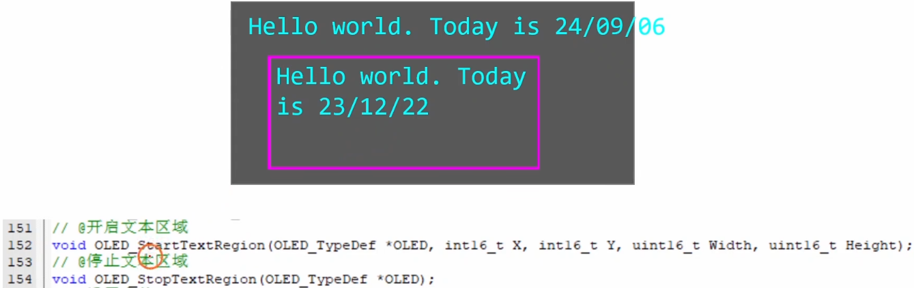
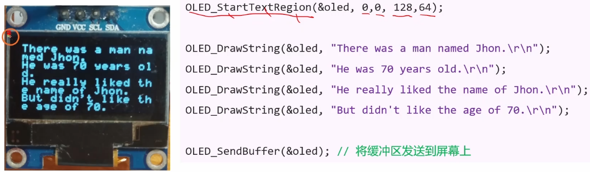
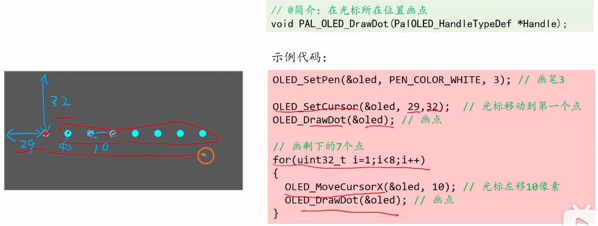
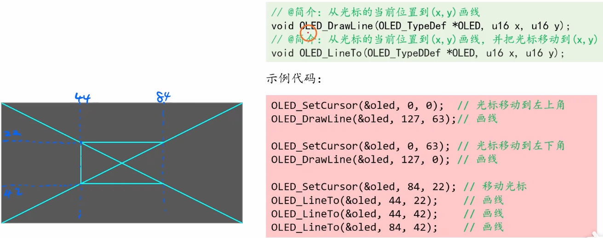
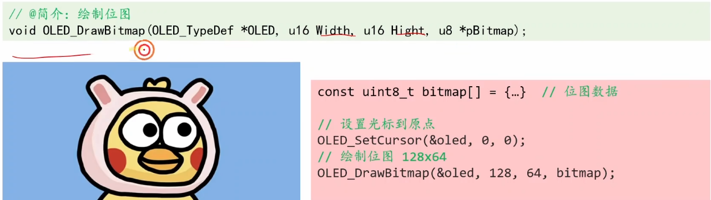

# 4.8 [I2C]OLED显示器

## 主要内容
本节介绍如何使用 I2C 接口驱动 0.96 寸 OLED 屏幕。该屏幕通常使用 SSD1306 驱动芯片，分辨率为 128x64。

### 硬件连接
*   **VCC**: 接 3.3V (注意电压，部分模块兼容 5V)
*   **GND**: 接地
*   **SCL**: I2C 时钟线 (如 PB8)
*   **SDA**: I2C 数据线 (如 PB9)

---

## 1. OLED显示器的基本原理
*   **自发光**: OLED (Organic Light-Emitting Diode) 是有机发光二极管，不需要背光，每个像素点都能自发光。
*   **驱动芯片 SSD1306**: 内部带有显存 (GDDRAM)。我们只需通过 I2C 将数据写入（==sendbytes==）显存，芯片会自动扫描显示。
*   **显存结构 (128x64)**:
    *   屏幕被分为 **8 个页 (Page 0 ~ Page 7)**。
    *   每一页包含 **128 列 (Column 0 ~ Column 127)**。
    *   每一页的高度是 **8 bit** (即 8 个像素)。
    *   **数据格式**: 写入一个字节，对应一列中的 8 个竖向像素。通常 **低位在上 (LSB Top)**，即 D0 对应最上面的像素，D7 对应最下面的像素。

## 2. 屏幕初始化
OLED 上电后需要进行一系列初始化配置（电荷泵、扫描方向、对比度等）才能正常工作。

软I2C初始化与OLED初始化

### 软I2C的初始化跟上节课一致

### OLED初始化

```c
void OLED_Init(void)
{
    MyI2C_Init(); // 初始化底层的 GPIO
    
    OLED_WriteCommand(0xAE); // 关闭显示
    OLED_WriteCommand(0xD5); // 设置显示时钟分频比/振荡器频率
    OLED_WriteCommand(0x80);
    OLED_WriteCommand(0xA8); // 设置多路复用率
    OLED_WriteCommand(0x3F);
    OLED_WriteCommand(0xD3); // 设置显示偏移
    OLED_WriteCommand(0x00);
    OLED_WriteCommand(0x40); // 设置显示开始行
    OLED_WriteCommand(0xA1); // 设置左右方向，0xA1正常 0xA0左右反置
    OLED_WriteCommand(0xC8); // 设置上下方向，0xC8正常 0xC0上下反置
    OLED_WriteCommand(0xDA); // 设置COM引脚硬件配置
    OLED_WriteCommand(0x12);
    OLED_WriteCommand(0x81); // 设置对比度控制
    OLED_WriteCommand(0xCF);
    OLED_WriteCommand(0xD9); // 设置预充电周期
    OLED_WriteCommand(0xF1);
    OLED_WriteCommand(0xDB); // 设置VCOMH取消选择级别
    OLED_WriteCommand(0x30);
    OLED_WriteCommand(0xA4); // 设置整个显示打开/关闭
    OLED_WriteCommand(0xA6); // 设置正常/倒转显示
    OLED_WriteCommand(0x8D); // 设置电荷泵
    OLED_WriteCommand(0x14);
    OLED_WriteCommand(0xAF); // 开启显示
    
    OLED_Clear(); // 上电清屏
}
```

## 3. 基本概念和操作

### 写命令 vs 写数据
*   **写命令 (Command)**: 控制 OLED 的行为（如设置光标位置、清屏、初始化）。
*   **写数据 (Data)**: 写入要显示的内容（点阵数据）。

在 I2C 协议中，通常通过控制字节 (Control Byte) 区分：
*   **0x00**: 接下来的字节是命令。
*   **0x40**: 接下来的字节是数据。

```c
void OLED_WriteCommand(uint8_t Command)
{
    MyI2C_Start();
    MyI2C_SendByte(0x78); // 从机地址 (写)
    MyI2C
    _SendByte(0x00); // 控制字节：命令
    MyI2C_SendByte(Command);
    MyI2C_Stop();
}

void OLED_WriteData(uint8_t Data)
{
    MyI2C_Start();
    MyI2C_SendByte(0x78);
    MyI2C_SendByte(0x40); // 控制字节：数据
    MyI2C_SendByte(Data);
    MyI2C_Stop();
}
```

### 设置光标位置
写入数据前，需要告诉 OLED 从哪里开始写。通常使用**页寻址模式**。
```c
void OLED_SetCursor(uint8_t Y, uint8_t X)
{
    OLED_WriteCommand(0xB0 | Y);                 // 设置页地址 (0~7)
    OLED_WriteCommand(0x10 | ((X & 0xF0) >> 4)); // 设置列地址高4位
    OLED_WriteCommand(0x00 | (X & 0x0F));        // 设置列地址低4位
}
```

### 清屏 (Clear)
遍历所有页和列，写入 0x00。
```c
void OLED_Clear(void)
{
    uint8_t i, j;
    for (i = 0; i < 8; i++)
    {
        OLED_SetCursor(i, 0);
        for (j = 0; j < 128; j++)
        {
            OLED_WriteData(0x00);
        }
    }
}
```

## 4. 文字相关的操作
OLED 本身没有字库，需要我们在代码中定义字模数组 (通常在 `OLED_Font.h`)。
常用的字体大小是 **8x16** (宽8，高16，占2页) 或 **6x8** (宽6，高8，占1页)。


### ==你好世界代码实现==
```c
#include "stm32f10x.h"                  // Device header
#include "i2c.h"
#include "si2c.h"
#include "oled.h"
#include "ct16.h"

SI2C_TypeDef si2c;
OLED_TypeDef oled;

void My_SoftI2C_Init(void);
void My_OLEDScreen_Init(void);
int i2c_write_bytes(uint8_t addr, const uint8_t *pdata, uint16_t size);

int main(void)
{	
	My_SoftI2C_Init();
	
	My_OLEDScreen_Init();
	
	//#1. 打印hello world
	OLED_SetPen(&oled, PEN_COLOR_WHITE, 1);//设置白画笔，粗细为1；
	OLED_SetBrush(&oled, PEN_COLOR_TRANSPARENT);//设置透明画刷
	OLED_SetCursor(&oled, 24, 50);//设置光标
	OLED_DrawString(&oled, "Hello world");//打印Hello world
	
	OLED_SendBuffer(&oled);
	
	//#2.打印你好世界
	OLED_SetFont(&oled, &ct16);
	
	int16_t x = (OLED_GetScreenWidth(&oled)-OLED_GetStrWidth(&oled, "你好世界")) / 2;
	
	OLED_SetCursor(&oled, x, 28);
	OLED_DrawString(&oled, "你好世界");
	
	OLED_SendBuffer(&oled);
	
	//#3.格式化打印日期
	OLED_SetFont(&oled, &default_font);
	OLED_SetCursor(&oled, 58, 64);
	OLED_Printf(&oled, "%04d/%02d/%02d", 2025, 1, 9);
	
	OLED_SendBuffer(&oled);
	
	while(1)
	{
		
	}
}

void My_SoftI2C_Init(void)
{
	si2c.SCL_GPIOx = GPIOB;
	si2c.SCL_GPIO_Pin = GPIO_Pin_6;
	si2c.SDA_GPIOx = GPIOB;
	si2c.SDA_GPIO_Pin = GPIO_Pin_7;
	My_SI2C_Init(&si2c);
}

int i2c_write_bytes(uint8_t addr, const uint8_t *pdata, uint16_t size)
{
	return My_SI2C_SendBytes(&si2c, addr, pdata, size);
}

void My_OLEDScreen_Init(void)
{
	OLED_InitTypeDef OLED_InitStruct;
	
	OLED_InitStruct.i2c_write_cb = i2c_write_bytes;
	
	OLED_Init(&oled, &OLED_InitStruct);
}

```
### ==printf代码实现==
```c
#include "stm32f10x.h"                  // Device header
#include "i2c.h"
#include "si2c.h"
#include "oled.h"
#include "ct16.h"

SI2C_TypeDef si2c;
OLED_TypeDef oled;

void My_SoftI2C_Init(void);
void My_OLEDScreen_Init(void);
int i2c_write_bytes(uint8_t addr, const uint8_t *pdata, uint16_t size);

int main(void)
{	
	My_SoftI2C_Init();
	
	My_OLEDScreen_Init();
	
//	//#1. 打印hello world
//	OLED_SetPen(&oled, PEN_COLOR_WHITE, 1);//设置白画笔，粗细为1；
//	OLED_SetBrush(&oled, PEN_COLOR_TRANSPARENT);//设置透明画刷
//	OLED_SetCursor(&oled, 24, 50);//设置光标
//	OLED_DrawString(&oled, "Hello world");//打印Hello world
//	
//	OLED_SendBuffer(&oled);
//	
//	//#2.打印你好世界
//	OLED_SetFont(&oled, &ct16);
//	
//	int16_t x = (OLED_GetScreenWidth(&oled)-OLED_GetStrWidth(&oled, "你好世界")) / 2;
//	
//	OLED_SetCursor(&oled, x, 28);
//	OLED_DrawString(&oled, "你好世界");
//	
//	OLED_SendBuffer(&oled);
//	
//	//#3.格式化打印日期
//	OLED_SetFont(&oled, &default_font);
//	OLED_SetCursor(&oled, 58, 64);
//	OLED_Printf(&oled, "%04d/%02d/%02d", 2025, 1, 9);
//	
//	OLED_SendBuffer(&oled);

	//#4. 设置文本区域
	OLED_StartTextRegion(&oled, 0, 0, 128, 64);
	OLED_DrawString(&oled, "There was a man named John. \r\n");
	OLED_DrawString(&oled, "He was 70 years old. \r\n");
	OLED_DrawString(&oled, "He really liked his name of John. \r\n");
	OLED_DrawString(&oled, "But didn't like the age of 70. \r\n");

	OLED_SendBuffer(&oled);
	while(1)
	{
		
	}
}

void My_SoftI2C_Init(void)
{
	si2c.SCL_GPIOx = GPIOB;
	si2c.SCL_GPIO_Pin = GPIO_Pin_6;
	si2c.SDA_GPIOx = GPIOB;
	si2c.SDA_GPIO_Pin = GPIO_Pin_7;
	My_SI2C_Init(&si2c);
}

int i2c_write_bytes(uint8_t addr, const uint8_t *pdata, uint16_t size)
{
	return My_SI2C_SendBytes(&si2c, addr, pdata, size);
}

void My_OLEDScreen_Init(void)
{
	OLED_InitTypeDef OLED_InitStruct;
	
	OLED_InitStruct.i2c_write_cb = i2c_write_bytes;
	
	OLED_Init(&oled, &OLED_InitStruct);
}

```


### 显示字符串 (ShowString)
循环调用 `OLED_ShowChar`。
```c
void OLED_ShowString(uint8_t Line, uint8_t Column, char *String)
{
    uint8_t i;
    for (i = 0; String[i] != '\0'; i++)
    {
        OLED_ShowChar(Line, Column + i, String[i]);
    }
}
```
### 显示数字
包括十进制、十六进制、二进制等，通常先转换每一位对应的字符，再调用显示字符函数。
*   `OLED_ShowNum(Line, Column, Number, Length)`: 显示十进制无符号数字
*   `OLED_ShowSignedNum(...)`: 显示有符号数字
*   `OLED_ShowHexNum(...)`: 显示十六进制
*   `OLED_ShowBinNum(...)`: 显示二进制

## 5. 绘图相关的操作
由于 SSD1306 在 I2C 模式下通常不支持“读取显存”，因此不能直接在屏幕上打点（需要先读出来，修改一位，再写回去）。
如果要实现任意画点、画线，通常有两种方法：

### 画点

### 画点代码实现
```c
#include "stm32f10x.h"                  // Device header
#include "i2c.h"
#include "si2c.h"
#include "oled.h"
#include "ct16.h"

SI2C_TypeDef si2c;
OLED_TypeDef oled;

void My_SoftI2C_Init(void);
void My_OLEDScreen_Init(void);
int i2c_write_bytes(uint8_t addr, const uint8_t *pdata, uint16_t size);

int main(void)
{	
	My_SoftI2C_Init();
	
	My_OLEDScreen_Init();
	
//	//#1. 打印hello world
//	OLED_SetPen(&oled, PEN_COLOR_WHITE, 1);//设置白画笔，粗细为1；
//	OLED_SetBrush(&oled, PEN_COLOR_TRANSPARENT);//设置透明画刷
//	OLED_SetCursor(&oled, 24, 50);//设置光标
//	OLED_DrawString(&oled, "Hello world");//打印Hello world
//	
//	OLED_SendBuffer(&oled);
//	
//	//#2.打印你好世界
//	OLED_SetFont(&oled, &ct16);
//	
//	int16_t x = (OLED_GetScreenWidth(&oled)-OLED_GetStrWidth(&oled, "你好世界")) / 2;
//	
//	OLED_SetCursor(&oled, x, 28);
//	OLED_DrawString(&oled, "你好世界");
//	
//	OLED_SendBuffer(&oled);
//	
//	//#3.格式化打印日期
//	OLED_SetFont(&oled, &default_font);
//	OLED_SetCursor(&oled, 58, 64);
//	OLED_Printf(&oled, "%04d/%02d/%02d", 2025, 1, 9);
//	
//	OLED_SendBuffer(&oled);

//	//#4. 设置文本区域
//	OLED_StartTextRegion(&oled, 0, 0, 128, 64);
//	OLED_DrawString(&oled, "There was a man named John. \r\n");
//	OLED_DrawString(&oled, "He was 70 years old. \r\n");
//	OLED_DrawString(&oled, "He really liked his name of John. \r\n");
//	OLED_DrawString(&oled, "But didn't like the age of 70. \r\n");
	//#5. 画点
	OLED_SetPen(&oled, PEN_COLOR_WHITE, 3);
	OLED_SetCursor(&oled, 29, 32);
	OLED_DrawDot(&oled);
	
	for(uint8_t i = 1; i < 8; i++)
	{
		OLED_MoveCursorX(&oled, 10);
		OLED_DrawDot(&oled);
	}
	
	OLED_SendBuffer(&oled);
	while(1)
	{

	}
}

void My_SoftI2C_Init(void)
{
	si2c.SCL_GPIOx = GPIOB;
	si2c.SCL_GPIO_Pin = GPIO_Pin_6;
	si2c.SDA_GPIOx = GPIOB;
	si2c.SDA_GPIO_Pin = GPIO_Pin_7;
	My_SI2C_Init(&si2c);
}

int i2c_write_bytes(uint8_t addr, const uint8_t *pdata, uint16_t size)
{
	return My_SI2C_SendBytes(&si2c, addr, pdata, size);
}

void My_OLEDScreen_Init(void)
{
	OLED_InitTypeDef OLED_InitStruct;
	
	OLED_InitStruct.i2c_write_cb = i2c_write_bytes;
	
	OLED_Init(&oled, &OLED_InitStruct);
}

```

### 画线

### 画线代码实现
```c
#include "stm32f10x.h"                  // Device header
#include "i2c.h"
#include "si2c.h"
#include "oled.h"
#include "ct16.h"

SI2C_TypeDef si2c;
OLED_TypeDef oled;

void My_SoftI2C_Init(void);
void My_OLEDScreen_Init(void);
int i2c_write_bytes(uint8_t addr, const uint8_t *pdata, uint16_t size);

int main(void)
{	
	My_SoftI2C_Init();
	
	My_OLEDScreen_Init();
	
//	//#1. 打印hello world
//	OLED_SetPen(&oled, PEN_COLOR_WHITE, 1);//设置白画笔，粗细为1；
//	OLED_SetBrush(&oled, PEN_COLOR_TRANSPARENT);//设置透明画刷
//	OLED_SetCursor(&oled, 24, 50);//设置光标
//	OLED_DrawString(&oled, "Hello world");//打印Hello world
//	
//	OLED_SendBuffer(&oled);
//	
//	//#2.打印你好世界
//	OLED_SetFont(&oled, &ct16);
//	
//	int16_t x = (OLED_GetScreenWidth(&oled)-OLED_GetStrWidth(&oled, "你好世界")) / 2;
//	
//	OLED_SetCursor(&oled, x, 28);
//	OLED_DrawString(&oled, "你好世界");
//	
//	OLED_SendBuffer(&oled);
//	
//	//#3.格式化打印日期
//	OLED_SetFont(&oled, &default_font);
//	OLED_SetCursor(&oled, 58, 64);
//	OLED_Printf(&oled, "%04d/%02d/%02d", 2025, 1, 9);
//	
//	OLED_SendBuffer(&oled);

//	//#4. 设置文本区域
//	OLED_StartTextRegion(&oled, 0, 0, 128, 64);
//	OLED_DrawString(&oled, "There was a man named John. \r\n");
//	OLED_DrawString(&oled, "He was 70 years old. \r\n");
//	OLED_DrawString(&oled, "He really liked his name of John. \r\n");
//	OLED_DrawString(&oled, "But didn't like the age of 70. \r\n");
//	//#5. 画点
//	OLED_SetPen(&oled, PEN_COLOR_WHITE, 3);
//	OLED_SetCursor(&oled, 29, 32);
//	OLED_DrawDot(&oled);
//	
//	for(uint8_t i = 1; i < 8; i++)
//	{
//		OLED_MoveCursorX(&oled, 10);
//		OLED_DrawDot(&oled);
//	}
	
	//#6. 画线
	OLED_SetCursor(&oled, 0, 0);
	OLED_DrawLine(&oled, 128, 64);
	
	OLED_SetCursor(&oled, 0, 64);
	OLED_DrawLine(&oled, 128, 0);
	
	OLED_SetCursor(&oled, 84, 22);
	OLED_LineTo(&oled, 44, 22);
	OLED_LineTo(&oled, 44, 42);
	OLED_LineTo(&oled, 84, 42);

	OLED_SendBuffer(&oled);
	while(1)
	{

	}
}

void My_SoftI2C_Init(void)
{
	si2c.SCL_GPIOx = GPIOB;
	si2c.SCL_GPIO_Pin = GPIO_Pin_6;
	si2c.SDA_GPIOx = GPIOB;
	si2c.SDA_GPIO_Pin = GPIO_Pin_7;
	My_SI2C_Init(&si2c);
}

int i2c_write_bytes(uint8_t addr, const uint8_t *pdata, uint16_t size)
{
	return My_SI2C_SendBytes(&si2c, addr, pdata, size);
}

void My_OLEDScreen_Init(void)
{
	OLED_InitTypeDef OLED_InitStruct;
	
	OLED_InitStruct.i2c_write_cb = i2c_write_bytes;
	
	OLED_Init(&oled, &OLED_InitStruct);
}

```
### 画矩形与画圆

### 代码实现
```c
	//#7.画矩形与画圆
	OLED_SetCursor(&oled, 20, 20);
	OLED_SetPen(&oled, PEN_COLOR_WHITE, 1);
	OLED_SetBrush(&oled, BRUSH_TRANSPARENT);
	OLED_DrawRect(&oled, 40, 20);
	
	OLED_SetCursor(&oled, 65, 30);
	OLED_DrawCircle(&oled, 5);
	
	OLED_SetCursor(&oled, 70, 20);
	OLED_SetPen(&oled, PEN_COLOR_TRANSPARENT, 1);
	OLED_SetBrush(&oled, BRUSH_WHITE);
	OLED_DrawRect(&oled, 40, 20);
	
	OLED_SendBuffer(&oled);
```
### 画图像

### 代码实现
```c
#include "stm32f10x.h"                  // Device header
#include "i2c.h"
#include "si2c.h"
#include "oled.h"
#include "ct16.h"
#include "delay.h"

SI2C_TypeDef si2c;
OLED_TypeDef oled;
uint8_t bitmap[] = {// 'images', 128x64px
0xff, 0xff, 0xff, 0xff, 0xff, 0xff, 0xff, 0xff, 0xff, 0xff, 0xff, 0xff, 0xff, 0xff, 0xff, 0xff, 
0xff, 0xff, 0xff, 0xff, 0xff, 0xff, 0xff, 0xff, 0xff, 0xff, 0xff, 0xff, 0xff, 0xff, 0xff, 0xff, 
0xff, 0xff, 0xff, 0xff, 0xff, 0xff, 0xff, 0xff, 0xff, 0xff, 0xff, 0xff, 0xff, 0xff, 0xff, 0xff, 
0xff, 0xff, 0xff, 0xff, 0xff, 0xff, 0xff, 0xff, 0xff, 0xff, 0xff, 0xff, 0xff, 0xff, 0xff, 0xff, 
0xff, 0xff, 0xff, 0xff, 0xff, 0xff, 0xff, 0xff, 0xff, 0xff, 0xff, 0xff, 0xff, 0xff, 0xff, 0xff, 
0xff, 0xff, 0xff, 0xff, 0xff, 0xff, 0xff, 0xff, 0xff, 0xff, 0xff, 0xff, 0xff, 0xff, 0xff, 0xff, 
0xff, 0xff, 0xff, 0xff, 0xff, 0xff, 0xff, 0xff, 0xff, 0xff, 0xff, 0xff, 0xff, 0xff, 0xff, 0xff, 
0xff, 0xff, 0xff, 0xff, 0xff, 0xff, 0xff, 0xff, 0xff, 0xff, 0xff, 0xff, 0xff, 0xff, 0xff, 0xff, 
0xff, 0xff, 0xff, 0xff, 0xff, 0xff, 0xff, 0xff, 0xff, 0xff, 0xff, 0xff, 0xff, 0xff, 0xff, 0xff, 
0xff, 0xff, 0xff, 0xff, 0xff, 0xff, 0xff, 0xff, 0xff, 0xfe, 0x00, 0x7f, 0xff, 0xff, 0xff, 0xff, 
0xff, 0xff, 0xff, 0xff, 0xff, 0xff, 0xff, 0xff, 0xff, 0xf0, 0x00, 0x03, 0xff, 0xff, 0xff, 0xff, 
0xff, 0xff, 0xff, 0xff, 0xff, 0xff, 0xff, 0xe0, 0x3f, 0xc0, 0x7f, 0x80, 0x3f, 0xff, 0xff, 0xff, 
0xff, 0xff, 0xff, 0xff, 0xff, 0xff, 0xfc, 0x00, 0x00, 0x83, 0xff, 0xfc, 0x03, 0xff, 0xff, 0xff, 
0xff, 0xff, 0xff, 0xff, 0xff, 0xff, 0xc0, 0x1f, 0xe0, 0x0f, 0xff, 0xff, 0xc0, 0x7f, 0xff, 0xff, 
0xff, 0xff, 0xff, 0xff, 0xff, 0xf8, 0x01, 0xff, 0xff, 0xff, 0xff, 0xff, 0xf8, 0x0f, 0xff, 0xff, 
0xff, 0xff, 0xff, 0xff, 0xff, 0xc0, 0x3f, 0xff, 0xff, 0xff, 0xff, 0xff, 0xff, 0x03, 0xff, 0xff, 
0xff, 0xff, 0xff, 0xff, 0xfe, 0x01, 0xff, 0xff, 0xff, 0x8f, 0x87, 0xff, 0xff, 0xc0, 0xff, 0xff, 
0xff, 0xff, 0xff, 0xff, 0xf0, 0x1f, 0xff, 0xff, 0xfe, 0x0e, 0x00, 0xff, 0xff, 0xf8, 0x1f, 0xff, 
0xff, 0xff, 0xff, 0xff, 0x80, 0xff, 0xff, 0xff, 0xfc, 0x10, 0x10, 0x1f, 0xff, 0xfe, 0x07, 0xff, 
0xff, 0xff, 0xff, 0xfe, 0x03, 0xff, 0xff, 0xff, 0xf8, 0x00, 0x00, 0x07, 0xff, 0xff, 0x81, 0xff, 
0xff, 0xff, 0xff, 0xf8, 0x1f, 0xff, 0xff, 0xff, 0xf8, 0x00, 0x00, 0x01, 0xfc, 0xff, 0xe0, 0xff, 
0xff, 0xff, 0xff, 0xe0, 0x7f, 0xff, 0xff, 0xff, 0xf0, 0x01, 0xff, 0xe0, 0xf8, 0x3f, 0xf8, 0x3f, 
0xff, 0xff, 0xff, 0x81, 0xff, 0xff, 0xff, 0xff, 0xf0, 0xff, 0xff, 0xf8, 0x3c, 0x1f, 0xfc, 0x1f, 
0xff, 0xff, 0xfe, 0x07, 0xff, 0xff, 0xff, 0xff, 0xf0, 0xff, 0xff, 0xfc, 0x1f, 0x07, 0xfe, 0x0f, 
0xff, 0xff, 0xfc, 0x1f, 0xfe, 0x3f, 0xff, 0xff, 0xe1, 0xff, 0xff, 0xfe, 0x0f, 0x83, 0xff, 0x87, 
0xff, 0xff, 0xf0, 0x3f, 0xfc, 0x3f, 0xff, 0xff, 0xe0, 0x01, 0xff, 0xff, 0x0f, 0xc1, 0xff, 0x83, 
0xff, 0xff, 0xe0, 0xff, 0xf8, 0x7f, 0xff, 0xff, 0xe1, 0xe0, 0x1f, 0xf8, 0x07, 0xe0, 0xff, 0xc3, 
0xff, 0xff, 0xc1, 0xff, 0xf0, 0x7f, 0xff, 0xff, 0xe1, 0xff, 0x07, 0xe0, 0x07, 0xf0, 0x7f, 0xe1, 
0xff, 0xff, 0x83, 0x0f, 0xf0, 0xff, 0xff, 0xff, 0xe1, 0xff, 0xc1, 0xc3, 0x87, 0xf8, 0x3f, 0xe1, 
0xff, 0xff, 0x06, 0x0f, 0xf0, 0xff, 0xff, 0xff, 0xc1, 0xff, 0xf0, 0x8f, 0x80, 0x08, 0x1f, 0xf0, 
0xff, 0xfe, 0x0e, 0x1f, 0xf0, 0xff, 0xff, 0xff, 0xc1, 0xff, 0xf8, 0x1f, 0xc0, 0x00, 0x0f, 0xf0, 
0xff, 0xff, 0x06, 0x1f, 0xe0, 0xff, 0xff, 0xe1, 0xe1, 0xf0, 0x08, 0x1f, 0xfc, 0x00, 0x0f, 0xf0, 
0xff, 0xff, 0xc0, 0x3f, 0xe1, 0xff, 0xe1, 0xe0, 0x01, 0xf0, 0x0c, 0x3f, 0xfc, 0x03, 0x07, 0xf0, 
0xff, 0xff, 0xfc, 0x3f, 0xe1, 0xff, 0xc1, 0xc0, 0x01, 0xf0, 0x0c, 0x3f, 0xfc, 0x03, 0x03, 0xe0, 
0xff, 0xff, 0xfc, 0x3f, 0xe1, 0xff, 0xc0, 0x01, 0xc1, 0xfc, 0x38, 0x1f, 0xfe, 0x0e, 0x00, 0xc1, 
0xff, 0xff, 0xfc, 0x3f, 0xe0, 0xff, 0xc0, 0x00, 0xff, 0xff, 0xf0, 0x0f, 0xff, 0xfc, 0x30, 0x03, 
0xff, 0xff, 0xfc, 0x3f, 0xc0, 0xff, 0xc1, 0xf8, 0x3f, 0xff, 0xe1, 0x87, 0xff, 0xe0, 0xfc, 0x1f, 
0xff, 0xff, 0xfe, 0x30, 0x00, 0xff, 0xc0, 0x7e, 0x07, 0xff, 0x00, 0x00, 0xff, 0x83, 0x80, 0x3f, 
0xff, 0xff, 0xfe, 0x00, 0x10, 0x7e, 0x00, 0x3f, 0xc0, 0x00, 0x07, 0xc0, 0x00, 0x1c, 0x00, 0x3f, 
0xff, 0xff, 0xff, 0x08, 0x78, 0x00, 0x00, 0x1f, 0xfc, 0x00, 0x7f, 0xff, 0x03, 0xf8, 0x00, 0x1f, 
0xff, 0xff, 0xff, 0xc0, 0x78, 0x00, 0x00, 0x0f, 0xff, 0xc3, 0xff, 0xff, 0xe3, 0xf0, 0x00, 0x1f, 
0xff, 0xff, 0x80, 0x00, 0x78, 0x00, 0x00, 0x0f, 0xff, 0xc7, 0xff, 0xff, 0xe1, 0xf0, 0x00, 0x1f, 
0xff, 0xf0, 0x01, 0x80, 0x38, 0x00, 0x00, 0x1f, 0xff, 0x83, 0xff, 0xff, 0x01, 0xf0, 0x00, 0x3f, 
0xff, 0x80, 0xff, 0xe0, 0x3c, 0x00, 0x00, 0x1f, 0xff, 0xc0, 0x00, 0x00, 0x01, 0xf0, 0x00, 0x3f, 
0xfc, 0x01, 0xff, 0xf0, 0x1e, 0x00, 0x00, 0x3f, 0xff, 0xe0, 0x00, 0x03, 0xc3, 0xf0, 0x00, 0x7f, 
0xf0, 0x00, 0x00, 0x00, 0x0f, 0x00, 0x00, 0xff, 0xff, 0xf0, 0x3f, 0xff, 0x0f, 0xf8, 0x00, 0xff, 
0xc0, 0xbf, 0x00, 0x00, 0x03, 0xe0, 0x07, 0xff, 0xff, 0xfe, 0x00, 0x00, 0x3f, 0xfc, 0x01, 0xff, 
0x87, 0xff, 0xff, 0xfe, 0x00, 0xff, 0xff, 0xff, 0xff, 0xff, 0xf0, 0x03, 0xff, 0xff, 0x03, 0xff, 
0x00, 0xff, 0xff, 0xfe, 0x00, 0x1e, 0x00, 0x00, 0x00, 0x00, 0x0f, 0xff, 0xff, 0xf0, 0x0f, 0xff, 
0x00, 0x00, 0xff, 0xfe, 0x00, 0x00, 0x00, 0x00, 0x00, 0x00, 0x00, 0x01, 0xff, 0xc0, 0x00, 0x7f, 
0x3f, 0x80, 0x03, 0xfa, 0x00, 0x00, 0x00, 0x00, 0x00, 0x00, 0x00, 0x00, 0x00, 0x00, 0x00, 0x3f, 
0x7f, 0x7e, 0x00, 0x06, 0x00, 0x00, 0x00, 0x00, 0x00, 0x00, 0x00, 0x00, 0x00, 0x00, 0x00, 0x3f, 
0x7f, 0xff, 0xfe, 0x00, 0x00, 0x00, 0x00, 0x00, 0x00, 0x00, 0x00, 0x00, 0x00, 0x00, 0x00, 0x7f, 
0x6f, 0xff, 0xff, 0xf0, 0x00, 0x00, 0x00, 0x00, 0x00, 0x00, 0x00, 0x00, 0x00, 0x00, 0x00, 0xff, 
0x7f, 0xff, 0xfe, 0xde, 0x0f, 0xe0, 0x00, 0x00, 0x00, 0x00, 0x00, 0x00, 0x00, 0x00, 0x1c, 0xff, 
0x0f, 0xff, 0xff, 0xfe, 0x3f, 0xff, 0xe0, 0x00, 0x00, 0x00, 0x00, 0x00, 0x00, 0x07, 0xfc, 0xff, 
0x00, 0x01, 0xff, 0xfe, 0x00, 0x7f, 0xfc, 0x00, 0x00, 0x00, 0x00, 0x00, 0x00, 0x3f, 0xf8, 0xff, 
0x60, 0x00, 0x1d, 0xfc, 0x00, 0x01, 0xff, 0x00, 0x00, 0x00, 0x00, 0x00, 0x19, 0xfe, 0x01, 0xff, 
0x7f, 0xfc, 0x00, 0xfc, 0x00, 0x00, 0x3f, 0x1f, 0xe0, 0x00, 0x00, 0x3f, 0xc3, 0xf0, 0x00, 0x7f, 
0x3f, 0xff, 0xc0, 0x3c, 0x00, 0x00, 0x0f, 0x80, 0x0f, 0xf0, 0xff, 0x80, 0x07, 0xc0, 0x00, 0x3f, 
0x3f, 0xff, 0xfc, 0x00, 0x00, 0x00, 0x07, 0x80, 0x00, 0x03, 0x00, 0x00, 0x07, 0x80, 0x00, 0x1f, 
0x0f, 0xff, 0xff, 0x80, 0x00, 0x00, 0x07, 0x80, 0x00, 0x07, 0xc0, 0x00, 0x0f, 0x80, 0x00, 0x0f, 
0x87, 0xff, 0xfe, 0xf0, 0x00, 0x00, 0x07, 0x80, 0x00, 0x1f, 0xf0, 0x00, 0x0f, 0x80, 0x00, 0x0f, 
0xc3, 0xff, 0xff, 0xf8, 0x00, 0x00, 0x07, 0x80, 0x00, 0x1f, 0xf8, 0x00, 0x0f, 0x00, 0x00, 0x07};

const uint8_t bitmapFlip[] = {// 'images', 128x64px
0xff, 0xff, 0xff, 0xff, 0xff, 0xff, 0xff, 0xff, 0xff, 0xff, 0xff, 0xff, 0xff, 0xff, 0xff, 0xff, 
0xff, 0xff, 0xff, 0xff, 0xff, 0xff, 0xff, 0xff, 0xff, 0xff, 0xff, 0xff, 0xff, 0xff, 0xff, 0xff, 
0xff, 0xff, 0xff, 0xff, 0xff, 0xff, 0xff, 0xff, 0xff, 0xff, 0xff, 0xff, 0xff, 0xff, 0xff, 0xff, 
0xff, 0xff, 0xff, 0xff, 0xff, 0xff, 0xff, 0xff, 0xff, 0xff, 0xff, 0xff, 0xff, 0xff, 0xff, 0xff, 
0xff, 0xff, 0xff, 0xff, 0xff, 0xff, 0xff, 0xff, 0xff, 0xff, 0xff, 0xff, 0xff, 0xff, 0xff, 0xff, 
0xff, 0xff, 0xff, 0xff, 0xff, 0xff, 0xff, 0xff, 0xff, 0xff, 0xff, 0xff, 0xff, 0xff, 0xff, 0xff, 
0xff, 0xff, 0xff, 0xff, 0xff, 0xff, 0xff, 0xff, 0xff, 0xff, 0xff, 0xff, 0xff, 0xff, 0xff, 0xff, 
0xff, 0xff, 0xff, 0xff, 0xff, 0xff, 0xff, 0xff, 0xff, 0xff, 0xff, 0xff, 0xff, 0xff, 0xff, 0xff, 
0xff, 0xff, 0xff, 0xff, 0xff, 0xff, 0xff, 0xff, 0xff, 0xff, 0xff, 0xff, 0xff, 0xff, 0xff, 0xff, 
0xff, 0xff, 0xff, 0xff, 0xfe, 0x00, 0x7f, 0xff, 0xff, 0xff, 0xff, 0xff, 0xff, 0xff, 0xff, 0xff, 
0xff, 0xff, 0xff, 0xff, 0xc0, 0x00, 0x0f, 0xff, 0xff, 0xff, 0xff, 0xff, 0xff, 0xff, 0xff, 0xff, 
0xff, 0xff, 0xff, 0xfc, 0x01, 0xfe, 0x03, 0xfc, 0x07, 0xff, 0xff, 0xff, 0xff, 0xff, 0xff, 0xff, 
0xff, 0xff, 0xff, 0xc0, 0x3f, 0xff, 0xc1, 0x00, 0x00, 0x3f, 0xff, 0xff, 0xff, 0xff, 0xff, 0xff, 
0xff, 0xff, 0xfe, 0x03, 0xff, 0xff, 0xf0, 0x07, 0xf8, 0x03, 0xff, 0xff, 0xff, 0xff, 0xff, 0xff, 
0xff, 0xff, 0xf0, 0x1f, 0xff, 0xff, 0xff, 0xff, 0xff, 0x80, 0x1f, 0xff, 0xff, 0xff, 0xff, 0xff, 
0xff, 0xff, 0xc0, 0xff, 0xff, 0xff, 0xff, 0xff, 0xff, 0xfc, 0x03, 0xff, 0xff, 0xff, 0xff, 0xff, 
0xff, 0xff, 0x03, 0xff, 0xff, 0xe1, 0xf1, 0xff, 0xff, 0xff, 0x80, 0x7f, 0xff, 0xff, 0xff, 0xff, 
0xff, 0xf8, 0x1f, 0xff, 0xff, 0x00, 0x70, 0x7f, 0xff, 0xff, 0xf8, 0x0f, 0xff, 0xff, 0xff, 0xff, 
0xff, 0xe0, 0x7f, 0xff, 0xf8, 0x08, 0x08, 0x3f, 0xff, 0xff, 0xff, 0x01, 0xff, 0xff, 0xff, 0xff, 
0xff, 0x81, 0xff, 0xff, 0xe0, 0x00, 0x00, 0x1f, 0xff, 0xff, 0xff, 0xc0, 0x7f, 0xff, 0xff, 0xff, 
0xff, 0x07, 0xff, 0x3f, 0x80, 0x00, 0x00, 0x1f, 0xff, 0xff, 0xff, 0xf8, 0x1f, 0xff, 0xff, 0xff, 
0xfc, 0x1f, 0xfc, 0x1f, 0x07, 0xff, 0x80, 0x0f, 0xff, 0xff, 0xff, 0xfe, 0x07, 0xff, 0xff, 0xff, 
0xf8, 0x3f, 0xf8, 0x3c, 0x1f, 0xff, 0xff, 0x0f, 0xff, 0xff, 0xff, 0xff, 0x81, 0xff, 0xff, 0xff, 
0xf0, 0x7f, 0xe0, 0xf8, 0x3f, 0xff, 0xff, 0x0f, 0xff, 0xff, 0xff, 0xff, 0xe0, 0x7f, 0xff, 0xff, 
0xe1, 0xff, 0xc1, 0xf0, 0x7f, 0xff, 0xff, 0x87, 0xff, 0xff, 0xfc, 0x7f, 0xf8, 0x3f, 0xff, 0xff, 
0xc1, 0xff, 0x83, 0xf0, 0xff, 0xff, 0x80, 0x07, 0xff, 0xff, 0xfc, 0x3f, 0xfc, 0x0f, 0xff, 0xff, 
0xc3, 0xff, 0x07, 0xe0, 0x1f, 0xf8, 0x07, 0x87, 0xff, 0xff, 0xfe, 0x1f, 0xff, 0x07, 0xff, 0xff, 
0x87, 0xfe, 0x0f, 0xe0, 0x07, 0xe0, 0xff, 0x87, 0xff, 0xff, 0xfe, 0x0f, 0xff, 0x83, 0xff, 0xff, 
0x87, 0xfc, 0x1f, 0xe1, 0xc3, 0x83, 0xff, 0x87, 0xff, 0xff, 0xff, 0x0f, 0xf0, 0xc1, 0xff, 0xff, 
0x0f, 0xf8, 0x10, 0x01, 0xf1, 0x0f, 0xff, 0x83, 0xff, 0xff, 0xff, 0x0f, 0xf0, 0x60, 0xff, 0xff, 
0x0f, 0xf0, 0x00, 0x03, 0xf8, 0x1f, 0xff, 0x83, 0xff, 0xff, 0xff, 0x0f, 0xf8, 0x70, 0x7f, 0xff, 
0x0f, 0xf0, 0x00, 0x3f, 0xf8, 0x10, 0x0f, 0x87, 0x87, 0xff, 0xff, 0x07, 0xf8, 0x60, 0xff, 0xff, 
0x0f, 0xe0, 0xc0, 0x3f, 0xfc, 0x30, 0x0f, 0x80, 0x07, 0x87, 0xff, 0x87, 0xfc, 0x03, 0xff, 0xff, 
0x07, 0xc0, 0xc0, 0x3f, 0xfc, 0x30, 0x0f, 0x80, 0x03, 0x83, 0xff, 0x87, 0xfc, 0x3f, 0xff, 0xff, 
0x83, 0x00, 0x70, 0x7f, 0xf8, 0x1c, 0x3f, 0x83, 0x80, 0x03, 0xff, 0x87, 0xfc, 0x3f, 0xff, 0xff, 
0xc0, 0x0c, 0x3f, 0xff, 0xf0, 0x0f, 0xff, 0xff, 0x00, 0x03, 0xff, 0x07, 0xfc, 0x3f, 0xff, 0xff, 
0xf8, 0x3f, 0x07, 0xff, 0xe1, 0x87, 0xff, 0xfc, 0x1f, 0x83, 0xff, 0x03, 0xfc, 0x3f, 0xff, 0xff, 
0xfc, 0x01, 0xc1, 0xff, 0x00, 0x00, 0xff, 0xe0, 0x7e, 0x03, 0xff, 0x00, 0x0c, 0x7f, 0xff, 0xff, 
0xfc, 0x00, 0x38, 0x00, 0x03, 0xe0, 0x00, 0x03, 0xfc, 0x00, 0x7e, 0x08, 0x00, 0x7f, 0xff, 0xff, 
0xf8, 0x00, 0x1f, 0xc0, 0xff, 0xfe, 0x00, 0x3f, 0xf8, 0x00, 0x00, 0x1e, 0x10, 0xff, 0xff, 0xff, 
0xf8, 0x00, 0x0f, 0xc7, 0xff, 0xff, 0xc3, 0xff, 0xf0, 0x00, 0x00, 0x1e, 0x03, 0xff, 0xff, 0xff, 
0xf8, 0x00, 0x0f, 0x87, 0xff, 0xff, 0xe3, 0xff, 0xf0, 0x00, 0x00, 0x1e, 0x00, 0x01, 0xff, 0xff, 
0xfc, 0x00, 0x0f, 0x80, 0xff, 0xff, 0xc1, 0xff, 0xf8, 0x00, 0x00, 0x1c, 0x01, 0x80, 0x0f, 0xff, 
0xfc, 0x00, 0x0f, 0x80, 0x00, 0x00, 0x03, 0xff, 0xf8, 0x00, 0x00, 0x3c, 0x07, 0xff, 0x01, 0xff, 
0xfe, 0x00, 0x0f, 0xc3, 0xc0, 0x00, 0x07, 0xff, 0xfc, 0x00, 0x00, 0x78, 0x0f, 0xff, 0x80, 0x3f, 
0xff, 0x00, 0x1f, 0xf0, 0xff, 0xfc, 0x0f, 0xff, 0xff, 0x00, 0x00, 0xf0, 0x00, 0x00, 0x00, 0x0f, 
0xff, 0x80, 0x3f, 0xfc, 0x00, 0x00, 0x7f, 0xff, 0xff, 0xe0, 0x07, 0xc0, 0x00, 0x00, 0xfd, 0x03, 
0xff, 0xc0, 0xff, 0xff, 0xc0, 0x0f, 0xff, 0xff, 0xff, 0xff, 0xff, 0x00, 0x7f, 0xff, 0xff, 0xe1, 
0xff, 0xf0, 0x0f, 0xff, 0xff, 0xf0, 0x00, 0x00, 0x00, 0x00, 0x78, 0x00, 0x7f, 0xff, 0xff, 0x00, 
0xfe, 0x00, 0x03, 0xff, 0x80, 0x00, 0x00, 0x00, 0x00, 0x00, 0x00, 0x00, 0x7f, 0xff, 0x00, 0x00, 
0xfc, 0x00, 0x00, 0x00, 0x00, 0x00, 0x00, 0x00, 0x00, 0x00, 0x00, 0x00, 0x5f, 0xc0, 0x01, 0xfc, 
0xfc, 0x00, 0x00, 0x00, 0x00, 0x00, 0x00, 0x00, 0x00, 0x00, 0x00, 0x00, 0x60, 0x00, 0x7e, 0xfe, 
0xfe, 0x00, 0x00, 0x00, 0x00, 0x00, 0x00, 0x00, 0x00, 0x00, 0x00, 0x00, 0x00, 0x7f, 0xff, 0xfe, 
0xff, 0x00, 0x00, 0x00, 0x00, 0x00, 0x00, 0x00, 0x00, 0x00, 0x00, 0x00, 0x0f, 0xff, 0xff, 0xf6, 
0xff, 0x38, 0x00, 0x00, 0x00, 0x00, 0x00, 0x00, 0x00, 0x00, 0x07, 0xf0, 0x7b, 0x7f, 0xff, 0xfe, 
0xff, 0x3f, 0xe0, 0x00, 0x00, 0x00, 0x00, 0x00, 0x00, 0x07, 0xff, 0xfc, 0x7f, 0xff, 0xff, 0xf0, 
0xff, 0x1f, 0xfc, 0x00, 0x00, 0x00, 0x00, 0x00, 0x00, 0x3f, 0xfe, 0x00, 0x7f, 0xff, 0x80, 0x00, 
0xff, 0x80, 0x7f, 0x98, 0x00, 0x00, 0x00, 0x00, 0x00, 0xff, 0x80, 0x00, 0x3f, 0xb8, 0x00, 0x06, 
0xfe, 0x00, 0x0f, 0xc3, 0xfc, 0x00, 0x00, 0x07, 0xf8, 0xfc, 0x00, 0x00, 0x3f, 0x00, 0x3f, 0xfe, 
0xfc, 0x00, 0x03, 0xe0, 0x01, 0xff, 0x0f, 0xf0, 0x01, 0xf0, 0x00, 0x00, 0x3c, 0x03, 0xff, 0xfc, 
0xf8, 0x00, 0x01, 0xe0, 0x00, 0x00, 0xc0, 0x00, 0x01, 0xe0, 0x00, 0x00, 0x00, 0x3f, 0xff, 0xfc, 
0xf0, 0x00, 0x01, 0xf0, 0x00, 0x03, 0xe0, 0x00, 0x01, 0xe0, 0x00, 0x00, 0x01, 0xff, 0xff, 0xf0, 
0xf0, 0x00, 0x01, 0xf0, 0x00, 0x0f, 0xf8, 0x00, 0x01, 0xe0, 0x00, 0x00, 0x0f, 0x7f, 0xff, 0xe1, 
0xe0, 0x00, 0x00, 0xf0, 0x00, 0x1f, 0xf8, 0x00, 0x01, 0xe0, 0x00, 0x00, 0x1f, 0xff, 0xff, 0xc3};

void My_SoftI2C_Init(void);
void My_OLEDScreen_Init(void);
int i2c_write_bytes(uint8_t addr, const uint8_t *pdata, uint16_t size);

int main(void) 
{	
	My_SoftI2C_Init();
	
	My_OLEDScreen_Init();
	
//	//#1. 打印hello world
//	OLED_SetPen(&oled, PEN_COLOR_WHITE, 1);//设置白画笔，粗细为1；
//	OLED_SetBrush(&oled, PEN_COLOR_TRANSPARENT);//设置透明画刷
//	OLED_SetCursor(&oled, 24, 50);//设置光标
//	OLED_DrawString(&oled, "Hello world");//打印Hello world
//	
//	OLED_SendBuffer(&oled);
//	
//	//#2.打印你好世界
//	OLED_SetFont(&oled, &ct16);
//	
//	int16_t x = (OLED_GetScreenWidth(&oled)-OLED_GetStrWidth(&oled, "你好世界")) / 2;
//	
//	OLED_SetCursor(&oled, x, 28);
//	OLED_DrawString(&oled, "你好世界");
//	
//	OLED_SendBuffer(&oled);
//	
//	//#3.格式化打印日期
//	OLED_SetFont(&oled, &default_font);
//	OLED_SetCursor(&oled, 58, 64);
//	OLED_Printf(&oled, "%04d/%02d/%02d", 2025, 1, 9);
//	
//	OLED_SendBuffer(&oled);

//	//#4. 设置文本区域
//	OLED_StartTextRegion(&oled, 0, 0, 128, 64);
//	OLED_DrawString(&oled, "There was a man named John. \r\n");
//	OLED_DrawString(&oled, "He was 70 years old. \r\n");
//	OLED_DrawString(&oled, "He really liked his name of John. \r\n");
//	OLED_DrawString(&oled, "But didn't like the age of 70. \r\n");
//	//#5. 画点
//	OLED_SetPen(&oled, PEN_COLOR_WHITE, 3);
//	OLED_SetCursor(&oled, 29, 32);
//	OLED_DrawDot(&oled);
//	
//	for(uint8_t i = 1; i < 8; i++)
//	{
//		OLED_MoveCursorX(&oled, 10);
//		OLED_DrawDot(&oled);
//	}
	
//	//#6. 画线
//	OLED_SetCursor(&oled, 0, 0);
//	OLED_DrawLine(&oled, 128, 64);
//	
//	OLED_SetCursor(&oled, 0, 64);
//	OLED_DrawLine(&oled, 128, 0);
//	
//	OLED_SetCursor(&oled, 84, 22);
//	OLED_LineTo(&oled, 44, 22);
//	OLED_LineTo(&oled, 44, 42);
//	OLED_LineTo(&oled, 84, 42);

//	//#7.画矩形与画圆
//	OLED_SetCursor(&oled, 20, 20);
//	OLED_SetPen(&oled, PEN_COLOR_WHITE, 1);
//	OLED_SetBrush(&oled, BRUSH_TRANSPARENT);
//	OLED_DrawRect(&oled, 40, 20);
//	
//	OLED_SetCursor(&oled, 65, 30);
//	OLED_DrawCircle(&oled, 5);
//	
//	OLED_SetCursor(&oled, 70, 20);
//	OLED_SetPen(&oled, PEN_COLOR_TRANSPARENT, 1);
//	OLED_SetBrush(&oled, BRUSH_WHITE);
//	OLED_DrawRect(&oled, 40, 20);
	
	//#8. 绘制图像

	while(1)
	{	
		OLED_Clear(&oled);
		OLED_SetCursor(&oled, 0, 0);
		OLED_DrawBitmap(&oled, 128, 64, bitmap);
		OLED_SendBuffer(&oled);
		
		Delay(500);
		
		OLED_Clear(&oled);
		OLED_SetCursor(&oled, 0, 0);
		OLED_DrawBitmap(&oled, 128, 64, bitmapFlip);
		OLED_SendBuffer(&oled);
		
		Delay(500);
	}
}

void My_SoftI2C_Init(void)
{
	si2c.SCL_GPIOx = GPIOB;
	si2c.SCL_GPIO_Pin = GPIO_Pin_6;
	si2c.SDA_GPIOx = GPIOB;
	si2c.SDA_GPIO_Pin = GPIO_Pin_7;
	My_SI2C_Init(&si2c);
}

int i2c_write_bytes(uint8_t addr, const uint8_t *pdata, uint16_t size)
{
	return My_SI2C_SendBytes(&si2c, addr, pdata, size);
}

void My_OLEDScreen_Init(void)
{
	OLED_InitTypeDef OLED_InitStruct;
	
	OLED_InitStruct.i2c_write_cb = i2c_write_bytes;
	
	OLED_Init(&oled, &OLED_InitStruct);
}

```