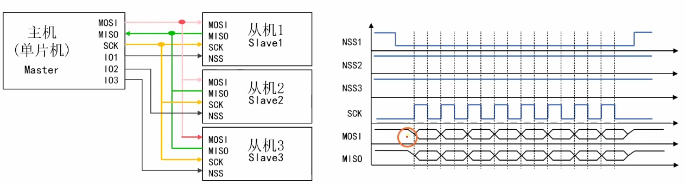
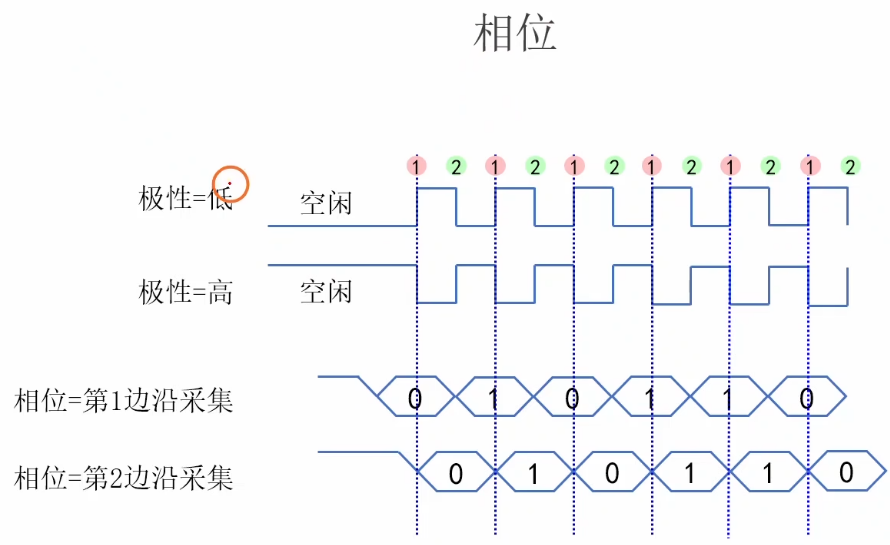
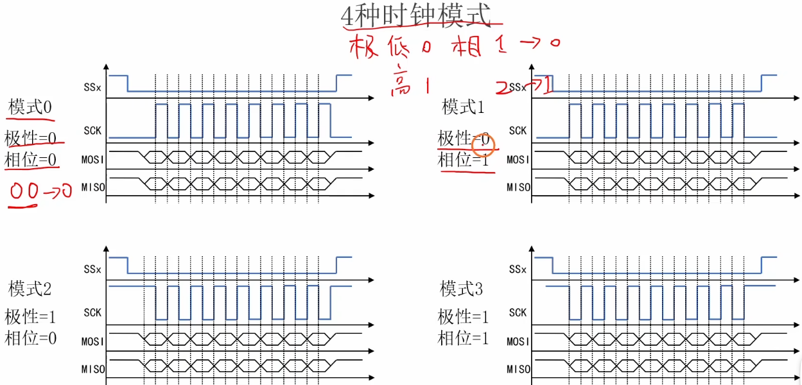
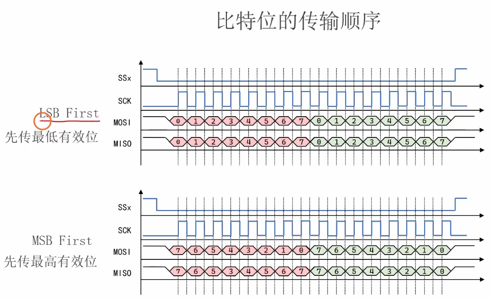

# 5.1 [SPI]电路结构和通信协议

## 主要内容
SPI (Serial Peripheral Interface) 的基本概念。

### 1. SPI总线的电路结构 (硬件层)

SPI (Serial Peripheral Interface) 是一种**同步、全双工**的通信协议。与I2C的“开漏输出+上拉电阻”不同，SPI通常使用**推挽输出**，这使得它的通信速率可以做得非常高（MHz级别）。

- **物理连接（4根线）：**
    
    - **SCK (Serial Clock)**：时钟线。**由主机（Master）产生**，决定通信速率。
        
    - **MOSI (Master Output Slave Input)**：主机输出，从机输入。
        
    - **MISO (Master Input Slave Output)**：主机输入，从机输出。
        
    - **SS/CS (Slave Select / Chip Select)**：片选线。==**通常低电平有效**==。主机拉低某从机的SS线，该从机才会被激活。
        
- **拓扑结构（一主多从）：**
    
    - **连接方式**：所有设备的SCK、MOSI、MISO并联在一起。
        
    - **片选方式**：主机为**每一个**从机单独分配一根==GPIO作为SS信号线==。想和谁说话，就把谁的==SS拉低==，其他人的SS保持高电平（其他从机此时对总线视而不见，且其MISO引脚处于**高阻态**，不影响总线）。
        
- **“推挽”的优势**：因为是推挽输出，驱动能力强，信号边沿陡峭，所以SPI能轻松跑出几十兆的频率，远快于I2C。
    

### 2. 通信流程及波形 (核心逻辑：交换)

铁头山羊教程中最经典的解释是：**SPI通信的本质是==“交换”==数据，而不是单纯的发送和接收。**

- **内部结构（移位寄存器）：**
    
    - 主机内部有一个8位移位寄存器，从机内部也有一个8位移位寄存器。
        
    - 波形发生器产生8个时钟脉冲。
        
- **交换过程（字节交换）：**
    
    1. **起始**：主机将**SS线拉低**，选中从机。
        
    2. **移位**：
        
        - 在SCK的每一个时钟周期里，主机把自己的最高位（假设MSB）移出到MOSI线上，同时从机把自己的最高位移出到MISO线上。
            
        - 主机读取MISO线上的数据移入最低位，从机读取MOSI线上的数据移入最低位。
            
    3. **结束**：经过8个时钟周期，主机的8位数据跑到了从机里，从机的8位数据跑到了主机里。**发送和接收是同时完成的。**
        
    4. **停止**：主机将**SS线拉高**，结束通信。
        

> **注意**：如果你只想发送数据不关心接收，你依然会收到一个字节（通常是垃圾数据或者从机的默认状态），你可以选择忽略它；如果你只想读取数据，你必须发送一个字节（通常发送0x00或0xFF）来产生时钟信号以“置换”回数据。

### 3. 参数1：时钟信号的极性和相位 (CPOL & CPHA)

因为SPI没有像I2C那样严格的统一标准，不同的芯片厂商对时钟的定义不同，所以STM32提供了配置项来适配所有情况。

- **CPOL (Clock Polarity) 时钟极性**：决定**空闲状态**（没传输数据时）SCK线的电平。
    
    - **CPOL = 0**：空闲时SCK为**低电平**。
        
    - **CPOL = 1**：空闲时SCK为**高电平**。
        
- **CPHA (Clock Phase) 时钟相位**：决定在第几个边沿进行**数据采样**（读取）和**数据移位**（改变）。
    
    - **CPHA = 0**：==在**第1个**跳变沿==（上升或下降取决于CPOL）进行**数据采样**（Capture），在第2个跳变沿数据更改。
        
        - _通俗理解_：时钟动之前，数据已经准备好了，第一个边沿直接读。
            
    - **CPHA = 1**：在**第1个**跳变沿数据更改（Shift），在**第2个**跳变沿进行**数据采样**。
        
        - _通俗理解_：时钟先动一下，数据才变，第二个边沿再读。
            

### 4. SPI的4种模式

将CPOL和CPHA组合，就构成了SPI的4种模式。**主机和从机必须配置为相同的模式才能通信。**

| **模式**     | **CPOL** | **CPHA** | **描述 (最关键的看采样时刻)**            |
| ---------- | -------- | -------- | ----------------------------- |
| **Mode 0** | **0**    | **0**    | **空闲低电平，第1个边沿(上升沿)采样。** (最常用) |
| Mode 1     | 0        | 1        | 空闲低电平，第2个边沿(下降沿)采样。           |
| Mode 2     | 1        | 0        | 空闲高电平，第1个边沿(下降沿)采样。           |
| **Mode 3** | **1**    | **1**    | **空闲高电平，第2个边沿(上升沿)采样。** (常用)  |

> **经验总结**：Mode 0 和 Mode 3 最为常见。如果你不知道从机是哪种模式，先查从机数据手册的时序图；如果手册没写，通常Mode 0是默认首选。

### 5. 参数2：传输顺序 (MSB/LSB)

这就好比吃甘蔗，是从头开始吃还是从尾巴开始吃。

- **MSB First (高位先行)**：一个字节8位，先发送第7位（最高位），最后发送第0位。
    
    - **绝大多数**SPI设备（如Flash芯片W25Q64、OLED屏幕）都使用MSB First。
        
- **LSB First (低位先行)**：先发送第0位，最后发送第7位。
    
    - 较少见，但在某些特定的ADC或特殊协议中可能存在。
        

**STM32配置**：在SPI结构体中通过 `SPI_FirstBit` 参数配置。如果配反了，你收到的数据就是二进制镜像反转的（例如发 `1000 0000` 变成 `0000 0001`）。

### 6. 参数3：数据宽度 (Data Width)

这决定了一次“交换”涉及多少位数据。

- **8位 (8-bit)**：最通用。每次读写一个字节 (`uint8_t`)。
    
- **16位 (16-bit)**：在某些高性能应用中常用。例如驱动TFT彩屏（一个像素颜色可能是RGB565，刚好16位），或者读取高精度ADC（12位或16位ADC）。
    
    - 如果配置为16位模式，STM32的DR寄存器读写就需要用 `uint16_t` 类型，一次SCK会连续产生16个脉冲。
        

---

**总结一张表帮助记忆配置流程：**

1. **连线**：你是谁？(主/从)，接哪根线？
    
2. **模式**：闲时高还是低？(CPOL)，第几边沿读数据？(CPHA) —— **这是最容易出错的地方。**
    
3. **格式**：先发高位还是低位？(MSB/LSB)，一次发8位还是16位？
    
4. **速度**：预分频系数是多少？(决定SCK频率，不能超过从机上限)。
