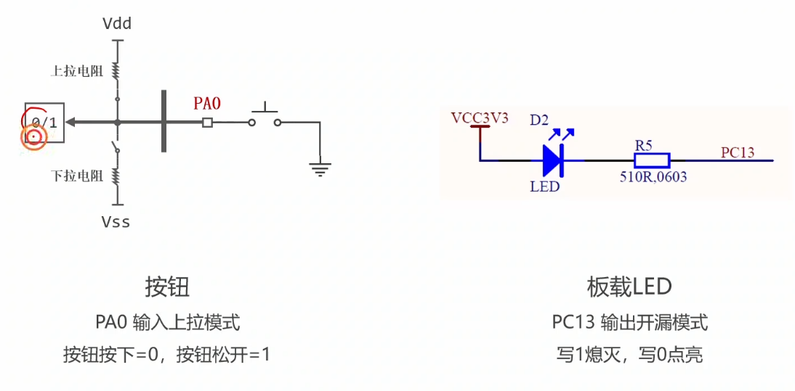
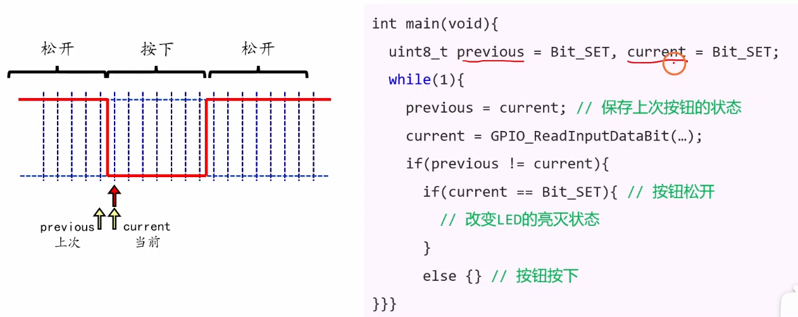

# 5.2 [番外] 按钮驱动程序编写

## 主要内容
编写一个健壮的按键扫描驱动。

### 1. 连接电路 (硬件基础)

在嵌入式开发中，理解电路是写代码的前提。STM32的GPIO（通用输入输出）引脚既可以输出电压驱动LED，也可以检测外部电压读取按键状态。

- **LED电路（输出设备）：**
    
    - **灌电流接法（低电平点亮 - 常用）：** LED的正极接3.3V电源，负极串联一个限流电阻（通常1kΩ-2kΩ）后接到STM32的GPIO引脚。
        
        - _逻辑：_ 当GPIO输出**低电平(0)**时，电流从3.3V流向GPIO，LED亮；输出**高电平(1)**时，两端都是3.3V，无电流，LED灭。
            
    - **拉电流接法（高电平点亮）：** LED正极接GPIO，负极接地。STM32的推挽输出能力较强，可以直接驱动，但在板载电路中不如灌电流接法常见。
        
- **按钮电路（输入设备）：**
    
    - **下接法（按键接低）：** 按钮一端接GPIO，另一端接GND（地）。
        
        - _关键点：_ 当按键未按下时，引脚处于悬空状态（电压不稳）。为了保证逻辑稳定，**必须开启STM32内部的上拉电阻（Pull-up）**。
            
        - _现象：_ 松开 = 高电平（1）；按下 = 接地 = 低电平（0）。
            
    - **上接法（按键接高）：** 按钮一端接GPIO，另一端接3.3V。此时需要开启**下拉电阻（Pull-down）**。
        

---

### 2. 初始化板载LED和按钮 (代码配置)

在STM32中，外设必须先“通电（开启时钟）”再“配置”，才能工作。初始化的核心是配置`GPIO_InitTypeDef`结构体。

- **第一步：开启时钟 (RCC)**
    
    - 这是新手最容易漏掉的一步！GPIO端口（GPIOA, GPIOB等）挂载在总线上，必须先使能对应的时钟（如 `__HAL_RCC_GPIOA_CLK_ENABLE()`），否则配置无效。
        
- **第二步：配置LED引脚 (推挽输出)**
    
    - **Mode (模式)：** `GPIO_MODE_OUTPUT_PP` (Push-Pull 推挽)。推挽模式下，引脚可以强力输出高电平或低电平，适合驱动LED。
        
    - **Speed (速度)：** 对于LED闪烁，低速（Low）或中速即可。
        
- **第三步：配置按钮引脚 (输入模式)**
    
    - **Mode (模式)：** `GPIO_MODE_INPUT` (输入模式)。
        
    - **Pull (上下拉 - 核心配置)：**
        
        - 如果电路是“按键接低”（常见板载接法），这里必须配置为 `GPIO_PULLUP` (上拉)。这样松手时，内部电阻把电平拉高，确保读到“1”。
            
        - 如果电路外部已经有了物理上拉电阻，这里可以配置为 `GPIO_NOPULL` (浮空)。
            

---

### 3. 按钮程序的基本原理 (轮询逻辑)

按钮程序的本质是STM32通过读取**输入数据寄存器 (IDR)** 的某一位，来判断引脚当前的电压高低。

- **逻辑映射（以按键接低+上拉为例）：**
    
    - **物理动作**：手指按下 -> **物理现象**：引脚电路导通接地 -> **电平变化**：电压变为0V -> **寄存器变化**：IDR寄存器对应位变为0 -> **代码读取**：`HAL_GPIO_ReadPin` 返回 `GPIO_PIN_RESET`。
        
    - **物理动作**：手指松开 -> **物理现象**：电路断开，内部上拉电阻起作用 -> **电平变化**：电压变为3.3V -> **寄存器变化**：IDR寄存器对应位变为1 -> **代码读取**：`HAL_GPIO_ReadPin` 返回 `GPIO_PIN_SET`。
        
- **代码核心：**
    
    
    
    ```c
    // 假设按键按下为低电平
    if (HAL_GPIO_ReadPin(GPIOA, GPIO_PIN_0) == GPIO_PIN_RESET) {
        // 检测到按键被按下，执行操作
    }
    ```
    

---

### 4. 按钮消抖的原理 (难点与重点)

物理按键内部是金属弹片。当你按下或松开的瞬间，金属片不会瞬间紧密接触，而是会发生**机械抖动**。

- **抖动现象：** 在按下的一瞬间（通常5ms~10ms内），引脚电平会在0和1之间剧烈跳变多次，就像弹簧一样。
    
    - _后果：_ 如果CPU处理速度很快，它会认为你在这10毫秒内疯狂按了几十次开关，导致程序误判（例如按一次灯却闪了好几下）。
        
- **消抖原理（软件延时法）：** 既然抖动不可避免，我们就选择“视而不见”。
    
    1. **初次检测：** 检测到电平变低（疑似按下）。
        
    2. **延时避让：** 让程序暂停（Delay）约10ms~20ms。这段时间是抖动的高发期，CPU什么都不做，单纯等待抖动过去。
        
    3. **再次确认：** 延时结束后，再次读取电平。如果此时依然是低电平，说明这是稳定的按下，而不是偶然的干扰或瞬间的抖动。
        
- **完整的消抖代码逻辑：**
    
    
    
    ```c
    if (HAL_GPIO_ReadPin(GPIOA, GPIO_PIN_0) == GPIO_PIN_RESET) { // 1. 初次检测
        HAL_Delay(20); // 2. 软件消抖：延时20ms跨过抖动区
    
        if (HAL_GPIO_ReadPin(GPIOA, GPIO_PIN_0) == GPIO_PIN_RESET) { // 3. 再次确认
            // 确认真的是按下了，执行功能代码
            Toggle_LED(); 
    
            // 4. (可选) 等待松手：防止长按一直触发
            while (HAL_GPIO_ReadPin(GPIOA, GPIO_PIN_0) == GPIO_PIN_RESET);
        }
    }
    ```